# MongoDB 완벽가이드

## 기본개념

* 데이터의 기본 단위는 도큐먼트
* 컬렉션은 동적 스키마가 있는 테이블과 동일한 개념
* 단일 인스턴스는 여러개의 독립적인 데이터베이스를 호스팅
* 몽고 셸을 통해 조작 가능
    * 여기에선 Datagrip을 활용 함

## Document

* 정렬된 키와 연결된 값의 집합으로 이뤄짐

```mongodb-json-query
{
  "greeting": "Hello world!"
}
```

* 데이터 타입과 대소문자 구별

아래는 서로 다른 도큐먼트임

```mongodb-json-query
{
  "count": 5
}
{
  "count": "5"
}
```

## 컬렉션

* 도큐먼트의 모음
* 하나의 컬렉션 내에 서로 다른 구조의 도큐먼트를 가질 수 있음
    * 그래도 용도에 따라 적절히 컬렉션을 나누는것이 좋다

### 컬렉션 네이밍

* 널 스트링, 빈 문자열은 사용 불가
* system.으로 시작하는 컬렉션 이름은 예약어
* 사용자가 만든 컬렉션은 $ 예약어 사용 불가

### 서브 컬렉션

* .을 통해서 컬렉션을 체계화 함
* 단지 이름을 기반으로 체계화 하는 것이지 상하 관계가 성립하는것은 아님
* ex)
    * master.items
    * master.categories
    * master.admins

### 데이터베이스

* 컬렉션의 그룹
* 컬렉션과 마찬가지로 이름으로 식별 됨
* 최대 64 bytes
* 시맨틱을 갖는 예약된 데이터베이스
    * admin
        * 인증과 권한 부여를 담당
    * local
        * 단일 서버에 대한 데이터 저장
        * 레플리카 셋ㅅ에서 local 데이터베이스는 복제되지 않음
    * config
        * 샤딩 된 클러스터의 경우 config db를 통해 샤드에 분배 함
* ex)
    * cms 데이터베이스의 blog.posts 컬렉션은 cms.blog.posts로 나타 냄
    * 네임스페이스(cms.blog.posts)의 최대 길이는 120 bytes 이나 실제 100 bytes 이하이어야 함

## 기본 데이터 조작

* db 변수는 현재 데이터베이스를 가리킨다
* use <db>로 선택 가능하다

```mongodb-json-query
use demo
```

### 생성

* insertOne

단건 삽입

```mongodb-json-query
// 지역 변수
movie = {
  "title": "Star wars",
  "director": "Geroge Lucas",
  "year": 1977,
}
db.movies.insertOne(movie)

// 확인
db.movies.find()
```

ObjectId가 자동 발급 됨  
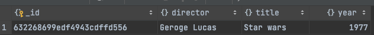

### 읽기

* findOne

단건 조회

```mongodb-json-query
db.movies.findOne()
```

### 갱신

* updateOne

단건 갱신

첫번째 인자로 매칭하는 조건 명시, 두번째로 갱신 작업에 대한 기술
```mongodb-json-query
db.movies.updateOne({
  title: 'Star wars'
},
{$set: {reviews: []
}
});
```
updateOne이라 하나만 업데이트 됐음

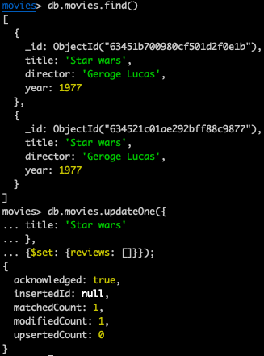

### 삭제

* deleteOne
* deleteMany

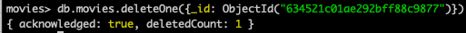

## 데이터 형
* null
* Boolean
* 숫자
  * 셸에선 64비트 부동소수점을 기본으로 함
  * 4byte, 8byte 정수는 NumberInt, NumberLong을 사용해야 함
  * NumberInt(4), NumberLong(12)
* 문자열
  * UTF8
* 날짜
  * Date로 표현
  * new Date()로 생성해야 함
  * 타임존은 저장하지 않음
* 정규표현식
  * 자바스크립트 정규표현식 문법
* 배열
* 내장 도큐먼트
* 객체 ID
  * 12byte
  * 하나의 컬렉션에서 도큐먼튼는 고유한 아이디를 가짐
  * 분산 데이터베이스를 위해 자동증가 값이 아닌 ObjectId를 사용 함
  * 0 1 2 3 4 5 6 7 8 9 10 11
  * 0~2는 타임스탬프, 3~8은 랜덤, 9~11은 카운타
* 이진데이터
* 자바스크립트 코드

## 도큐먼트 생성, 갱신, 삭제
### insertMany 
```mongodb-json-query
db.movies.insertMany(
    [
        {'title': 'GhostBusters'},
        {'title': 'E.T'},
        {'title': 'Blade Runner'}
    ]
)
```
* 다량의 도큐먼트 생성시 반복보다 훨씬 효율적임
* 데이터 피드
* RDB와 같은 원본 소스에서 임포트하는 경우 mongoimport 도구가 있음
* 48메가 이상이면 드라이버가 여러 insertMany 구문으로 분리 함

```mongodb-json-query
db.movies.insertMany(
    [
        {_id: 0, 'title': 'GhostBusters'},
        {_id: 1, 'title': 'E.T'},
        {_id: 1, 'title': 'Blade Runner'},
        {_id: 2, 'title': 'Blade Runner'}
    ],
    {
        ordered: true
    }
)
```
* 기본으로 ordered가 true임
* 정렬된 삽입이면 오류가 발생하는 지점에서 중단 함
* 비정렬된 삽입이면 오류 발생 여부에 상관없이 모두 삽입 시도 함

### deleteOne
* 필터와 일치하는 첫번째 도큐먼트를 삭제
```mongodb-json-query
db.movies.deleteOne({
    _id: 4
})
```
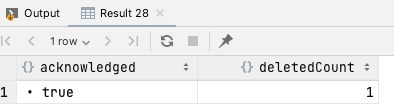

### deleteMany
* 필터와 일치하는 모든 도큐먼트를 삭제
```mongodb-json-query
db.movies.deleteMany({
    title: 'Blade Runner'
})
```

* 이전버전에서 remove를 지원하나 deleteOne, deleteMany를 쓸 것

### drop
* deleteMany에 아무런 인수를 주지 않으면 모든 도큐먼트가 제거 됨
* drop이 더 빠름

### replaceOne
* 도큐먼트를 새로운것으로 완전 치환
* 대대적인 스키마 마이그레이션에 유용 함 
```mongodb-json-query
db.users.insertOne({
    name: 'lee',
    friends: 32,
    enemies: 2
});

var lee = db.users.findOne({name: 'lee'});
lee.username = lee.name;
delete lee.name;  // name -> username

// relationships이라는 내장도큐먼트로 이동
lee.relationships = {
    friends: lee.friends,
    enemies: lee.enemies,
};
delete lee.friends;
delete lee.enemies;
db.users.replaceOne({name: 'lee'}, lee);
```
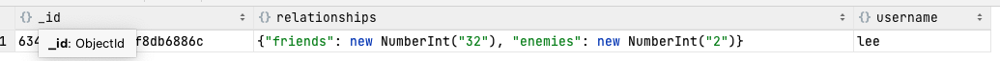

* 주어진 조건절에 두 개 이상의 도큐먼트가 매치하면 하나만 치환 한
  * 단 주의할 것이 id가 중복되는 상태가 발생할 수 있다는 것
```mongodb-json-query
db.users.insertOne({
    name: 'lee',
    friends: 32,
    enemies: 2
});
db.users.insertOne({
    name: 'lee',
    friends: 22,
    enemies: 2
});
var lee = db.users.findOne({name: 'lee', friends: 22}) // 63452da64b62ab4f8db6887a를 조회 했으나
lee.friends++;
db.users.replaceOne({name: 'lee'}, lee); // 63452d914b62ab4f8db68878가 대체 되도록 시도 됨
```
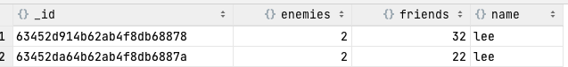

### 갱신연산자
* 도큐먼트의 특정 부분만 갱신하는 경우 원자적 갱신 연산자를 쓸 수 있음

#### set/unset 제한자(modifier)
**set**
* 필드 값을 설정
* 없으면 필드를 추가 함
```mongodb-json-query
db.users.updateOne({name: 'lee'}, {
    $set: {
        'favorite book': 'harry porter'
    }
})

// 데이터 형도 바꿀 수 있음
db.users.updateOne({name: 'lee'}, {
    $set: {
        'favorite book': ['harry porter', 'effective kotlin']
    }
})
```
* replaceOne과 무슨 차이일까?
  * replaceOne은 아예 도큐먼트를 대치하는 것이니 변경내역 소실 가능성이 있음
  * 조회 후 replace이니까
  * set은 atomic 하므로 소실 가능성이 없다고 봐도 좋을 듯

**unset** 
* 키와 값 제거
```mongodb-json-query
db.users.updateOne({name: 'lee'}, {
    $unset: {
        'favorite book': ''
    }
})
```
* 내장 도큐먼트도 수정 가능
```mongodb-json-query
db.users.insertOne({
    name: 'lee2',
    friends: 22,
    enemies: 1,
    additional: {
        hobby: ['running', 'ps'],
        address: 'home'
    }
})
;
db.users.updateOne({name: 'lee2'},{
    $set: {
        'additional.address': 'changed'
    }
})
```

#### inc 제한자(modifier)
* 이미 존재하는 키를 변경하거나 추가
* set과 유사하나 숫자의 증감을 위해 설계 됨
* int, long, double, decimal에 사용 가능
```mongodb-json-query
db.analytics.insertOne({
    url: 'www.taesu.com',
    pageviews: 42
});
db.analytics.updateOne({'url': 'www.taesu.com'},
    {
        $inc: {'pageviews': 1}
    }
);
```

### 배열 연산자
#### push
* 배열이 없으면 생성 후 추가 함
```mongodb-json-query
db.blog.posts.insertOne({
    title: 'A post',
    content: '...'
});
db.blog.posts.updateOne({title: 'A post'},{
    $push: {
        comments: {
            name: 'lee taesu',
            content: 'nice!'
        }
    }
});
// 여러개 삽입
db.blog.posts.updateOne({title: 'A post'}, {
    $push: {
        comments: [
            {
                name: 'lee taesu',
                content: 'nice!'
            },
            {
                name: 'lee taesu',
                content: 'nice!'
            }
        ]
    }
});

// each로도 가능
db.blog.posts.updateOne({title: 'A post'}, {
    $push: {
        comments: {
            $each: [
                {
                    name: 'lee taesu',
                    content: 'nice 0!'
                },
                {
                    name: 'lee taesu',
                    content: 'nice 1!'
                }
            ]
        }
    }
})
```

#### push + slice
* push와 slice로 길이 유지가 가능
* Top-N 기능 구현
* 도큐먼트 내에 큐도 구현 가능
* slice, sort를 push랑 쓰려면 반드시 each를 써야 함
```mongodb-json-query
db.blog.posts.updateOne({title: 'A post'}, {
    $push: {
        comments: {
            $each: [
                {
                    name: 'lee taesu',
                    content: 'nice 123'
                },
                {
                    name: 'lee taesu',
                    content: 'nice 456'
                }
            ],
            $slice: -2
        }
    }
})
```
* nice0!, nice1! 댓글은 밀리고 새로 추가 된 두개만 남음
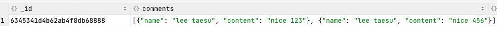

* sort로 정렬도 가능
```mongodb-json-query
db.blog.posts.updateOne({title: 'A post'}, {
    $push: {
        comments: {
            $each: [
                {
                    name: 'lee taesu',
                    content: 'nice 123'
                },
                {
                    name: 'lee taesu',
                    content: 'nice 456'
                }
            ],
            $slice: -2,
            $sort: {'content': -1}
        }
    }
})
```

### 배열을 집합으로
#### ne
```mongodb-json-query
db.papers.insertOne({author: 'taesu'});
db.papers.updateOne({author: {$ne: 'taesu'}}, {$push: {author: 'taesu'}}); // not updated
db.papers.find()
```

#### addToSet
* 고유한 값 추가해야 하는 경우 addToSet, each를 조합
```mongodb-json-query
db.users.insertOne({
    name: 'lee',
    emails: [
        'taesu@gmail.com',
        'taesu@gmail.com'
    ]
});

db.users.updateOne({name: 'lee'}, {
    $addToSet: {
        emails: {
            $each: [
                'taesulee93@gmail.com'
            ]
        }
    }
});
```

* 주의, 이렇게 해버리면 이중배열이 들어간다는 것
```mongodb-json-query
db.users.updateOne({name: 'lee'}, {
    $addToSet: {
        emails: [
            'taesulee93@gmail.com'
        ]
    }
});
```

### 요소 제거
#### pop
```mongodb-json-query
// 배열의 처음부터 제거
db.users.updateOne({}, {$pop: {emails: -1}});
// 배열의 마지막부터 제거
db.users.updateOne({}, {$pop: {emails: 1}});
```
#### pull
* 하나의 도큐먼트의 emails 배열에서 일치하는 요소 제거
* 조건에 부합하는 도큐먼트가 여러개일때 하나가 적용되면 나머지는 무시 됨 (updateOne)
  * doc1: {emails: '...'}, doc2: {emails: '...'} 일때 doc1만 계속 배열이 지워질거임
```mongodb-json-query
db.users.updateOne({}, {$pull: {emails: 'taesu@gmail.com'}})
```
* 여러 도큐먼트에 적용하고 싶다면
```mongodb-json-query
db.users.updateMany({}, {$pull: {emails: 'taesu@gmail.com'}})
```


### 배열의 위치기반 변경
* 몇번째 요소인지 모르는 경우 'comments.$.name' 으로 접근 가능하다
```mongodb-json-query
db.blog.posts.insertOne({
    title: 'A post',
    content: '...',
    comments: [{
        name: 'lee taesu',
        content: 'nice!2awef'
    }]
});

db.blog.posts.updateMany({'comments.name': 'lee taesu'}, {
    $set: {
        'comments.$.name': 'Lee Tae Su'
    }
})
```
* arrayFilters를 통해서 조건에 맞는 배열만 변경 가능
```mongodb-json-query
// 투표 수가 -5 이하인 댓글은 숨김 처리
db.blog.posts.updateMany(
    {'comments.name': 'lee taesu'},
    {
        $set: {'comments.$[element].visible': false}  // 각 요소를 element로 선언
    },
    {
        arrayFilters: [{'element.votes': {$lte: -5}}]   // 여기서 사용
    }
)
```

### Upsert
* 1에 넘긴 인자에 매치하는 도큐먼트 검색
* 2에 넘긴 오퍼레이션 수행
* 3에 upsert: true라면 없으면 생성하고 오퍼레이션 수행
* 애플리케이션 로직으로 upsert를 구현하면 경쟁상태에 빠질 수 있음
  * UK 등으로 정합성은 보장할 수 있으나 오류가 날 것임
  * Upsert는 원자적이므로 비교적 안전
```mongodb-json-query
db.analytics.updateOne(
    {url: 'www.taesu2.com',},
    {$inc: {pageviews: 1}},
    {upsert: true}
    )
```

* 주의, 아래처럼 하면 pageviews: 0인 도큐먼트는 항상 없을 것이므로 매번 도큐먼트가 생성된다
```mongodb-json-query
db.analytics.updateOne({url: 'www.taesu2.com', pageviews: 0},
    {$inc: {pageviews: 1}},
    {upsert: true}
    )
```
* 도큐먼트 생성과 동시에 필드 설정이 필요하다면 $setOnInsert를 사용할 것
```mongodb-json-query
db.analytics.updateOne({url: 'www.taesu3.com',},
    {
        $inc: {pageviews: 1},
        $setOnInsert: {findBy: 'taesu'}
    },
    {upsert: true}
)
```

### updateMany
* updateOne과 매개변수는 동일
* updateOne은 필터에 부합하는 첫번째 도큐먼트만 갱신
* 필터에 부합하는 모든 도큐먼트 갱신은 updateMany
* 스키마 변경, 특정 사용자에 새로운 정보 추가 등에 효율적임 
```mongodb-json-query
db.users.insertMany(
    [
        {name: 'lee', birth: '1993-02-16'},
        {name: 'lee2', birth: '1991-02-16'},
    ]
);
db.users.updateMany({birth: '1993-02-16'}, {
    $set: {gift: 'happy birthday pack'}
})
```

### findAndGet (수정한 도큐먼트 반환)
**findOneAndUpdate**
* set and get을 원자적으로 해야하는 작업에 적합
* 여러 프로세스 중 락 등이 필요한 경우 아래처럼 
  * type에 따라 ready 상태인 것을 프로세스 1이 획득 하면서 ongoing으로 변경
  * 변경 됐다면 return 된것이 있음
  * 아무것도 없다면 작업 진행하지 않음
```mongodb-json-query
db.jobs.findOneAndUpdate(
    {type: 'MY_BATCH', status: 'READY'},
    {
        $set: {status: 'ONGOING'},
    },
    {
        returnNewDocument: true
    }
)
        
// 작업 다한 프로세스는 완료처리로
db.jobs.updateOne({type: 'MY_BATCH', status: 'ONGOING'}, {
    $set: {status: 'READY'}
})
```

**findOneAndReplace**
* returnNewDocument가 false면 교체 전 도큐먼트
* returnNewDocument가 true면 교체 후 도큐먼트
```mongodb-json-query
db.types.drop()
db.types.find()
db.types.insertOne({name: 'type1', when: '111'});
var type = db.types.findOne({name: 'type1'})
type.when = '123213'
db.types.findOneAndReplace({name: 'type1'}, type,
{
    returnNewDocument: true
})
```

**findOneAndDelete**
* 삭제된 도큐먼트를 반환

## 쿼리
### find 기본
```mongodb-json-query
db.users.find() == db.users.find({}) // 아무 조건 명시 안하면 빈 쿼리 도큐먼트로 인식

db.users.find({name: 'lee'})  // name이 lee인 도큐먼트를 검색하는 쿼리 도큐먼트
```

* 반환받을 키 지정을 통해 효율적으로 쿼리할 수 있음
* ID는 매번 반환 됨
```mongodb-json-query
db.users.find({}, {friends: 1, name: 1, birth: 1})
```
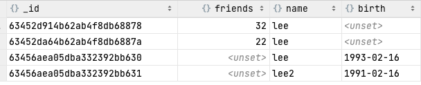

* friends를 제외한 나머지를 쿼리 할수도 있음
```mongodb-json-query
db.users.find({}, {friends: 0})
```

* 쿼리 도큐먼트의 값은 반드시 상수이어야 함
* 아래처럼 name과 username 값이 같은 쿼리는 불가 함
  * 이 경우엔 where을 사용할 것
```mongodb-json-query
db.users.find({'name':  'username'})
```

### 쿼리 조건
* equal 외에도 or, range, negation 등 검색 가능
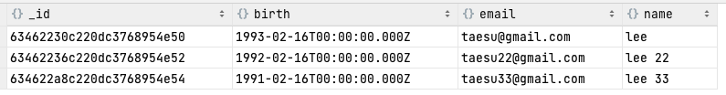

**범위조건 (lte)**
```mongodb-json-query
db.users.find({
    birth: {
        $lte: ISODate('1992-02-16')
    }
})
;
```
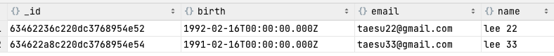
**부정 (ne)**
```mongodb-json-query
db.users.find({
    name: {
        $ne: 'lee'
    }
})
```
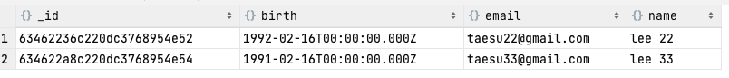

**in, not in**
```mongodb-json-query
db.users.find({
    name: {
        $in: ['lee', 'lee 22']
    }
})

db.users.find({
    name: {
        $nin: ['lee', 'lee 22']
    }
})
```
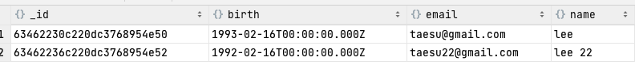  
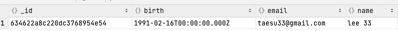

**or**
* in 연산자가 가능하다면 or 대신 in을 쓸 것
* 쿼리 옵티마이저가 더 효율적으로 다룸 
```mongodb-json-query
db.users.find({
    $or: [
        {
            name: {
                $in: ['lee', 'lee 22']
            }
        },
        {
            name: {
                $nin: ['lee', 'lee 22']
            },
            email: 'taesu@gmail.com'
        }
    ]
})
```
* name in(lee, lee 22) or (name not in (lee, lee 22) and email eq 'taesu@gmail.com')
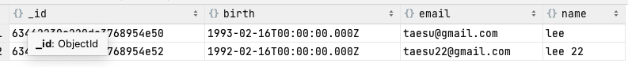

**not, mod**
* mod 연산자는 첫번째 요소로 나눈후 나머지가 두번째 요소인 경우를 매치 함
```mongodb-json-query
// key를 3으로 나눴을때 나머지가 0인 도큐먼트 검색
db.users.find({
    key: {$mod: [3, 0]}
})

// key를 3으로 나눴을때 나머지가 0이 아닌 도큐먼트 검색
db.users.find({
    key: {
        $not: {$mod: [3, 0]}
    }
})
```

### 형 특정 쿼리
**null**
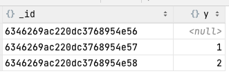

y가 null인 도큐먼트가 잘 나오는 듯 하나
```mongodb-json-query
db.c.find({
    y: null
})
```
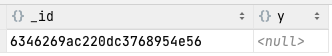

키가 존재하지 않는 경우도 나온다
```mongodb-json-query
db.c.find({
    z: null
})
```
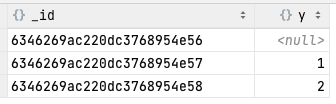

만약 값이 진짜 null인것을 검색하려면 아래처럼 eq, exists로 검색 해줘야 한다
```mongodb-json-query
db.c.find({
    z: {
        $eq: null,
        $exists: true
    }
})
```

**정규표현식**
* 정규표현식으로 매턴일치 문자열 검색 가능
* 정규표현식 플래그 i는 사용 가능하지만 필수는 아님
  * i는 대소문자 구분 할지 안할지 여부
* PCRE에서 사용가능한 모든 문법 사용 가능
```mongodb-json-query
db.users.find({
    name: {
        $regex: /lee 2/i
    }
})
```

* 접두사 정규표현식에 인덱스 활용 가능
```mongodb-json-query
db.users.find({
    name: {
        $regex: /^le/
    }
})
```
* 대소문자 비구별 검색에는 인덱스 활용 불가
```mongodb-json-query
db.users.find({
    name: {
        $regex: /^le/i
    }
})
```

**배열에 쿼리하기**
* 스칼라 쿼리랑 같은 방식
```mongodb-json-query
db.foods.find({
    fruit: 'banana'
})
```
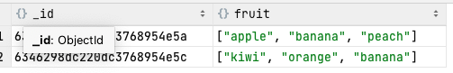

**all 연산자**
* 2개 이상의 배열 요소와 일치하는 배열 찾기
* 순서는 상관 없음
```mongodb-json-query
db.foods.find({
    fruit: {
        $all: ['banana', 'apple']
    }
})
```
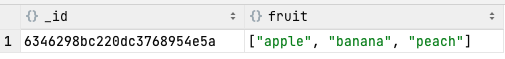

* 배열 요소와 정확히 일치해야 하는 경우
* 순서도 일치해야 함
```mongodb-json-query
db.foods.find({
    fruit: ['apple', 'banana', 'peach']
})
```

* 인덱스 기반 검색
```mongodb-json-query
db.foods.find({
    'fruit.2': 'banana'
})
```
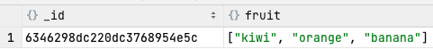

**size 연산자**
* 특정 크기의 배열을 쿼리
* gt 등 범위 조회 불가
```mongodb-json-query
db.foods.find({
    fruit: {
        $size: 3
    }
})
```

* 범위 검색이 필요하다면 별도의 size 컬럼을 두는게 좋을 것
```mongodb-json-query
db.foods.updateOne({_id: ObjectId('6346298bc220dc3768954e5a')}, {
    $push: {
        fruit: {
            $each: [
                'pineapple', 'grape'
            ]
        }
    },
    $inc: {
        size: 2
    }
})
```
* 단 addToSet엔 사용 불가 
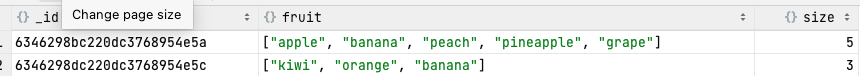

**slice 연산자**  
```mongodb-json-query
// 먼저 달린 댓글 1개
db.blog.posts.find({}, {
    comments: {
        $slice: 1
    }
})

// 나중에 달린 댓글 1개
db.blog.posts.find({}, {
    comments: {
        $slice: -1
    }
})

// 처음 1개를 건너 뛰고 2개 반환
db.blog.posts.find({}, {
    comments: {
        $slice: [1, 2]
    }
})
```

* 각 도큐먼트에서 댓글 작성자가 like taesu인 첫번째 코멘트만 조회
```mongodb-json-query
db.blog.posts.find(
    {
        'comments.name': {
            $regex: /taesu/
        }
    },
    {
        title: 1,
        'comments.$': 1
    }
)
```
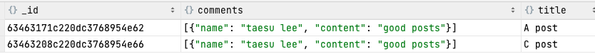

### 배열 및 범위쿼리
```mongodb-json-query
db.test.insertMany([
    {x: 5},
    {x: 15},
    {x: 25},
    {x: [5, 25]},
    {x: [22]},
]);

db.test.find({
    x: {
        $lt: 20,
        $gt: 5
    }
})
```
* [5, 25] 배열의 경우 5가 $lt 20에 부합하고 25가 $gt 5에 부합하므로 나옴
* [22] 배열의 경우 $gt 5엔 부합하나 $lt 20엔 부합하지 않으므로 걸러짐
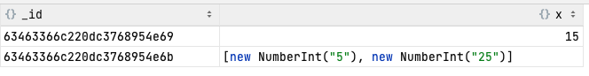

**elemMatch**
* 배열요소와 일치시킴
  * 즉 배열을 대상으로하는 쿼리에 적합
* 비 배열요소는 일치시키지 않음
```mongodb-json-query
db.test.find({
    x: {
        $elemMatch: {
            $lt: 30,
            $gt: 6
        }
    }
})
```
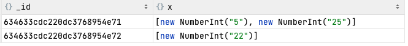

**min, max**
* 인덱스가 있다면 사용 가능
* 일반적으로 배열을 포함하는 도큐먼트에 범위쿼리를 할 때 min, max가 좋음
* gt, lt는 범위 내가 아닌 모든 인덱스 항목을 검색한다
```
db.test.createIndex({
    x: 1
})
db.test.find({x: {$gt: 5, $lt: 20}})
    .hint( { x: 1 } )
    .min({x: 5}).max({x: 20})
```

### 내장 도큐먼트에 쿼리하기
```mongodb-json-query
db.people.insertOne({
    name: {
        first: 'taesu',
        last: 'lee'
    },
    age: 30
});


// 결과 없음
db.people.find({
    name: {
        first: 'taesu',
    }
})
        
// 서브도큐먼트가 정확히 일치해야 함
db.people.find({
    name: {
        first: 'taesu',
        last: 'lee',
    }
})

// 결과 없음 - 순서도 정확히 일치해야 함         
db.people.find({
    name: {
        last: 'lee',
        first: 'taesu',
    }
})

// 가능하다면 내장도큐먼트의 키 기반으로 검색하길
db.people.find({
    'name.last': 'lee',
})
```

**elemMatch 조합**
* 정의: 지정된 모든 쿼리 기준과 일치하는 요소가 하나 이상 있는 배열 필드가 포함된 문서를 찾습니다.
* taesu lee가 작성한 5점 이상 댓글이 있는 받은 블로그 게시물 검색
```mongodb-json-query
db.blog.posts.insertOne(
  {
            "comments": [
                {
                    "name": "taesu lee",
                    "content": "good posts",
                    "score": 4
                },
                {
                    "name": "kim",
                    "content": "nice posts",
                    "score": 6
                },
                {
                    "name": "park",
                    "content": "...",
                    "score": 1
                }
            ],
            "content": "complex contents",
            "title": "A post"
        }
    )

// 결과가 나와버림
// 주어진 조건이 배열내의 내장 도큐먼트 각각과 일치하므로
db.blog.posts.find({
    'comments.name': 'taesu lee',
    'comments.score': {
        $gte: 5
    },
})

// 결과 없음 - 정상적으로 쿼리 됨
// elemMatch를 통해 조건을 그룹화 할 수 있음
db.blog.posts.find({
    comments: {
        $elemMatch: {
            'name': 'taesu lee',
            'score': {
                $gte: 5
            },
        }
    }
})

```

### 커서
* 커서를 통해 find 결과를 받아올 수 있음
```mongodb-json-query
var cursor = db.blog.posts.find()
while (cursor.hasNext()) {
    var ele = cursor.next();
    print(ele.title)
}

var cursor = db.blog.posts.find()
cursor.forEach(it => {
    print(it)
})
```

* find 호출 시 셸이 즉시 쿼리하지 않고 결과 요청 쿼리시에 날림
```mongodb-json-query
// 아래 구문은 실행시 쿼리는 아직 수행되지 않음
var cursor = db.blog.posts.find().limit(1).skip(0)

// 여기서 쿼리가 수행 됨
cursor.haxNext()
```
* 비욜 절감을 위해 hasNext 호출시 첫 100개 혹은 4메가 정도를 미리 가져옴

**limit, skip, sort**
```mongodb-json-query
db.blog.posts.find()
  .limit(2)
  .skip(0)
  .sort({
    title: -1
  })
```
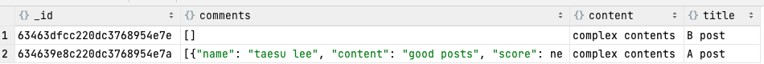
* RDB와 마찬가지로 skip이 커질수록 비효율적

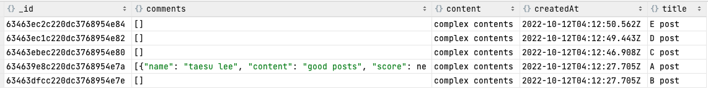
```mongodb-json-query
db.blog.posts.find(
    {
        createdAt: {
            $lt: ISODate('2022-10-12T04:12:49.443Z')
        }
    }
    )
    .limit(2)
    .sort({
        createdAt: -1
    })

```
* no offset 방식 쿼리
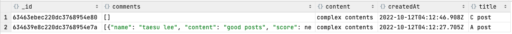

### 데이터형 비교 순서
* 최솟값
* null
* 숫자
* 문자열
* 객체/도큐먼트
* 배열
* 이진데이터
* 객체 ID
* 불리언
* 타임스탬프
* 정규표현식
* 최댓값

### 랜덤 도큐먼트
* 가장 간단한 버전
* count는 언제나 오버헤드가 심하다
```mongodb-json-query
db.blog.posts.find()
    .skip(
        Math.floor(Math.random() * db.blog.posts.countDocuments())
    )
    .limit(1)
```

* random을 생성시에 밀어 넣어놓고 프로그래밍으로 가져오기
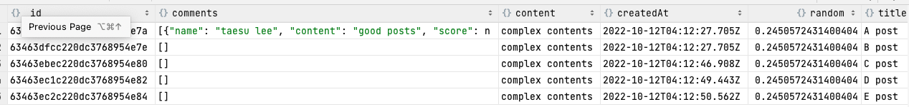
```mongodb-json-query
var random = Math.random()
var randomResult = db.blog.posts.findOne({
    random: {
        $gt: random
    }
})
if(randomResult == null) {
    randomResult = db.blog.posts.findOne({
    random: {
        $lte: random
    }
})
}
print(randomResult)
```

### 종료되지 않는 커서
* 서버측에서 커서는 메모리, 리소스를 점유하는 주체
* 더 가져올 결과가 없거나 클라이언트가 종료 요청 시 리소스 해제 됨
* 종료 조건
  * 조건에 일치하는 결과가 더 이상 없는 경우
  * 클라이언트 측에서 유효 영역을 벗어나서 드라이버가 서버 측으로 종료 요청 보내는 경우
  * 타임아웃에 의한 종료
    * 아직 결과를 다 안봤고 유효영역을 벗어나지 않았으나 10분동안 활동이 없으면
* immortal이라는 함수를 통해 타임아웃에 의한 종료를 방지할 수 있음
  * 단 반드시 명시적으로 종료 해줘야 함 

## 인덱스
* 테스트 데이터 준비
```mongodb-json-query
var users = []
for (i = 0; i < 1000000; i++) {
    users[i] = {
        name: 'user-' + i,
        key: i + 3,
        email: 'user-' + i + '@test.com',
        birth: ISODate()
    }
}
db.users.insertMany(users)

// 또는
for (i = 0; i < 1000000; i++) {
    var user = {
        name: 'user-' + i,
        key: i + 3,
        email: 'user-' + i + '@test.com',
        birth: ISODate()
    }
    db.users.insertOne(user)
}
```

* explain 명령을 통해 실행계획 확인
* totalDocsExamined 수치가 쿼리 수행시 살펴본 도큐먼트 개수
```mongodb-json-query
db.users.find({name: 'user-99912'}).explain('executionStats')
```
```json
[
  {
    "executionStats": {
      "executionSuccess": true,
      "nReturned": 1,
      "executionTimeMillis": 235,
      "totalKeysExamined": 0,
      "totalDocsExamined": 1000003,
      "executionStages": {
        "stage": "COLLSCAN",
        "filter": {
          "name": {
            "$eq": "user-99912"
          }
        },
        "nReturned": 1,
        "executionTimeMillisEstimate": 5,
        "works": 1000005,
        "advanced": 1,
        "needTime": 1000003,
        "needYield": 0,
        "saveState": 1000,
        "restoreState": 1000,
        "isEOF": 1,
        "direction": "forward",
        "docsExamined": 1000003
      }
    },
    "queryPlanner": {
      "namespace": "users.users",
      "indexFilterSet": false,
      "parsedQuery": {
        "name": {
          "$eq": "user-99912"
        }
      },
      "queryHash": "64908032",
      "planCacheKey": "64908032",
      "maxIndexedOrSolutionsReached": false,
      "maxIndexedAndSolutionsReached": false,
      "maxScansToExplodeReached": false,
      "winningPlan": {
        "stage": "COLLSCAN",
        "filter": {
          "name": {
            "$eq": "user-99912"
          }
        },
        "direction": "forward"
      }
    }
  }
]
```

### 인덱스 생성
**단일인덱스**
* 사용자 이름에 인덱스 생성
* db.currentOp()를 통해 구축 진행률 확인 가능
* RDB와 마찬가지로 인덱스가 많을수록 쓰기 연산에 오버헤드가 있음
```mongodb-json-query
db.users.createIndex({'name': 1})
```
```json
[
  {
    "executionStats": {
      "executionSuccess": true,
      "nReturned": 1,
      "executionTimeMillis": 8,
      "totalKeysExamined": 1,
      "totalDocsExamined": 1, // 살펴본 도큐먼트 1개
      "executionStages": {
        "stage": "FETCH",
        "nReturned": 1,
        "executionTimeMillisEstimate": 0,
        "works": 2,
        "advanced": 1,
        "needTime": 0,
        "needYield": 0,
        "saveState": 0,
        "restoreState": 0,
        "isEOF": 1,
        "docsExamined": 1,
        "alreadyHasObj": 0,
        "inputStage": {
          "stage": "IXSCAN",
          "nReturned": 1,
          "executionTimeMillisEstimate": 0,
          "works": 2,
          "advanced": 1,
          "needTime": 0,
          "needYield": 0,
          "saveState": 0,
          "restoreState": 0,
          "isEOF": 1,
          "keyPattern": {
            "name": 1
          },
          "indexName": "name_1",
          "isMultiKey": false,
          "multiKeyPaths": {
            "name": []
          },
          "isUnique": false,
          "isSparse": false,
          "isPartial": false,
          "indexVersion": 2,
          "direction": "forward",
          "indexBounds": {
            "name": ["[\"user-99912\", \"user-99912\"]"]
          },
          "keysExamined": 1,
          "seeks": 1,
          "dupsTested": 0,
          "dupsDropped": 0
        }
      }
    },
    "queryPlanner": {
      "namespace": "users.users",
      "indexFilterSet": false,
      "parsedQuery": {
        "name": {
          "$eq": "user-99912"
        }
      },
      "queryHash": "64908032",
      "planCacheKey": "A6C0273F",
      "maxIndexedOrSolutionsReached": false,
      "maxIndexedAndSolutionsReached": false,
      "maxScansToExplodeReached": false,
      "winningPlan": {
        "stage": "FETCH",
        "inputStage": {
          "stage": "IXSCAN",
          "keyPattern": {
            "name": 1
          },
          "indexName": "name_1",
          "isMultiKey": false,
          "multiKeyPaths": {
            "name": []
          },
          "isUnique": false,
          "isSparse": false,
          "isPartial": false,
          "indexVersion": 2,
          "direction": "forward",
          "indexBounds": {
            "name": ["[\"user-99912\", \"user-99912\"]"]
          }
        }
      }
    }
  }
]
```

**복합인덱스**
* name 인덱스는 아래 쿼리에 도움이 안됨
```mongodb-json-query
db.users.find().sort({birth: 1, name: 1})
```
* 따라서 아래와 같은 복합 인덱스 생성
```mongodb-json-query
db.users.createIndex({birth: 1, 'name': 1})
```
아래처럼 인덱스가 구성 됨  
['1993-02-16', 'user-12311'] -> 8623513776  
['1993-02-16', 'user-12111'] -> 8623513778  
* 생년월일, 이름 항목이 레코드 식별자를 가리킴
* 레코드 식별자란 내부적으로 스토리지 엔진에 의해 사용되며 도큐먼트 데이터를 찾음
* 생년월일로 오름차순 정렬되고 동일한 생년월일에서 사용자 이름으로 오름차순 정렬

* 인덱스 생성 전
* 쿼리 수행시간도 3초 이상
```json
[
  {
    "executionStats": {
      "executionSuccess": true,
      "nReturned": 1000003,
      "executionTimeMillis": 4188,
      "totalKeysExamined": 0,
      "totalDocsExamined": 1000003,
      "executionStages": {
        "stage": "SORT",
        "nReturned": 1000003,
        "executionTimeMillisEstimate": 3211,
        "works": 2000009,
        "advanced": 1000003,
        "needTime": 1000005,
        "needYield": 0,
        "saveState": 2001,
        "restoreState": 2001,
        "isEOF": 1,
        "sortPattern": {
          "birth": 1,
          "name": 1
        },
        "memLimit": 104857600,
        "type": "simple",
        "totalDataSizeSorted": 203778363,
        "usedDisk": true,
        "spills": 2,
        "inputStage": {
          "stage": "COLLSCAN",
          "nReturned": 1000003,
          "executionTimeMillisEstimate": 2,
          "works": 1000005,
          "advanced": 1000003,
          "needTime": 1,
          "needYield": 0,
          "saveState": 2001,
          "restoreState": 2001,
          "isEOF": 1,
          "direction": "forward",
          "docsExamined": 1000003
        }
      }
    },
    "queryPlanner": {
      "namespace": "users.users",
      "indexFilterSet": false,
      "parsedQuery": {
      },
      "queryHash": "42015AE3",
      "planCacheKey": "42015AE3",
      "maxIndexedOrSolutionsReached": false,
      "maxIndexedAndSolutionsReached": false,
      "maxScansToExplodeReached": false,
      "winningPlan": {
        "stage": "SORT",
        "sortPattern": {
          "birth": 1,
          "name": 1
        },
        "memLimit": 104857600,
        "type": "simple",
        "inputStage": {
          "stage": "COLLSCAN",
          "direction": "forward"
        }
      }
    }
  }
]
```

* 인덱스 생성 후
* 쿼리 수행시간도 300ms 이하
```json
[
  {
    "executionStats": {
      "executionSuccess": true,
      "nReturned": 1000003,
      "executionTimeMillis": 494, // 4188 -> 494
      "totalKeysExamined": 1000003, // 0 -> 1000003 
      "totalDocsExamined": 1000003,
      "executionStages": {
        "stage": "FETCH",
        "nReturned": 1000003,
        "executionTimeMillisEstimate": 14,
        "works": 1000004,
        "advanced": 1000003,
        "needTime": 0,
        "needYield": 0,
        "saveState": 1000,
        "restoreState": 1000,
        "isEOF": 1,
        "docsExamined": 1000003,
        "alreadyHasObj": 0,
        "inputStage": {
          "stage": "IXSCAN",
          "nReturned": 1000003,
          "executionTimeMillisEstimate": 11,
          "works": 1000004,
          "advanced": 1000003,
          "needTime": 0,
          "needYield": 0,
          "saveState": 1000,
          "restoreState": 1000,
          "isEOF": 1,
          "keyPattern": {
            "birth": 1,
            "name": 1
          },
          "indexName": "birth_1_name_1",
          "isMultiKey": false,
          "multiKeyPaths": {
            "birth": [],
            "name": []
          },
          "isUnique": false,
          "isSparse": false,
          "isPartial": false,
          "indexVersion": 2,
          "direction": "forward",
          "indexBounds": {
            "birth": ["[MinKey, MaxKey]"],
            "name": ["[MinKey, MaxKey]"]
          },
          "keysExamined": 1000003,
          "seeks": 1,
          "dupsTested": 0,
          "dupsDropped": 0
        }
      }
    },
    "queryPlanner": {
      "namespace": "users.users",
      "indexFilterSet": false,
      "parsedQuery": {
      },
      "queryHash": "42015AE3",
      "planCacheKey": "42015AE3",
      "maxIndexedOrSolutionsReached": false,
      "maxIndexedAndSolutionsReached": false,
      "maxScansToExplodeReached": false,
      "winningPlan": {
        "stage": "FETCH",
        "inputStage": {
          "stage": "IXSCAN",
          "keyPattern": {
            "birth": 1,
            "name": 1
          },
          "indexName": "birth_1_name_1",
          "isMultiKey": false,
          "multiKeyPaths": {
            "birth": [],
            "name": []
          },
          "isUnique": false,
          "isSparse": false,
          "isPartial": false,
          "indexVersion": 2,
          "direction": "forward",
          "indexBounds": {
            "birth": ["[MinKey, MaxKey]"],
            "name": ["[MinKey, MaxKey]"]
          }
        }
      }
    }
  }
]
```

가장 많이 사용하는 세가지 유형의 인덱스 사용법
```mongodb-json-query
db.users.find({birth: ISODate('1993-02-16')}).sort({name: -1})
```
* 단일 값을 찾는 동등쿼리
* 인덱스의 두번째 필드로 결과가 이미 적절한 순서로 정렬 됨
['1993-02-16', 'user-12311'] -> 8623513776  
['1993-02-16', 'user-12111'] -> 8623513778 
1993-02-16과 일치하는 마지막 항목부터 역 탐색, 단일 인덱스의 정렬 방향은 문제되지 않음    


```mongodb-json-query
db.users.find({
    birth: {
        $lt: ISODate('1993-02-20'),
        $gt: ISODate('1993-02-16'),
    }
})
```
* 범위 쿼리
* 첫번째 키인 birth를 사용해서 아래 도큐먼트를 가져 옴
['1993-02-17', 'user-12311'] -> 8623513776  
['1993-02-17', 'user-12111'] -> 8623513778  
...  
['1993-02-18', 'user-02311'] -> 8623513770  
['1993-02-18', 'user-52111'] -> 8623513772  
...    
['1993-02-19', 'user-12351'] -> 8623513771  
['1993-02-19', 'user-62111'] -> 8623513773  

```mongodb-json-query
db.users.find({
    birth: {
        $lt: ISODate('1993-02-20'),
        $gt: ISODate('1993-02-16'),
    }
}).sort({name: -1})
```
* 범위 쿼리 + 정렬
* 첫번째 키인 birth를 사용해서 아래 도큐먼트를 가져 옴
* 그리고 name으로 정렬 함
  * 정렬은 메모리에서 발생 함
  * 결과가 많으면 느려짐
  * 결과가 32mb 이상이면 정렬 거부 함

['1993-02-17', 'user-12311'] -> 8623513776  
['1993-02-17', 'user-12111'] -> 8623513778  
...  
['1993-02-18', 'user-02311'] -> 8623513770  
['1993-02-18', 'user-52111'] -> 8623513772  
...    
['1993-02-19', 'user-12351'] -> 8623513771  
['1993-02-19', 'user-62111'] -> 8623513773  

-> 62111, 52111, 12351 ... 순서로 정렬을 메모리에서 수행  

* 동등 검색이 아닌경우에서 복합인덱스 구성 시 정렬 키를 첫번째에 두는것이 좋음
  * 대규모의 인메모리 정렬이 필요하지 않기 때문
* 단, 정렬은 이미 되어있고 조건에 맞는 것을 찾기 위해 인덱스 전체를 훑게 됨 
```mongodb-json-query
db.users.createIndex({name: 1, birth: 1});
db.users.find({
    birth: {
        $lt: ISODate('1993-02-20'),
        $gt: ISODate('1993-02-16'),
    }
}).sort({name: -1})
.explain('executionStats')  // name_1 인덱스를 선택 함 name_1_birth_1 은 reject으로 감
```

### 인덱스 선정
* 몽고DB는 쿼리 모양을 확인
* 인덱스 후보 집합 식별
* 쿼리 후보에 대해 플랜을 만들고 병렬 스레드에서 쿼리 실행
* 가장 먼저 목표 상태에 도착하는 플랜이 승자가 됨
* 목표 조건은 아래 중 한개
  * 모든 결과가 발견 됨
  * 결과의 전체 배치가 발견
  * 1만 건의 실행 단계 작업 수행 완료
* 승리한 플랜은 추후 모양이 같은 쿼리에 사용하도록 캐시 됨
* 선정된 플랜은 winningPlan 필드에
* 선정되지 않은 플랜은 rejectedPlans 필드에

### Index Prefix
* 기본적으로 정렬조건은 prefix를 만족해야 함
find().sort({ a: 1, b: 1 })	                { a: 1, b: 1 }  
find().sort({ a: -1, b: -1 })	            { a: 1, b: 1 }  
find().sort({ a: 1, b: 1, c: 1 })	        { a: 1, b: 1, c: 1 }  
find({ a: { $gt: 4 }}).sort({ a: 1, b: 1 })	{ a: 1, b: 1 }   

* 정렬조건이 prefix가 아닌경우 검색조건이 동등검색 이어야 인덱스를 잘 탐
예제 쿼리	인덱스 Prefix
find({ a: 5 }).sort({ b: 1, c: 1 })	        { a: 1 , b: 1, c: 1 }  
find({ b: 3, a: 4 }).sort({ c: 1 })	        { a: 1, b: 1, c: 1 }
find({ a: 5, b: { $lt: 3}}).sort({ b: 1 }	{ a: 1, b: 1 }

### 인덱스 설계

**복합 인덱스 설계**  
* 동등 필터에 대한 키를 맨 앞에
* 정렬에 사용되는 키는 다중값 필드 앞에 표시
* 다중값 필터에 대한 키는 마지막에 표시

**키 방향 선택**
* 단일 인덱스라면 방향은 무관하다
* 둘 이상의 키에 대해 정렬이 들어간다면 방향이 중요함
* 역방향 인덱스는 서로 동등함
* 각각 -1을 곱한 방향과 동등

{age: 1, name: 1}로 잡힌경우 {age: -1, name: -1}과 동등하다    
[21, user0001] -> 8812313183  
[21, user1001] -> 8812313181  
[21, user1020] -> 8812313185  
[22, user2020] -> 8812313182  
[22, user5020] -> 8812315185  
[23, user1020] -> 8812311185  
[23, user1040] -> 8812317185  

{a:  1, b: -1, c:  1}  
{a: -1, b:  1, c: -1}  
[1, 2, 1]    
[1, 2, 2]  
[1, 1, 1]  
[1, 1, 2]
[2, 2, 1]   
[2, 2, 2]    
[2, 1, 1]  
[2, 1, 2]  
[3, 3, 1]  
[3, 3, 2]  
[3, 2, 1]  
[3, 2, 2]  
[3, 1, 1]  
[3, 1, 2]  

**커버드 쿼리**  
* 인덱스가 쿼리가 요구하는 값을 모두 포함하는 경우
* _id 필드를 반환받지 않도록 키를 지정해야 함

```mongodb-json-query
db.users.find({
     birth: {
        $lt: ISODate('1993-02-20'),
        $gt: ISODate('1993-02-16'),
    }
},
    {
         name:1,
         birth:1,
        _id: 0
    }
).sort({name: -1})
    .explain('executionStats');
```
* totalDocsExamined가 0으로 잡힘
  * document에 접근하지 않고 인덱스 선에서 해결 했으므로
* inputStage에 FETCH 단계가 없이 PROJECTION_COVERED과 IXSCAN 단계만 있음
* 
```json
[
  {
    "executionStats": {
      "executionSuccess": true,
      "nReturned": 0,
      "executionTimeMillis": 3,
      "totalKeysExamined": 0,
      "totalDocsExamined": 0,
      "executionStages": {
        "stage": "SORT",
        "nReturned": 0,
        "executionTimeMillisEstimate": 0,
        "works": 3,
        "advanced": 0,
        "needTime": 1,
        "needYield": 0,
        "saveState": 0,
        "restoreState": 0,
        "isEOF": 1,
        "sortPattern": {
          "name": -1
        },
        "memLimit": 104857600,
        "type": "default",
        "totalDataSizeSorted": 0,
        "usedDisk": false,
        "spills": 0,
        "inputStage": {
          "stage": "PROJECTION_COVERED",
          "nReturned": 0,
          "executionTimeMillisEstimate": 0,
          "works": 1,
          "advanced": 0,
          "needTime": 0,
          "needYield": 0,
          "saveState": 0,
          "restoreState": 0,
          "isEOF": 1,
          "transformBy": {
            "name": 1,
            "birth": 1,
            "_id": 0
          },
          "inputStage": {
            "stage": "IXSCAN",
            "nReturned": 0,
            "executionTimeMillisEstimate": 0,
            "works": 1,
            "advanced": 0,
            "needTime": 0,
            "needYield": 0,
            "saveState": 0,
            "restoreState": 0,
            "isEOF": 1,
            "keyPattern": {
              "birth": 1,
              "name": 1
            },
            "indexName": "birth_1_name_1",
            "isMultiKey": false,
            "multiKeyPaths": {
              "birth": [],
              "name": []
            },
            "isUnique": false,
            "isSparse": false,
            "isPartial": false,
            "indexVersion": 2,
            "direction": "forward",
            "indexBounds": {
              "birth": ["(new Date(729820800000), new Date(730166400000))"],
              "name": ["[MinKey, MaxKey]"]
            },
            "keysExamined": 0,
            "seeks": 1,
            "dupsTested": 0,
            "dupsDropped": 0
          }
        }
      }
    },
    "queryPlanner": {
      "namespace": "users.users",
      "indexFilterSet": false,
      "parsedQuery": {
        "$and": [
          {
            "birth": {
              "$lt": {"$date": "1993-02-20T00:00:00.000Z"}
            }
          },
          {
            "birth": {
              "$gt": {"$date": "1993-02-16T00:00:00.000Z"}
            }
          }
        ]
      },
      "queryHash": "53E37C76",
      "planCacheKey": "6A6F1DD8",
      "maxIndexedOrSolutionsReached": false,
      "maxIndexedAndSolutionsReached": false,
      "maxScansToExplodeReached": false,
      "winningPlan": {
        "stage": "SORT",
        "sortPattern": {
          "name": -1
        },
        "memLimit": 104857600,
        "type": "default",
        "inputStage": {
          "stage": "PROJECTION_COVERED",
          "transformBy": {
            "name": 1,
            "birth": 1,
            "_id": 0
          },
          "inputStage": {
            "stage": "IXSCAN",
            "keyPattern": {
              "birth": 1,
              "name": 1
            },
            "indexName": "birth_1_name_1",
            "isMultiKey": false,
            "multiKeyPaths": {
              "birth": [],
              "name": []
            },
            "isUnique": false,
            "isSparse": false,
            "isPartial": false,
            "indexVersion": 2,
            "direction": "forward",
            "indexBounds": {
              "birth": ["(new Date(729820800000), new Date(730166400000))"],
              "name": ["[MinKey, MaxKey]"]
            }
          }
        }
      }
    }
  }
]
```

**암시적 인덱스**
* 복합 인덱스는 prefix 규칙을 따름 
* {a: 1, b: 1, c: 1} 인덱스는 아래의 인덱스로 활용 가능
  * {a: 1}
  * {a: 1, b: 1}
  * {a: 1, b: 1, c: 1}

### $ 연산자의 인덱스 사용 법
**비효율적인 연산자**
* 일반적으로 부정 조건 ($ne)은 비효율임
  * 인덱스를 사용하긴 하나 잘 활용되지 않음
  * $ne: {name: 'user-1'}인 경우 user-1이 아닌것을 모두 찾아야 하기에 인덱스 전체를 뒤져야 함
  * $ne: {age: 3}인 경우 3보다 작거나 3보다 큰 것을 모두 뒤져야 함
* $not은 종종 인덱스를 사용하나 대부분 테이블 스캔을 수행
* $nin은 항상 테이블 스캔
* 이런 종류를 사용해야 한다면 결과셋이 적은 도큐먼트를 필터링한 후 추가하는 것을 고려

**범위**
* 동등 절을 첫번째에
* 범위절을 마지막에

**OR 쿼리**
* 현재 몽고DB는 쿼리당 하나의 인덱스만 사용 가능
* {a: 1}, {b: 1}로 생성하고 {x: 'taesu', b: 'manager'}로 쿼리하면 두 개 중 하나가 선택 됨
* or의 경우 두개의 쿼리를 수행하고 하나로 합치므로 인덱스 두개가 선택
```mongodb-json-query
db.users.find({
    $or: [
        {name: 'user-99123'},
        {_id: ObjectId('634622a8c220dc3768954e54')},
    ]
}).explain('executionStats');
```
* SUBPLAN에 두개의 IXSCAN이 존재
  * name
  * _id
```js
[
  {
    "executionStats": {
      "executionSuccess": true,
      "nReturned": 2,
      "executionTimeMillis": 0,
      "totalKeysExamined": 2,
      "totalDocsExamined": 2,
      "executionStages": {
        "stage": "SUBPLAN",
        "nReturned": 2,
        "executionTimeMillisEstimate": 0,
        "works": 4,
        "advanced": 2,
        "needTime": 1,
        "needYield": 0,
        "saveState": 0,
        "restoreState": 0,
        "isEOF": 1,
        "inputStage": {
          "stage": "FETCH",
          "nReturned": 2,
          "executionTimeMillisEstimate": 0,
          "works": 4,
          "advanced": 2,
          "needTime": 1,
          "needYield": 0,
          "saveState": 0,
          "restoreState": 0,
          "isEOF": 1,
          "docsExamined": 2,
          "alreadyHasObj": 0,
          "inputStage": {
            "stage": "OR",
            "nReturned": 2,
            "executionTimeMillisEstimate": 0,
            "works": 4,
            "advanced": 2,
            "needTime": 1,
            "needYield": 0,
            "saveState": 0,
            "restoreState": 0,
            "isEOF": 1,
            "dupsTested": 2,
            "dupsDropped": 0,
            "inputStages": [
              {
                "stage": "IXSCAN",
                "nReturned": 1,
                "executionTimeMillisEstimate": 0,
                "works": 2,
                "advanced": 1,
                "needTime": 0,
                "needYield": 0,
                "saveState": 0,
                "restoreState": 0,
                "isEOF": 1,
                "keyPattern": {
                  "_id": 1
                },
                "indexName": "_id_",
                "isMultiKey": false,
                "multiKeyPaths": {
                  "_id": []
                },
                "isUnique": true,
                "isSparse": false,
                "isPartial": false,
                "indexVersion": 2,
                "direction": "forward",
                "indexBounds": {
                  "_id": ["[ObjectId('634622a8c220dc3768954e54'), ObjectId('634622a8c220dc3768954e54')]"]
                },
                "keysExamined": 1,
                "seeks": 1,
                "dupsTested": 0,
                "dupsDropped": 0
              },
              {
                "stage": "IXSCAN",
                "nReturned": 1,
                "executionTimeMillisEstimate": 0,
                "works": 2,
                "advanced": 1,
                "needTime": 0,
                "needYield": 0,
                "saveState": 0,
                "restoreState": 0,
                "isEOF": 1,
                "keyPattern": {
                  "name": 1
                },
                "indexName": "name_1",
                "isMultiKey": false,
                "multiKeyPaths": {
                  "name": []
                },
                "isUnique": false,
                "isSparse": false,
                "isPartial": false,
                "indexVersion": 2,
                "direction": "forward",
                "indexBounds": {
                  "name": ["[\"user-99123\", \"user-99123\"]"]
                },
                "keysExamined": 1,
                "seeks": 1,
                "dupsTested": 0,
                "dupsDropped": 0
              }
            ]
          }
        }
      }
    },
    "queryPlanner": {
      "namespace": "users.users",
      "indexFilterSet": false,
      "parsedQuery": {
        "$or": [
          {
            "_id": {
              "$eq": {"$oid": "634622a8c220dc3768954e54"}
            }
          },
          {
            "name": {
              "$eq": "user-99123"
            }
          }
        ]
      },
      "queryHash": "830FCEF5",
      "planCacheKey": "F684D860",
      "maxIndexedOrSolutionsReached": false,
      "maxIndexedAndSolutionsReached": false,
      "maxScansToExplodeReached": false,
      "winningPlan": {
        "stage": "SUBPLAN",
        "inputStage": {
          "stage": "FETCH",
          "inputStage": {
            "stage": "OR",
            "inputStages": [
              {
                "stage": "IXSCAN",
                "keyPattern": {
                  "_id": 1
                },
                "indexName": "_id_",
                "isMultiKey": false,
                "multiKeyPaths": {
                  "_id": []
                },
                "isUnique": true,
                "isSparse": false,
                "isPartial": false,
                "indexVersion": 2,
                "direction": "forward",
                "indexBounds": {
                  "_id": ["[ObjectId('634622a8c220dc3768954e54'), ObjectId('634622a8c220dc3768954e54')]"]
                }
              },
              {
                "stage": "IXSCAN",
                "keyPattern": {
                  "name": 1
                },
                "indexName": "name_1",
                "isMultiKey": false,
                "multiKeyPaths": {
                  "name": []
                },
                "isUnique": false,
                "isSparse": false,
                "isPartial": false,
                "indexVersion": 2,
                "direction": "forward",
                "indexBounds": {
                  "name": ["[\"user-99123\", \"user-99123\"]"]
                }
              }
            ]
          }
        }
      },
      "rejectedPlans": []
    }
  }
]
```
* 가능하다면 or보다는 in을 사용할 것
```mongodb-json-query
db.users.find({
    $or: [
        {name: 'user-99123'},
        {name: 'user-99223'},
    ]
}).explain('executionStats')
```
* or이지만 쿼리플래너가 in으로 바꿈
```json
[
  {
    "command": {
      "find": "users",
      "filter": {
        "$or": [
          {
            "name": "user-99123"
          },
          {
            "name": "user-99223"
          }
        ]
      },
      "$db": "users"
    },
    "executionStats": {
      "executionSuccess": true,
      "nReturned": 2,
      "executionTimeMillis": 1,
      "totalKeysExamined": 4,
      "totalDocsExamined": 2,
      "executionStages": {
        "stage": "FETCH",
        "nReturned": 2,
        "executionTimeMillisEstimate": 0,
        "works": 5,
        "advanced": 2,
        "needTime": 1,
        "needYield": 0,
        "saveState": 0,
        "restoreState": 0,
        "isEOF": 1,
        "docsExamined": 2,
        "alreadyHasObj": 0,
        "inputStage": {
          "stage": "IXSCAN",
          "nReturned": 2,
          "executionTimeMillisEstimate": 0,
          "works": 4,
          "advanced": 2,
          "needTime": 1,
          "needYield": 0,
          "saveState": 0,
          "restoreState": 0,
          "isEOF": 1,
          "keyPattern": {
            "name": 1
          },
          "indexName": "name_1",
          "isMultiKey": false,
          "multiKeyPaths": {
            "name": []
          },
          "isUnique": false,
          "isSparse": false,
          "isPartial": false,
          "indexVersion": 2,
          "direction": "forward",
          "indexBounds": {
            "name": ["[\"user-99123\", \"user-99123\"]", "[\"user-99223\", \"user-99223\"]"]
          },
          "keysExamined": 4,
          "seeks": 2,
          "dupsTested": 0,
          "dupsDropped": 0
        }
      }
    },
    "queryPlanner": {
      "namespace": "users.users",
      "indexFilterSet": false,
      "parsedQuery": {
        "name": {
          "$in": ["user-99123", "user-99223"]
        }
      },
      "queryHash": "A8024AF6",
      "planCacheKey": "3ABE760D",
      "maxIndexedOrSolutionsReached": false,
      "maxIndexedAndSolutionsReached": false,
      "maxScansToExplodeReached": false,
      "winningPlan": {
        "stage": "FETCH",
        "inputStage": {
          "stage": "IXSCAN",
          "keyPattern": {
            "name": 1
          },
          "indexName": "name_1",
          "isMultiKey": false,
          "multiKeyPaths": {
            "name": []
          },
          "isUnique": false,
          "isSparse": false,
          "isPartial": false,
          "indexVersion": 2,
          "direction": "forward",
          "indexBounds": {
            "name": ["[\"user-99123\", \"user-99123\"]", "[\"user-99223\", \"user-99223\"]"]
          }
        }
      }
    }
  }
]
```

### 객체, 배열 인덱싱
**객체 인덱싱**
```json
{
  "name": "taesu",
  "loc": {
    "ip": "192.168.1.1",
    "city": "seoul",
    "state": "ny"
  }
}
```
* 내장 도큐먼트의 서브 필드에 인덱스를 생성할 수 있음
```mongodb-json-query
db.users.createIndex({'ioc.city':  1})
```
* 내장 도큐먼트 자체에 인덱스를 걸면 서브 도큐먼트 전체에 쿼리할 때만 유용하다
```mongodb-json-query
db.users.createIndex({'ioc':  1})

// 아래처럼 정확히 올바른 필드 순서로 기술된 쿼리만 인덱스 활용 가능
db.users.find({
  loc: {
    ip: '1.2.3.4',
    city: 'seoul',
    state: 'ny'
  }
})
```

**배열 인덱싱**
* 배열에 인덱스를 생성하면 쓰기작업시 모든 배열요소가 갱신 되어야 함
  * db.blog.createIndex({'comments.date'})
* 배열의 특정 항목에만 인덱스 생성할 수 있다
  * db.blog.createIndex({'comments.10.votes': 1})
  * 11번째 댓글에 인덱스를 거는 것이라 크게 의미는 없는 듯
* 인덱스 항목의 한 필드만 배열로 가져갈 수 있다
```mongodb-json-query
db.multi.createIndex({x: 1, y: 1})
db.multi.insertOne({
    x: 1,
    y: [1,2,3]
})
db.multi.insertOne({
    x: [1],
    y: 1
})
// error
// 총 6개의 인덱스를 만들어야 하므로
db.multi.insertOne({
    x: [1, 2],
    y: [1,2,3]
})
```

* 배열 필드를 인덱스 키로 가지면 다중키 인덱스로 표시 됨
* isMultiKey: true면 다중키 인덱스가 사용 된 것임
* 다중키 인덱스는 비다중키 인덱스보다 다소 느릴 수 있음
  * 결과 반환 전 중복을 제거해야 하므로
```mongodb-json-query
db.multi.find({x: 1}).explain('executionStats')
```
```json
{
  "inputStage": {
    "stage": "IXSCAN",
    "nReturned": 2,
    "executionTimeMillisEstimate": 0,
    "works": 5,
    "advanced": 2,
    "needTime": 2,
    "needYield": 0,
    "saveState": 0,
    "restoreState": 0,
    "isEOF": 1,
    "keyPattern": {
      "x": 1,
      "y": 1
    },
    "indexName": "x_1_y_1",
    "isMultiKey": true,
    "multiKeyPaths": {
      "x": ["x"],
      "y": ["y"]
    },
    "isUnique": false,
    "isSparse": false,
    "isPartial": false,
    "indexVersion": 2,
    "direction": "forward",
    "indexBounds": {
      "x": ["[1, 1]"],
      "y": ["[MinKey, MaxKey]"]
    },
    "keysExamined": 4,
    "seeks": 1,
    "dupsTested": 4,
    "dupsDropped": 2
  }
}
```

**카디널리티**
* RDB와 동일하게 카디널리티가 높은 필드를 인덱스로
* 복합인덱스에서도 마찬가지 높은 카디널리티 -> 낮은 카디널리티 순으로 기술

**explain 출력**
* COLLSCAN = 컬렉션 풀 스캔
* IXSCAN = 인덱스 스캔 가능 했는지 여부
* nRetruned = 반환된 도큐먼트 개수
* totalKeysExamined = 검색한 인덱스 개수
  * 인덱스가 사용 된 경우 살펴본 인덱스 항목 개수
  * 테이블을 스캔 했다면 조사한 도큐먼트 개수
* totalDocsExamined = 검색한 도큐먼트 개수 (디스크 접근)
  * 디스크내 실제 도큐먼트를 가리키는 인덱스 포인터를 따라간 횟수
* totalKeysExamined == totalDocsExamined
  * 인덱스를 사용해 모든 도큐먼트를 찾았음
* nscannedObjects = 스캔한 도큐먼트 개수
* executionTimeMillis = 서버가 요청을 받고 응답을 보낸 시점까지 경과 시간
  * 여러 플랜을 시도 했다면 모든 플랜이 실행 되기까지 걸린 시간
* isMultiKey = 다중키 인덱스 사용 여부
* needYields = 쓰기 요청을 처리하도록 쿼리가 양보(yield)한 횟수
  * 대기 중인 스기가 있다면 쿼리는 일시적으로 락을 해제하고 쓰기부터 처리 함
* indexBounds = 인덱스가 어떻게 사용되었는지 설명
  * 탐색한 인덱스의 범위를 제공

**인덱스를 생성하지 않는 경우**
* 풀스캔이 더 효율적인 경우
* 통상적으로 쿼리가 컬렉션의 30% 미만을 반환하는 경우
  * 절대적이지 않음
  * 2% ~ 60%로 광범위 함

### 인덱스 종류
**고유 인덱스**
* Unique를 보장
```mongodb-json-query
db.users.createIndex({email: 1}, {unique: true})
```
* 4.2 버전 이후 인덱스 버킷의 크기제한은 8킬로바이트
  * 8킬로바이트보다 긴 키는 고유 인덱스 제약 조건이 적용되지 않음

**복합 고유 인덱스**
* GridFS는 복합 고유 인덱스를 사용 함

**중복 제거하기**
* 기존 컬렉션에 고유 인덱스 추가 시 중복이 있으면 실패 함
* 집계 프레임워크를 통해 어떤 중복이 있는지 찾으면 유용 함

**부분 인덱스**
* 고유 인덱스는 null도 값으로 취급 함
* 오직 키가 존재할 때만 고유 인덱스를 적용하도록 하려면 unique + partial을 결합
  * RDB의 희소 인덱스(sparse index)와 비슷 
```mongodb-json-query
db.users.createIndex({email: 1}, {
    unique: true,
    partialFilterExpression: {
        email: {    // email 필드가 있는 도큐먼트에 대해서만
            $exists: true
        }
    }
})
```
```mongodb-json-query
db.foo.find()
{_id:  0}
{_id:  1, x:  1}
{_id:  2, x:  2}
{_id:  3, x:  3}

db.foo.createIndex({x:  1})
db.foo.find({
  x: {
    $ne: 2
  }  
})
{_id:  0}
{_id:  1, x:  1}
{_id:  3, x:  3}

db.foo.createIndex({x:  1}, {
   partialFilterExpression: {
    x: {$exists: true}
  }
})
db.foo.find({
  x: {
    $ne: 2
  }  
})
{_id:  1, x:  1}
{_id:  3, x:  3}
```

**인덱스 관리**
* db.users.getIndexes()
```json
[
  {
    "key": {
      "email": 1
    },
    "name": "email_1",
    "v": 2,   // 내부적으로 갖는 인덱스 버저닝, 오래 된 버전의 인덱스는 삭제 및 재구축이 필요 함
    "partialFilterExpression": {
      "email": {
        "$exists": true
      }
    },
    "unique": true
  }
]
```
* db.users.createIndexes()
* db.users.dropIndex()
* db.users.dropIndexes()

**인덱스 식별**
* 컬렉션 내 각 인덱스는 고유 식별자를 가짐
* 인덱스 명은 서버에서 인덱스를 삭제, 조작 하는데 사용
* 기본이름은 키명1_방향1_키명2_방향2...
* 이름 지정 가능
  * db.foo.createIndex({x:  1}, {name: 'myIndex'})

**인덱스 변경**
* dropIndex로 인덱스 삭제
  * db.users.dropIndex('name_1')
* 인덱스 생성, 수정 시 오랜 시간과 리소스가 많이 필요 함
  * 4.2 버전 이후부턴 인덱스 빠른 구축을 위해 모든 읽기 쓰기를 중단 함
  * 이것을 막기 위해 background 옵션을 사용 하는 것이 좋음
  * 하지만 여전히 애플리케이션에 큰 영향을 줌
  * 백그라운드 인덱싱은 포그라운드 인덱싱보다 훨씬 느림
  * 4.2 버전 이후부터 하이브리드 인덱스 구축이라는 것을 제공
    * 인덱스 구축 프로세스의 시작과 끝에 락을 걸며 나머지 부분엔 읽기 쓰기 작업을 인터리빙 함
    * 포그라운드/백그라운드 인덱싱을 대체 할 수 있음
* 기존 도큐먼트에 인덱스를 생성하는게 인덱스 생성 후 도큐먼트를 마이그레이션 하는 것보다 빠름
