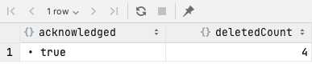

# MongoDB 완벽가이드

## 기본개념

* 데이터의 기본 단위는 도큐먼트
* 컬렉션은 동적 스키마가 있는 테이블과 동일한 개념
* 단일 인스턴스는 여러개의 독립적인 데이터베이스를 호스팅
* 몽고 셸을 통해 조작 가능
    * 여기에선 Datagrip을 활용 함

## Document

* 정렬된 키와 연결된 값의 집합으로 이뤄짐

```mongodb-json-query
{
  "greeting": "Hello world!"
}
```

* 데이터 타입과 대소문자 구별

아래는 서로 다른 도큐먼트임

```mongodb-json-query
{
  "count": 5
}
{
  "count": "5"
}
```

## 컬렉션

* 도큐먼트의 모음
* 하나의 컬렉션 내에 서로 다른 구조의 도큐먼트를 가질 수 있음
    * 그래도 용도에 따라 적절히 컬렉션을 나누는것이 좋다

### 컬렉션 네이밍

* 널 스트링, 빈 문자열은 사용 불가
* system.으로 시작하는 컬렉션 이름은 예약어
* 사용자가 만든 컬렉션은 $ 예약어 사용 불가

### 서브 컬렉션

* .을 통해서 컬렉션을 체계화 함
* 단지 이름을 기반으로 체계화 하는 것이지 상하 관계가 성립하는것은 아님
* ex)
    * master.items
    * master.categories
    * master.admins

### 데이터베이스

* 컬렉션의 그룹
* 컬렉션과 마찬가지로 이름으로 식별 됨
* 최대 64 bytes
* 시맨틱을 갖는 예약된 데이터베이스
    * admin
        * 인증과 권한 부여를 담당
    * local
        * 단일 서버에 대한 데이터 저장
        * 레플리카 셋ㅅ에서 local 데이터베이스는 복제되지 않음
    * config
        * 샤딩 된 클러스터의 경우 config db를 통해 샤드에 분배 함
* ex)
    * cms 데이터베이스의 blog.posts 컬렉션은 cms.blog.posts로 나타 냄
    * 네임스페이스(cms.blog.posts)의 최대 길이는 120 bytes 이나 실제 100 bytes 이하이어야 함

## 기본 데이터 조작

* db 변수는 현재 데이터베이스를 가리킨다
* use <db>로 선택 가능하다

```mongodb-json-query
use demo
```

### 생성

* insertOne

단건 삽입

```mongodb-json-query
// 지역 변수
movie = {
  "title": "Star wars",
  "director": "Geroge Lucas",
  "year": 1977,
}
db.movies.insertOne(movie)

// 확인
db.movies.find()
```

ObjectId가 자동 발급 됨  


### 읽기

* findOne

단건 조회

```mongodb-json-query
db.movies.findOne()
```

### 갱신

* updateOne

단건 갱신

첫번째 인자로 매칭하는 조건 명시, 두번째로 갱신 작업에 대한 기술
```mongodb-json-query
db.movies.updateOne({
  title: 'Star wars'
},
{$set: {reviews: []
}
});
```
updateOne이라 하나만 업데이트 됐음


### 삭제

* deleteOne
* deleteMany


## 데이터 형
* null
* Boolean
* 숫자
  * 셸에선 64비트 부동소수점을 기본으로 함
  * 4byte, 8byte 정수는 NumberInt, NumberLong을 사용해야 함
  * NumberInt(4), NumberLong(12)
* 문자열
  * UTF8
* 날짜
  * Date로 표현
  * new Date()로 생성해야 함
  * 타임존은 저장하지 않음
* 정규표현식
  * 자바스크립트 정규표현식 문법
* 배열
* 내장 도큐먼트
* 객체 ID
  * 12byte
  * 하나의 컬렉션에서 도큐먼튼는 고유한 아이디를 가짐
  * 분산 데이터베이스를 위해 자동증가 값이 아닌 ObjectId를 사용 함
  * 0 1 2 3 4 5 6 7 8 9 10 11
  * 0~2는 타임스탬프, 3~8은 랜덤, 9~11은 카운타
* 이진데이터
* 자바스크립트 코드

## 도큐먼트 생성, 갱신, 삭제
### insertMany 
```mongodb-json-query
db.movies.insertMany(
    [
        {'title': 'GhostBusters'},
        {'title': 'E.T'},
        {'title': 'Blade Runner'}
    ]
)
```
* 다량의 도큐먼트 생성시 반복보다 훨씬 효율적임
* 데이터 피드
* RDB와 같은 원본 소스에서 임포트하는 경우 mongoimport 도구가 있음
* 48메가 이상이면 드라이버가 여러 insertMany 구문으로 분리 함

```mongodb-json-query
db.movies.insertMany(
    [
        {_id: 0, 'title': 'GhostBusters'},
        {_id: 1, 'title': 'E.T'},
        {_id: 1, 'title': 'Blade Runner'},
        {_id: 2, 'title': 'Blade Runner'}
    ],
    {
        ordered: true
    }
)
```
* 기본으로 ordered가 true임
* 정렬된 삽입이면 오류가 발생하는 지점에서 중단 함
* 비정렬된 삽입이면 오류 발생 여부에 상관없이 모두 삽입 시도 함

### deleteOne
* 필터와 일치하는 첫번째 도큐먼트를 삭제
```mongodb-json-query
db.movies.deleteOne({
    _id: 4
})
```


### deleteMany
* 필터와 일치하는 모든 도큐먼트를 삭제
```mongodb-json-query
db.movies.deleteMany({
    title: 'Blade Runner'
})
```

* 이전버전에서 remove를 지원하나 deleteOne, deleteMany를 쓸 것

### drop
* deleteMany에 아무런 인수를 주지 않으면 모든 도큐먼트가 제거 됨
* drop이 더 빠름

### replaceOne
* 도큐먼트를 새로운것으로 완전 치환
* 대대적인 스키마 마이그레이션에 유용 함 
```mongodb-json-query
db.users.insertOne({
    name: 'lee',
    friends: 32,
    enemies: 2
});

var lee = db.users.findOne({name: 'lee'});
lee.username = lee.name;
delete lee.name;  // name -> username

// relationships이라는 내장도큐먼트로 이동
lee.relationships = {
    friends: lee.friends,
    enemies: lee.enemies,
};
delete lee.friends;
delete lee.enemies;
db.users.replaceOne({name: 'lee'}, lee);
```


* 주어진 조건절에 두 개 이상의 도큐먼트가 매치하면 하나만 치환 한
  * 단 주의할 것이 id가 중복되는 상태가 발생할 수 있다는 것
```mongodb-json-query
db.users.insertOne({
    name: 'lee',
    friends: 32,
    enemies: 2
});
db.users.insertOne({
    name: 'lee',
    friends: 22,
    enemies: 2
});
var lee = db.users.findOne({name: 'lee', friends: 22}) // 63452da64b62ab4f8db6887a를 조회 했으나
lee.friends++;
db.users.replaceOne({name: 'lee'}, lee); // 63452d914b62ab4f8db68878가 대체 되도록 시도 됨
```


### 갱신연산자
* 도큐먼트의 특정 부분만 갱신하는 경우 원자적 갱신 연산자를 쓸 수 있음

#### set/unset 제한자(modifier)
**set**
* 필드 값을 설정
* 없으면 필드를 추가 함
```mongodb-json-query
db.users.updateOne({name: 'lee'}, {
    $set: {
        'favorite book': 'harry porter'
    }
})

// 데이터 형도 바꿀 수 있음
db.users.updateOne({name: 'lee'}, {
    $set: {
        'favorite book': ['harry porter', 'effective kotlin']
    }
})
```
* replaceOne과 무슨 차이일까?
  * replaceOne은 아예 도큐먼트를 대치하는 것이니 변경내역 소실 가능성이 있음
  * 조회 후 replace이니까
  * set은 atomic 하므로 소실 가능성이 없다고 봐도 좋을 듯

**unset** 
* 키와 값 제거
```mongodb-json-query
db.users.updateOne({name: 'lee'}, {
    $unset: {
        'favorite book': ''
    }
})
```
* 내장 도큐먼트도 수정 가능
```mongodb-json-query
db.users.insertOne({
    name: 'lee2',
    friends: 22,
    enemies: 1,
    additional: {
        hobby: ['running', 'ps'],
        address: 'home'
    }
})
;
db.users.updateOne({name: 'lee2'},{
    $set: {
        'additional.address': 'changed'
    }
})
```

#### inc 제한자(modifier)
* 이미 존재하는 키를 변경하거나 추가
* set과 유사하나 숫자의 증감을 위해 설계 됨
* int, long, double, decimal에 사용 가능
```mongodb-json-query
db.analytics.insertOne({
    url: 'www.taesu.com',
    pageviews: 42
});
db.analytics.updateOne({'url': 'www.taesu.com'},
    {
        $inc: {'pageviews': 1}
    }
);
```

### 배열 연산자
#### push
* 배열이 없으면 생성 후 추가 함
```mongodb-json-query
db.blog.posts.insertOne({
    title: 'A post',
    content: '...'
});
db.blog.posts.updateOne({title: 'A post'},{
    $push: {
        comments: {
            name: 'lee taesu',
            content: 'nice!'
        }
    }
});
// 여러개 삽입
db.blog.posts.updateOne({title: 'A post'}, {
    $push: {
        comments: [
            {
                name: 'lee taesu',
                content: 'nice!'
            },
            {
                name: 'lee taesu',
                content: 'nice!'
            }
        ]
    }
});

// each로도 가능
db.blog.posts.updateOne({title: 'A post'}, {
    $push: {
        comments: {
            $each: [
                {
                    name: 'lee taesu',
                    content: 'nice 0!'
                },
                {
                    name: 'lee taesu',
                    content: 'nice 1!'
                }
            ]
        }
    }
})
```

#### push + slice
* push와 slice로 길이 유지가 가능
* Top-N 기능 구현
* 도큐먼트 내에 큐도 구현 가능
* slice, sort를 push랑 쓰려면 반드시 each를 써야 함
```mongodb-json-query
db.blog.posts.updateOne({title: 'A post'}, {
    $push: {
        comments: {
            $each: [
                {
                    name: 'lee taesu',
                    content: 'nice 123'
                },
                {
                    name: 'lee taesu',
                    content: 'nice 456'
                }
            ],
            $slice: -2
        }
    }
})
```
* nice0!, nice1! 댓글은 밀리고 새로 추가 된 두개만 남음


* sort로 정렬도 가능
```mongodb-json-query
db.blog.posts.updateOne({title: 'A post'}, {
    $push: {
        comments: {
            $each: [
                {
                    name: 'lee taesu',
                    content: 'nice 123'
                },
                {
                    name: 'lee taesu',
                    content: 'nice 456'
                }
            ],
            $slice: -2,
            $sort: {'content': -1}
        }
    }
})
```

### 배열을 집합으로
#### ne
```mongodb-json-query
db.papers.insertOne({author: 'taesu'});
db.papers.updateOne({author: {$ne: 'taesu'}}, {$push: {author: 'taesu'}}); // not updated
db.papers.find()
```

#### addToSet
* 고유한 값 추가해야 하는 경우 addToSet, each를 조합
```mongodb-json-query
db.users.insertOne({
    name: 'lee',
    emails: [
        'taesu@gmail.com',
        'taesu@gmail.com'
    ]
});

db.users.updateOne({name: 'lee'}, {
    $addToSet: {
        emails: {
            $each: [
                'taesulee93@gmail.com'
            ]
        }
    }
});
```

* 주의, 이렇게 해버리면 이중배열이 들어간다는 것
```mongodb-json-query
db.users.updateOne({name: 'lee'}, {
    $addToSet: {
        emails: [
            'taesulee93@gmail.com'
        ]
    }
});
```

### 요소 제거
#### pop
```mongodb-json-query
// 배열의 처음부터 제거
db.users.updateOne({}, {$pop: {emails: -1}});
// 배열의 마지막부터 제거
db.users.updateOne({}, {$pop: {emails: 1}});
```
#### pull
* 하나의 도큐먼트의 emails 배열에서 일치하는 요소 제거
* 조건에 부합하는 도큐먼트가 여러개일때 하나가 적용되면 나머지는 무시 됨 (updateOne)
  * doc1: {emails: '...'}, doc2: {emails: '...'} 일때 doc1만 계속 배열이 지워질거임
```mongodb-json-query
db.users.updateOne({}, {$pull: {emails: 'taesu@gmail.com'}})
```
* 여러 도큐먼트에 적용하고 싶다면
```mongodb-json-query
db.users.updateMany({}, {$pull: {emails: 'taesu@gmail.com'}})
```


### 배열의 위치기반 변경
* 몇번째 요소인지 모르는 경우 'comments.$.name' 으로 접근 가능하다
```mongodb-json-query
db.blog.posts.insertOne({
    title: 'A post',
    content: '...',
    comments: [{
        name: 'lee taesu',
        content: 'nice!2awef'
    }]
});

db.blog.posts.updateMany({'comments.name': 'lee taesu'}, {
    $set: {
        'comments.$.name': 'Lee Tae Su'
    }
})
```
* arrayFilters를 통해서 조건에 맞는 배열만 변경 가능
```mongodb-json-query
// 투표 수가 -5 이하인 댓글은 숨김 처리
db.blog.posts.updateMany(
    {'comments.name': 'lee taesu'},
    {
        $set: {'comments.$[element].visible': false}  // 각 요소를 element로 선언
    },
    {
        arrayFilters: [{'element.votes': {$lte: -5}}]   // 여기서 사용
    }
)
```

### Upsert
* 1에 넘긴 인자에 매치하는 도큐먼트 검색
* 2에 넘긴 오퍼레이션 수행
* 3에 upsert: true라면 없으면 생성하고 오퍼레이션 수행
* 애플리케이션 로직으로 upsert를 구현하면 경쟁상태에 빠질 수 있음
  * UK 등으로 정합성은 보장할 수 있으나 오류가 날 것임
  * Upsert는 원자적이므로 비교적 안전
```mongodb-json-query
db.analytics.updateOne(
    {url: 'www.taesu2.com',},
    {$inc: {pageviews: 1}},
    {upsert: true}
    )
```

* 주의, 아래처럼 하면 pageviews: 0인 도큐먼트는 항상 없을 것이므로 매번 도큐먼트가 생성된다
```mongodb-json-query
db.analytics.updateOne({url: 'www.taesu2.com', pageviews: 0},
    {$inc: {pageviews: 1}},
    {upsert: true}
    )
```
* 도큐먼트 생성과 동시에 필드 설정이 필요하다면 $setOnInsert를 사용할 것
```mongodb-json-query
db.analytics.updateOne({url: 'www.taesu3.com',},
    {
        $inc: {pageviews: 1},
        $setOnInsert: {findBy: 'taesu'}
    },
    {upsert: true}
)
```

### updateMany
* updateOne과 매개변수는 동일
* updateOne은 필터에 부합하는 첫번째 도큐먼트만 갱신
* 필터에 부합하는 모든 도큐먼트 갱신은 updateMany
* 스키마 변경, 특정 사용자에 새로운 정보 추가 등에 효율적임 
```mongodb-json-query
db.users.insertMany(
    [
        {name: 'lee', birth: '1993-02-16'},
        {name: 'lee2', birth: '1991-02-16'},
    ]
);
db.users.updateMany({birth: '1993-02-16'}, {
    $set: {gift: 'happy birthday pack'}
})
```

### findAndGet (수정한 도큐먼트 반환)
**findOneAndUpdate**
* set and get을 원자적으로 해야하는 작업에 적합
* 여러 프로세스 중 락 등이 필요한 경우 아래처럼 
  * type에 따라 ready 상태인 것을 프로세스 1이 획득 하면서 ongoing으로 변경
  * 변경 됐다면 return 된것이 있음
  * 아무것도 없다면 작업 진행하지 않음
```mongodb-json-query
db.jobs.findOneAndUpdate(
    {type: 'MY_BATCH', status: 'READY'},
    {
        $set: {status: 'ONGOING'},
    },
    {
        returnNewDocument: true
    }
)
        
// 작업 다한 프로세스는 완료처리로
db.jobs.updateOne({type: 'MY_BATCH', status: 'ONGOING'}, {
    $set: {status: 'READY'}
})
```

**findOneAndReplace**
* returnNewDocument가 false면 교체 전 도큐먼트
* returnNewDocument가 true면 교체 후 도큐먼트
```mongodb-json-query
db.types.drop()
db.types.find()
db.types.insertOne({name: 'type1', when: '111'});
var type = db.types.findOne({name: 'type1'})
type.when = '123213'
db.types.findOneAndReplace({name: 'type1'}, type,
{
    returnNewDocument: true
})
```

**findOneAndDelete**
* 삭제된 도큐먼트를 반환

## 쿼리
### find 기본
```mongodb-json-query
db.users.find() == db.users.find({}) // 아무 조건 명시 안하면 빈 쿼리 도큐먼트로 인식

db.users.find({name: 'lee'})  // name이 lee인 도큐먼트를 검색하는 쿼리 도큐먼트
```

* 반환받을 키 지정을 통해 효율적으로 쿼리할 수 있음
* ID는 매번 반환 됨
```mongodb-json-query
db.users.find({}, {friends: 1, name: 1, birth: 1})
```


* friends를 제외한 나머지를 쿼리 할수도 있음
```mongodb-json-query
db.users.find({}, {friends: 0})
```

* 쿼리 도큐먼트의 값은 반드시 상수이어야 함
* 아래처럼 name과 username 값이 같은 쿼리는 불가 함
  * 이 경우엔 where을 사용할 것
```mongodb-json-query
db.users.find({'name':  'username'})
```

### 쿼리 조건
* equal 외에도 or, range, negation 등 검색 가능


**범위조건 (lte)**
```mongodb-json-query
db.users.find({
    birth: {
        $lte: ISODate('1992-02-16')
    }
})
;
```

**부정 (ne)**
```mongodb-json-query
db.users.find({
    name: {
        $ne: 'lee'
    }
})
```


**in, not in**
```mongodb-json-query
db.users.find({
    name: {
        $in: ['lee', 'lee 22']
    }
})

db.users.find({
    name: {
        $nin: ['lee', 'lee 22']
    }
})
```
  


**or**
* in 연산자가 가능하다면 or 대신 in을 쓸 것
* 쿼리 옵티마이저가 더 효율적으로 다룸 
```mongodb-json-query
db.users.find({
    $or: [
        {
            name: {
                $in: ['lee', 'lee 22']
            }
        },
        {
            name: {
                $nin: ['lee', 'lee 22']
            },
            email: 'taesu@gmail.com'
        }
    ]
})
```
* name in(lee, lee 22) or (name not in (lee, lee 22) and email eq 'taesu@gmail.com')


**not, mod**
* mod 연산자는 첫번째 요소로 나눈후 나머지가 두번째 요소인 경우를 매치 함
```mongodb-json-query
// key를 3으로 나눴을때 나머지가 0인 도큐먼트 검색
db.users.find({
    key: {$mod: [3, 0]}
})

// key를 3으로 나눴을때 나머지가 0이 아닌 도큐먼트 검색
db.users.find({
    key: {
        $not: {$mod: [3, 0]}
    }
})
```

### 형 특정 쿼리
**null**


y가 null인 도큐먼트가 잘 나오는 듯 하나
```mongodb-json-query
db.c.find({
    y: null
})
```


키가 존재하지 않는 경우도 나온다
```mongodb-json-query
db.c.find({
    z: null
})
```


만약 값이 진짜 null인것을 검색하려면 아래처럼 eq, exists로 검색 해줘야 한다
```mongodb-json-query
db.c.find({
    z: {
        $eq: null,
        $exists: true
    }
})
```

**정규표현식**
* 정규표현식으로 매턴일치 문자열 검색 가능
* 정규표현식 플래그 i는 사용 가능하지만 필수는 아님
  * i는 대소문자 구분 할지 안할지 여부
* PCRE에서 사용가능한 모든 문법 사용 가능
```mongodb-json-query
db.users.find({
    name: {
        $regex: /lee 2/i
    }
})
```

* 접두사 정규표현식에 인덱스 활용 가능
```mongodb-json-query
db.users.find({
    name: {
        $regex: /^le/
    }
})
```
* 대소문자 비구별 검색에는 인덱스 활용 불가
```mongodb-json-query
db.users.find({
    name: {
        $regex: /^le/i
    }
})
```

**배열에 쿼리하기**
* 스칼라 쿼리랑 같은 방식
```mongodb-json-query
db.foods.find({
    fruit: 'banana'
})
```


**all 연산자**
* 2개 이상의 배열 요소와 일치하는 배열 찾기
* 순서는 상관 없음
```mongodb-json-query
db.foods.find({
    fruit: {
        $all: ['banana', 'apple']
    }
})
```


* 배열 요소와 정확히 일치해야 하는 경우
* 순서도 일치해야 함
```mongodb-json-query
db.foods.find({
    fruit: ['apple', 'banana', 'peach']
})
```

* 인덱스 기반 검색
```mongodb-json-query
db.foods.find({
    'fruit.2': 'banana'
})
```


**size 연산자**
* 특정 크기의 배열을 쿼리
* gt 등 범위 조회 불가
```mongodb-json-query
db.foods.find({
    fruit: {
        $size: 3
    }
})
```

* 범위 검색이 필요하다면 별도의 size 컬럼을 두는게 좋을 것
```mongodb-json-query
db.foods.updateOne({_id: ObjectId('6346298bc220dc3768954e5a')}, {
    $push: {
        fruit: {
            $each: [
                'pineapple', 'grape'
            ]
        }
    },
    $inc: {
        size: 2
    }
})
```
* 단 addToSet엔 사용 불가 


**slice 연산자**  
```mongodb-json-query
// 먼저 달린 댓글 1개
db.blog.posts.find({}, {
    comments: {
        $slice: 1
    }
})

// 나중에 달린 댓글 1개
db.blog.posts.find({}, {
    comments: {
        $slice: -1
    }
})

// 처음 1개를 건너 뛰고 2개 반환
db.blog.posts.find({}, {
    comments: {
        $slice: [1, 2]
    }
})
```

* 각 도큐먼트에서 댓글 작성자가 like taesu인 첫번째 코멘트만 조회
```mongodb-json-query
db.blog.posts.find(
    {
        'comments.name': {
            $regex: /taesu/
        }
    },
    {
        title: 1,
        'comments.$': 1
    }
)
```


### 배열 및 범위쿼리
```mongodb-json-query
db.test.insertMany([
    {x: 5},
    {x: 15},
    {x: 25},
    {x: [5, 25]},
    {x: [22]},
]);

db.test.find({
    x: {
        $lt: 20,
        $gt: 5
    }
})
```
* [5, 25] 배열의 경우 5가 $lt 20에 부합하고 25가 $gt 5에 부합하므로 나옴
* [22] 배열의 경우 $gt 5엔 부합하나 $lt 20엔 부합하지 않으므로 걸러짐


**elemMatch**
* 배열요소와 일치시킴
  * 즉 배열을 대상으로하는 쿼리에 적합
* 비 배열요소는 일치시키지 않음
```mongodb-json-query
db.test.find({
    x: {
        $elemMatch: {
            $lt: 30,
            $gt: 6
        }
    }
})
```


**min, max**
* 인덱스가 있다면 사용 가능
* 일반적으로 배열을 포함하는 도큐먼트에 범위쿼리를 할 때 min, max가 좋음
* gt, lt는 범위 내가 아닌 모든 인덱스 항목을 검색한다
```
db.test.createIndex({
    x: 1
})
db.test.find({x: {$gt: 5, $lt: 20}})
    .hint( { x: 1 } )
    .min({x: 5}).max({x: 20})
```

### 내장 도큐먼트에 쿼리하기
```mongodb-json-query
db.people.insertOne({
    name: {
        first: 'taesu',
        last: 'lee'
    },
    age: 30
});


// 결과 없음
db.people.find({
    name: {
        first: 'taesu',
    }
})
        
// 서브도큐먼트가 정확히 일치해야 함
db.people.find({
    name: {
        first: 'taesu',
        last: 'lee',
    }
})

// 결과 없음 - 순서도 정확히 일치해야 함         
db.people.find({
    name: {
        last: 'lee',
        first: 'taesu',
    }
})

// 가능하다면 내장도큐먼트의 키 기반으로 검색하길
db.people.find({
    'name.last': 'lee',
})
```

**elemMatch 조합**
* 정의: 지정된 모든 쿼리 기준과 일치하는 요소가 하나 이상 있는 배열 필드가 포함된 문서를 찾습니다.
* taesu lee가 작성한 5점 이상 댓글이 있는 받은 블로그 게시물 검색
```mongodb-json-query
db.blog.posts.insertOne(
  {
            "comments": [
                {
                    "name": "taesu lee",
                    "content": "good posts",
                    "score": 4
                },
                {
                    "name": "kim",
                    "content": "nice posts",
                    "score": 6
                },
                {
                    "name": "park",
                    "content": "...",
                    "score": 1
                }
            ],
            "content": "complex contents",
            "title": "A post"
        }
    )

// 결과가 나와버림
// 주어진 조건이 배열내의 내장 도큐먼트 각각과 일치하므로
db.blog.posts.find({
    'comments.name': 'taesu lee',
    'comments.score': {
        $gte: 5
    },
})

// 결과 없음 - 정상적으로 쿼리 됨
// elemMatch를 통해 조건을 그룹화 할 수 있음
db.blog.posts.find({
    comments: {
        $elemMatch: {
            'name': 'taesu lee',
            'score': {
                $gte: 5
            },
        }
    }
})

```

### 커서
* 커서를 통해 find 결과를 받아올 수 있음
```mongodb-json-query
var cursor = db.blog.posts.find()
while (cursor.hasNext()) {
    var ele = cursor.next();
    print(ele.title)
}

var cursor = db.blog.posts.find()
cursor.forEach(it => {
    print(it)
})
```

* find 호출 시 셸이 즉시 쿼리하지 않고 결과 요청 쿼리시에 날림
```mongodb-json-query
// 아래 구문은 실행시 쿼리는 아직 수행되지 않음
var cursor = db.blog.posts.find().limit(1).skip(0)

// 여기서 쿼리가 수행 됨
cursor.haxNext()
```
* 비욜 절감을 위해 hasNext 호출시 첫 100개 혹은 4메가 정도를 미리 가져옴

**limit, skip, sort**
```mongodb-json-query
db.blog.posts.find()
  .limit(2)
  .skip(0)
  .sort({
    title: -1
  })
```

* RDB와 마찬가지로 skip이 커질수록 비효율적


```mongodb-json-query
db.blog.posts.find(
    {
        createdAt: {
            $lt: ISODate('2022-10-12T04:12:49.443Z')
        }
    })
    .limit(2)
    .sort({
        createdAt: -1
    })

```
* no offset 방식 쿼리


### 데이터형 비교 순서
* 최솟값
* null
* 숫자
* 문자열
* 객체/도큐먼트
* 배열
* 이진데이터
* 객체 ID
* 불리언
* 타임스탬프
* 정규표현식
* 최댓값

### 랜덤 도큐먼트
* 가장 간단한 버전
* count는 언제나 오버헤드가 심하다
```mongodb-json-query
db.blog.posts.find()
    .skip(
        Math.floor(Math.random() * db.blog.posts.countDocuments())
    )
    .limit(1)
```

* random을 생성시에 밀어 넣어놓고 프로그래밍으로 가져오기

```mongodb-json-query
var random = Math.random()
var randomResult = db.blog.posts.findOne({
    random: {
        $gt: random
    }
})
if(randomResult == null) {
    randomResult = db.blog.posts.findOne({
    random: {
        $lte: random
    }
})
}
print(randomResult)
```

### 종료되지 않는 커서
* 서버측에서 커서는 메모리, 리소스를 점유하는 주체
* 더 가져올 결과가 없거나 클라이언트가 종료 요청 시 리소스 해제 됨
* 종료 조건
  * 조건에 일치하는 결과가 더 이상 없는 경우
  * 클라이언트 측에서 유효 영역을 벗어나서 드라이버가 서버 측으로 종료 요청 보내는 경우
  * 타임아웃에 의한 종료
    * 아직 결과를 다 안봤고 유효영역을 벗어나지 않았으나 10분동안 활동이 없으면
* immortal이라는 함수를 통해 타임아웃에 의한 종료를 방지할 수 있음
  * 단 반드시 명시적으로 종료 해줘야 함 

## 인덱스
* 테스트 데이터 준비
```mongodb-json-query
var users = []
for (i = 0; i < 1000000; i++) {
    users[i] = {
        name: 'user-' + i,
        key: i + 3,
        email: 'user-' + i + '@test.com',
        birth: ISODate()
    }
}
db.users.insertMany(users)

// 또는
for (i = 0; i < 1000000; i++) {
    var user = {
        name: 'user-' + i,
        key: i + 3,
        email: 'user-' + i + '@test.com',
        birth: ISODate()
    }
    db.users.insertOne(user)
}
```

* explain 명령을 통해 실행계획 확인
* totalDocsExamined 수치가 쿼리 수행시 살펴본 도큐먼트 개수
```mongodb-json-query
db.users.find({name: 'user-99912'}).explain('executionStats')
```
```json
[
  {
    "executionStats": {
      "executionSuccess": true,
      "nReturned": 1,
      "executionTimeMillis": 235,
      "totalKeysExamined": 0,
      "totalDocsExamined": 1000003,
      "executionStages": {
        "stage": "COLLSCAN",
        "filter": {
          "name": {
            "$eq": "user-99912"
          }
        },
        "nReturned": 1,
        "executionTimeMillisEstimate": 5,
        "works": 1000005,
        "advanced": 1,
        "needTime": 1000003,
        "needYield": 0,
        "saveState": 1000,
        "restoreState": 1000,
        "isEOF": 1,
        "direction": "forward",
        "docsExamined": 1000003
      }
    },
    "queryPlanner": {
      "namespace": "users.users",
      "indexFilterSet": false,
      "parsedQuery": {
        "name": {
          "$eq": "user-99912"
        }
      },
      "queryHash": "64908032",
      "planCacheKey": "64908032",
      "maxIndexedOrSolutionsReached": false,
      "maxIndexedAndSolutionsReached": false,
      "maxScansToExplodeReached": false,
      "winningPlan": {
        "stage": "COLLSCAN",
        "filter": {
          "name": {
            "$eq": "user-99912"
          }
        },
        "direction": "forward"
      }
    }
  }
]
```

### 인덱스 생성
**단일인덱스**
* 사용자 이름에 인덱스 생성
* db.currentOp()를 통해 구축 진행률 확인 가능
* RDB와 마찬가지로 인덱스가 많을수록 쓰기 연산에 오버헤드가 있음
```mongodb-json-query
db.users.createIndex({'name': 1})
```
```json
[
  {
    "executionStats": {
      "executionSuccess": true,
      "nReturned": 1,
      "executionTimeMillis": 8,
      "totalKeysExamined": 1,
      "totalDocsExamined": 1, // 살펴본 도큐먼트 1개
      "executionStages": {
        "stage": "FETCH",
        "nReturned": 1,
        "executionTimeMillisEstimate": 0,
        "works": 2,
        "advanced": 1,
        "needTime": 0,
        "needYield": 0,
        "saveState": 0,
        "restoreState": 0,
        "isEOF": 1,
        "docsExamined": 1,
        "alreadyHasObj": 0,
        "inputStage": {
          "stage": "IXSCAN",
          "nReturned": 1,
          "executionTimeMillisEstimate": 0,
          "works": 2,
          "advanced": 1,
          "needTime": 0,
          "needYield": 0,
          "saveState": 0,
          "restoreState": 0,
          "isEOF": 1,
          "keyPattern": {
            "name": 1
          },
          "indexName": "name_1",
          "isMultiKey": false,
          "multiKeyPaths": {
            "name": []
          },
          "isUnique": false,
          "isSparse": false,
          "isPartial": false,
          "indexVersion": 2,
          "direction": "forward",
          "indexBounds": {
            "name": ["[\"user-99912\", \"user-99912\"]"]
          },
          "keysExamined": 1,
          "seeks": 1,
          "dupsTested": 0,
          "dupsDropped": 0
        }
      }
    },
    "queryPlanner": {
      "namespace": "users.users",
      "indexFilterSet": false,
      "parsedQuery": {
        "name": {
          "$eq": "user-99912"
        }
      },
      "queryHash": "64908032",
      "planCacheKey": "A6C0273F",
      "maxIndexedOrSolutionsReached": false,
      "maxIndexedAndSolutionsReached": false,
      "maxScansToExplodeReached": false,
      "winningPlan": {
        "stage": "FETCH",
        "inputStage": {
          "stage": "IXSCAN",
          "keyPattern": {
            "name": 1
          },
          "indexName": "name_1",
          "isMultiKey": false,
          "multiKeyPaths": {
            "name": []
          },
          "isUnique": false,
          "isSparse": false,
          "isPartial": false,
          "indexVersion": 2,
          "direction": "forward",
          "indexBounds": {
            "name": ["[\"user-99912\", \"user-99912\"]"]
          }
        }
      }
    }
  }
]
```

**복합인덱스**
* name 인덱스는 아래 쿼리에 도움이 안됨
```mongodb-json-query
db.users.find().sort({birth: 1, name: 1})
```
* 따라서 아래와 같은 복합 인덱스 생성
```mongodb-json-query
db.users.createIndex({birth: 1, 'name': 1})
```
아래처럼 인덱스가 구성 됨  
['1993-02-16', 'user-12311'] -> 8623513776  
['1993-02-16', 'user-12111'] -> 8623513778  
* 생년월일, 이름 항목이 레코드 식별자를 가리킴
* 레코드 식별자란 내부적으로 스토리지 엔진에 의해 사용되며 도큐먼트 데이터를 찾음
* 생년월일로 오름차순 정렬되고 동일한 생년월일에서 사용자 이름으로 오름차순 정렬

* 인덱스 생성 전
* 쿼리 수행시간도 3초 이상
```json
[
  {
    "executionStats": {
      "executionSuccess": true,
      "nReturned": 1000003,
      "executionTimeMillis": 4188,
      "totalKeysExamined": 0,
      "totalDocsExamined": 1000003,
      "executionStages": {
        "stage": "SORT",
        "nReturned": 1000003,
        "executionTimeMillisEstimate": 3211,
        "works": 2000009,
        "advanced": 1000003,
        "needTime": 1000005,
        "needYield": 0,
        "saveState": 2001,
        "restoreState": 2001,
        "isEOF": 1,
        "sortPattern": {
          "birth": 1,
          "name": 1
        },
        "memLimit": 104857600,
        "type": "simple",
        "totalDataSizeSorted": 203778363,
        "usedDisk": true,
        "spills": 2,
        "inputStage": {
          "stage": "COLLSCAN",
          "nReturned": 1000003,
          "executionTimeMillisEstimate": 2,
          "works": 1000005,
          "advanced": 1000003,
          "needTime": 1,
          "needYield": 0,
          "saveState": 2001,
          "restoreState": 2001,
          "isEOF": 1,
          "direction": "forward",
          "docsExamined": 1000003
        }
      }
    },
    "queryPlanner": {
      "namespace": "users.users",
      "indexFilterSet": false,
      "parsedQuery": {
      },
      "queryHash": "42015AE3",
      "planCacheKey": "42015AE3",
      "maxIndexedOrSolutionsReached": false,
      "maxIndexedAndSolutionsReached": false,
      "maxScansToExplodeReached": false,
      "winningPlan": {
        "stage": "SORT",
        "sortPattern": {
          "birth": 1,
          "name": 1
        },
        "memLimit": 104857600,
        "type": "simple",
        "inputStage": {
          "stage": "COLLSCAN",
          "direction": "forward"
        }
      }
    }
  }
]
```

* 인덱스 생성 후
* 쿼리 수행시간도 300ms 이하
```json
[
  {
    "executionStats": {
      "executionSuccess": true,
      "nReturned": 1000003,
      "executionTimeMillis": 494, // 4188 -> 494
      "totalKeysExamined": 1000003, // 0 -> 1000003 
      "totalDocsExamined": 1000003,
      "executionStages": {
        "stage": "FETCH",
        "nReturned": 1000003,
        "executionTimeMillisEstimate": 14,
        "works": 1000004,
        "advanced": 1000003,
        "needTime": 0,
        "needYield": 0,
        "saveState": 1000,
        "restoreState": 1000,
        "isEOF": 1,
        "docsExamined": 1000003,
        "alreadyHasObj": 0,
        "inputStage": {
          "stage": "IXSCAN",
          "nReturned": 1000003,
          "executionTimeMillisEstimate": 11,
          "works": 1000004,
          "advanced": 1000003,
          "needTime": 0,
          "needYield": 0,
          "saveState": 1000,
          "restoreState": 1000,
          "isEOF": 1,
          "keyPattern": {
            "birth": 1,
            "name": 1
          },
          "indexName": "birth_1_name_1",
          "isMultiKey": false,
          "multiKeyPaths": {
            "birth": [],
            "name": []
          },
          "isUnique": false,
          "isSparse": false,
          "isPartial": false,
          "indexVersion": 2,
          "direction": "forward",
          "indexBounds": {
            "birth": ["[MinKey, MaxKey]"],
            "name": ["[MinKey, MaxKey]"]
          },
          "keysExamined": 1000003,
          "seeks": 1,
          "dupsTested": 0,
          "dupsDropped": 0
        }
      }
    },
    "queryPlanner": {
      "namespace": "users.users",
      "indexFilterSet": false,
      "parsedQuery": {
      },
      "queryHash": "42015AE3",
      "planCacheKey": "42015AE3",
      "maxIndexedOrSolutionsReached": false,
      "maxIndexedAndSolutionsReached": false,
      "maxScansToExplodeReached": false,
      "winningPlan": {
        "stage": "FETCH",
        "inputStage": {
          "stage": "IXSCAN",
          "keyPattern": {
            "birth": 1,
            "name": 1
          },
          "indexName": "birth_1_name_1",
          "isMultiKey": false,
          "multiKeyPaths": {
            "birth": [],
            "name": []
          },
          "isUnique": false,
          "isSparse": false,
          "isPartial": false,
          "indexVersion": 2,
          "direction": "forward",
          "indexBounds": {
            "birth": ["[MinKey, MaxKey]"],
            "name": ["[MinKey, MaxKey]"]
          }
        }
      }
    }
  }
]
```

가장 많이 사용하는 세가지 유형의 인덱스 사용법
```mongodb-json-query
db.users.find({birth: ISODate('1993-02-16')}).sort({name: -1})
```
* 단일 값을 찾는 동등쿼리
* 인덱스의 두번째 필드로 결과가 이미 적절한 순서로 정렬 됨
['1993-02-16', 'user-12311'] -> 8623513776  
['1993-02-16', 'user-12111'] -> 8623513778 
1993-02-16과 일치하는 마지막 항목부터 역 탐색, 단일 인덱스의 정렬 방향은 문제되지 않음    


```mongodb-json-query
db.users.find({
    birth: {
        $lt: ISODate('1993-02-20'),
        $gt: ISODate('1993-02-16'),
    }
})
```
* 범위 쿼리
* 첫번째 키인 birth를 사용해서 아래 도큐먼트를 가져 옴
['1993-02-17', 'user-12311'] -> 8623513776  
['1993-02-17', 'user-12111'] -> 8623513778  
...  
['1993-02-18', 'user-02311'] -> 8623513770  
['1993-02-18', 'user-52111'] -> 8623513772  
...    
['1993-02-19', 'user-12351'] -> 8623513771  
['1993-02-19', 'user-62111'] -> 8623513773  

```mongodb-json-query
db.users.find({
    birth: {
        $lt: ISODate('1993-02-20'),
        $gt: ISODate('1993-02-16'),
    }
}).sort({name: -1})
```
* 범위 쿼리 + 정렬
* 첫번째 키인 birth를 사용해서 아래 도큐먼트를 가져 옴
* 그리고 name으로 정렬 함
  * 정렬은 메모리에서 발생 함
  * 결과가 많으면 느려짐
  * 결과가 32mb 이상이면 정렬 거부 함

['1993-02-17', 'user-12311'] -> 8623513776  
['1993-02-17', 'user-12111'] -> 8623513778  
...  
['1993-02-18', 'user-02311'] -> 8623513770  
['1993-02-18', 'user-52111'] -> 8623513772  
...    
['1993-02-19', 'user-12351'] -> 8623513771  
['1993-02-19', 'user-62111'] -> 8623513773  

-> 62111, 52111, 12351 ... 순서로 정렬을 메모리에서 수행  

* 동등 검색이 아닌경우에서 복합인덱스 구성 시 정렬 키를 첫번째에 두는것이 좋음
  * 대규모의 인메모리 정렬이 필요하지 않기 때문
* 단, 정렬은 이미 되어있고 조건에 맞는 것을 찾기 위해 인덱스 전체를 훑게 됨 
```mongodb-json-query
db.users.createIndex({name: 1, birth: 1});
db.users.find({
    birth: {
        $lt: ISODate('1993-02-20'),
        $gt: ISODate('1993-02-16'),
    }
}).sort({name: -1})
.explain('executionStats')  // name_1 인덱스를 선택 함 name_1_birth_1 은 reject으로 감
```

### 인덱스 선정
* 몽고DB는 쿼리 모양을 확인
* 인덱스 후보 집합 식별
* 쿼리 후보에 대해 플랜을 만들고 병렬 스레드에서 쿼리 실행
* 가장 먼저 목표 상태에 도착하는 플랜이 승자가 됨
* 목표 조건은 아래 중 한개
  * 모든 결과가 발견 됨
  * 결과의 전체 배치가 발견
  * 1만 건의 실행 단계 작업 수행 완료
* 승리한 플랜은 추후 모양이 같은 쿼리에 사용하도록 캐시 됨
* 선정된 플랜은 winningPlan 필드에
* 선정되지 않은 플랜은 rejectedPlans 필드에

### Index Prefix
* 기본적으로 정렬조건은 prefix를 만족해야 함
find().sort({ a: 1, b: 1 })	                { a: 1, b: 1 }  
find().sort({ a: -1, b: -1 })	            { a: 1, b: 1 }  
find().sort({ a: 1, b: 1, c: 1 })	        { a: 1, b: 1, c: 1 }  
find({ a: { $gt: 4 }}).sort({ a: 1, b: 1 })	{ a: 1, b: 1 }   

* 정렬조건이 prefix가 아닌경우 검색조건이 동등검색 이어야 인덱스를 잘 탐
예제 쿼리	인덱스 Prefix
find({ a: 5 }).sort({ b: 1, c: 1 })	        { a: 1 , b: 1, c: 1 }  
find({ b: 3, a: 4 }).sort({ c: 1 })	        { a: 1, b: 1, c: 1 }
find({ a: 5, b: { $lt: 3}}).sort({ b: 1 }	{ a: 1, b: 1 }

### 인덱스 설계

**복합 인덱스 설계**  
* 동등 필터에 대한 키를 맨 앞에
* 정렬에 사용되는 키는 다중값 필드 앞에 표시
* 다중값 필터에 대한 키는 마지막에 표시

**키 방향 선택**
* 단일 인덱스라면 방향은 무관하다
* 둘 이상의 키에 대해 정렬이 들어간다면 방향이 중요함
* 역방향 인덱스는 서로 동등함
* 각각 -1을 곱한 방향과 동등

{age: 1, name: 1}로 잡힌경우 {age: -1, name: -1}과 동등하다    
[21, user0001] -> 8812313183  
[21, user1001] -> 8812313181  
[21, user1020] -> 8812313185  
[22, user2020] -> 8812313182  
[22, user5020] -> 8812315185  
[23, user1020] -> 8812311185  
[23, user1040] -> 8812317185  

{a:  1, b: -1, c:  1}  
{a: -1, b:  1, c: -1}  
[1, 2, 1]    
[1, 2, 2]  
[1, 1, 1]  
[1, 1, 2]
[2, 2, 1]   
[2, 2, 2]    
[2, 1, 1]  
[2, 1, 2]  
[3, 3, 1]  
[3, 3, 2]  
[3, 2, 1]  
[3, 2, 2]  
[3, 1, 1]  
[3, 1, 2]  

**커버드 쿼리**  
* 인덱스가 쿼리가 요구하는 값을 모두 포함하는 경우
* _id 필드를 반환받지 않도록 키를 지정해야 함

```mongodb-json-query
db.users.find({
     birth: {
        $lt: ISODate('1993-02-20'),
        $gt: ISODate('1993-02-16'),
    }
},
    {
         name:1,
         birth:1,
        _id: 0
    }
).sort({name: -1})
    .explain('executionStats');
```
* totalDocsExamined가 0으로 잡힘
  * document에 접근하지 않고 인덱스 선에서 해결 했으므로
* inputStage에 FETCH 단계가 없이 PROJECTION_COVERED과 IXSCAN 단계만 있음
* 
```json
[
  {
    "executionStats": {
      "executionSuccess": true,
      "nReturned": 0,
      "executionTimeMillis": 3,
      "totalKeysExamined": 0,
      "totalDocsExamined": 0,
      "executionStages": {
        "stage": "SORT",
        "nReturned": 0,
        "executionTimeMillisEstimate": 0,
        "works": 3,
        "advanced": 0,
        "needTime": 1,
        "needYield": 0,
        "saveState": 0,
        "restoreState": 0,
        "isEOF": 1,
        "sortPattern": {
          "name": -1
        },
        "memLimit": 104857600,
        "type": "default",
        "totalDataSizeSorted": 0,
        "usedDisk": false,
        "spills": 0,
        "inputStage": {
          "stage": "PROJECTION_COVERED",
          "nReturned": 0,
          "executionTimeMillisEstimate": 0,
          "works": 1,
          "advanced": 0,
          "needTime": 0,
          "needYield": 0,
          "saveState": 0,
          "restoreState": 0,
          "isEOF": 1,
          "transformBy": {
            "name": 1,
            "birth": 1,
            "_id": 0
          },
          "inputStage": {
            "stage": "IXSCAN",
            "nReturned": 0,
            "executionTimeMillisEstimate": 0,
            "works": 1,
            "advanced": 0,
            "needTime": 0,
            "needYield": 0,
            "saveState": 0,
            "restoreState": 0,
            "isEOF": 1,
            "keyPattern": {
              "birth": 1,
              "name": 1
            },
            "indexName": "birth_1_name_1",
            "isMultiKey": false,
            "multiKeyPaths": {
              "birth": [],
              "name": []
            },
            "isUnique": false,
            "isSparse": false,
            "isPartial": false,
            "indexVersion": 2,
            "direction": "forward",
            "indexBounds": {
              "birth": ["(new Date(729820800000), new Date(730166400000))"],
              "name": ["[MinKey, MaxKey]"]
            },
            "keysExamined": 0,
            "seeks": 1,
            "dupsTested": 0,
            "dupsDropped": 0
          }
        }
      }
    },
    "queryPlanner": {
      "namespace": "users.users",
      "indexFilterSet": false,
      "parsedQuery": {
        "$and": [
          {
            "birth": {
              "$lt": {"$date": "1993-02-20T00:00:00.000Z"}
            }
          },
          {
            "birth": {
              "$gt": {"$date": "1993-02-16T00:00:00.000Z"}
            }
          }
        ]
      },
      "queryHash": "53E37C76",
      "planCacheKey": "6A6F1DD8",
      "maxIndexedOrSolutionsReached": false,
      "maxIndexedAndSolutionsReached": false,
      "maxScansToExplodeReached": false,
      "winningPlan": {
        "stage": "SORT",
        "sortPattern": {
          "name": -1
        },
        "memLimit": 104857600,
        "type": "default",
        "inputStage": {
          "stage": "PROJECTION_COVERED",
          "transformBy": {
            "name": 1,
            "birth": 1,
            "_id": 0
          },
          "inputStage": {
            "stage": "IXSCAN",
            "keyPattern": {
              "birth": 1,
              "name": 1
            },
            "indexName": "birth_1_name_1",
            "isMultiKey": false,
            "multiKeyPaths": {
              "birth": [],
              "name": []
            },
            "isUnique": false,
            "isSparse": false,
            "isPartial": false,
            "indexVersion": 2,
            "direction": "forward",
            "indexBounds": {
              "birth": ["(new Date(729820800000), new Date(730166400000))"],
              "name": ["[MinKey, MaxKey]"]
            }
          }
        }
      }
    }
  }
]
```

**암시적 인덱스**
* 복합 인덱스는 prefix 규칙을 따름 
* {a: 1, b: 1, c: 1} 인덱스는 아래의 인덱스로 활용 가능
  * {a: 1}
  * {a: 1, b: 1}
  * {a: 1, b: 1, c: 1}

### $ 연산자의 인덱스 사용 법
**비효율적인 연산자**
* 일반적으로 부정 조건 ($ne)은 비효율임
  * 인덱스를 사용하긴 하나 잘 활용되지 않음
  * $ne: {name: 'user-1'}인 경우 user-1이 아닌것을 모두 찾아야 하기에 인덱스 전체를 뒤져야 함
  * $ne: {age: 3}인 경우 3보다 작거나 3보다 큰 것을 모두 뒤져야 함
* $not은 종종 인덱스를 사용하나 대부분 테이블 스캔을 수행
* $nin은 항상 테이블 스캔
* 이런 종류를 사용해야 한다면 결과셋이 적은 도큐먼트를 필터링한 후 추가하는 것을 고려

**범위**
* 동등 절을 첫번째에
* 범위절을 마지막에

**OR 쿼리**
* 현재 몽고DB는 쿼리당 하나의 인덱스만 사용 가능
* {a: 1}, {b: 1}로 생성하고 {x: 'taesu', b: 'manager'}로 쿼리하면 두 개 중 하나가 선택 됨
* or의 경우 두개의 쿼리를 수행하고 하나로 합치므로 인덱스 두개가 선택
```mongodb-json-query
db.users.find({
    $or: [
        {name: 'user-99123'},
        {_id: ObjectId('634622a8c220dc3768954e54')},
    ]
}).explain('executionStats');
```
* SUBPLAN에 두개의 IXSCAN이 존재
  * name
  * _id
```js
[
  {
    "executionStats": {
      "executionSuccess": true,
      "nReturned": 2,
      "executionTimeMillis": 0,
      "totalKeysExamined": 2,
      "totalDocsExamined": 2,
      "executionStages": {
        "stage": "SUBPLAN",
        "nReturned": 2,
        "executionTimeMillisEstimate": 0,
        "works": 4,
        "advanced": 2,
        "needTime": 1,
        "needYield": 0,
        "saveState": 0,
        "restoreState": 0,
        "isEOF": 1,
        "inputStage": {
          "stage": "FETCH",
          "nReturned": 2,
          "executionTimeMillisEstimate": 0,
          "works": 4,
          "advanced": 2,
          "needTime": 1,
          "needYield": 0,
          "saveState": 0,
          "restoreState": 0,
          "isEOF": 1,
          "docsExamined": 2,
          "alreadyHasObj": 0,
          "inputStage": {
            "stage": "OR",
            "nReturned": 2,
            "executionTimeMillisEstimate": 0,
            "works": 4,
            "advanced": 2,
            "needTime": 1,
            "needYield": 0,
            "saveState": 0,
            "restoreState": 0,
            "isEOF": 1,
            "dupsTested": 2,
            "dupsDropped": 0,
            "inputStages": [
              {
                "stage": "IXSCAN",
                "nReturned": 1,
                "executionTimeMillisEstimate": 0,
                "works": 2,
                "advanced": 1,
                "needTime": 0,
                "needYield": 0,
                "saveState": 0,
                "restoreState": 0,
                "isEOF": 1,
                "keyPattern": {
                  "_id": 1
                },
                "indexName": "_id_",
                "isMultiKey": false,
                "multiKeyPaths": {
                  "_id": []
                },
                "isUnique": true,
                "isSparse": false,
                "isPartial": false,
                "indexVersion": 2,
                "direction": "forward",
                "indexBounds": {
                  "_id": ["[ObjectId('634622a8c220dc3768954e54'), ObjectId('634622a8c220dc3768954e54')]"]
                },
                "keysExamined": 1,
                "seeks": 1,
                "dupsTested": 0,
                "dupsDropped": 0
              },
              {
                "stage": "IXSCAN",
                "nReturned": 1,
                "executionTimeMillisEstimate": 0,
                "works": 2,
                "advanced": 1,
                "needTime": 0,
                "needYield": 0,
                "saveState": 0,
                "restoreState": 0,
                "isEOF": 1,
                "keyPattern": {
                  "name": 1
                },
                "indexName": "name_1",
                "isMultiKey": false,
                "multiKeyPaths": {
                  "name": []
                },
                "isUnique": false,
                "isSparse": false,
                "isPartial": false,
                "indexVersion": 2,
                "direction": "forward",
                "indexBounds": {
                  "name": ["[\"user-99123\", \"user-99123\"]"]
                },
                "keysExamined": 1,
                "seeks": 1,
                "dupsTested": 0,
                "dupsDropped": 0
              }
            ]
          }
        }
      }
    },
    "queryPlanner": {
      "namespace": "users.users",
      "indexFilterSet": false,
      "parsedQuery": {
        "$or": [
          {
            "_id": {
              "$eq": {"$oid": "634622a8c220dc3768954e54"}
            }
          },
          {
            "name": {
              "$eq": "user-99123"
            }
          }
        ]
      },
      "queryHash": "830FCEF5",
      "planCacheKey": "F684D860",
      "maxIndexedOrSolutionsReached": false,
      "maxIndexedAndSolutionsReached": false,
      "maxScansToExplodeReached": false,
      "winningPlan": {
        "stage": "SUBPLAN",
        "inputStage": {
          "stage": "FETCH",
          "inputStage": {
            "stage": "OR",
            "inputStages": [
              {
                "stage": "IXSCAN",
                "keyPattern": {
                  "_id": 1
                },
                "indexName": "_id_",
                "isMultiKey": false,
                "multiKeyPaths": {
                  "_id": []
                },
                "isUnique": true,
                "isSparse": false,
                "isPartial": false,
                "indexVersion": 2,
                "direction": "forward",
                "indexBounds": {
                  "_id": ["[ObjectId('634622a8c220dc3768954e54'), ObjectId('634622a8c220dc3768954e54')]"]
                }
              },
              {
                "stage": "IXSCAN",
                "keyPattern": {
                  "name": 1
                },
                "indexName": "name_1",
                "isMultiKey": false,
                "multiKeyPaths": {
                  "name": []
                },
                "isUnique": false,
                "isSparse": false,
                "isPartial": false,
                "indexVersion": 2,
                "direction": "forward",
                "indexBounds": {
                  "name": ["[\"user-99123\", \"user-99123\"]"]
                }
              }
            ]
          }
        }
      },
      "rejectedPlans": []
    }
  }
]
```
* 가능하다면 or보다는 in을 사용할 것
```mongodb-json-query
db.users.find({
    $or: [
        {name: 'user-99123'},
        {name: 'user-99223'},
    ]
}).explain('executionStats')
```
* or이지만 쿼리플래너가 in으로 바꿈
```json
[
  {
    "command": {
      "find": "users",
      "filter": {
        "$or": [
          {
            "name": "user-99123"
          },
          {
            "name": "user-99223"
          }
        ]
      },
      "$db": "users"
    },
    "executionStats": {
      "executionSuccess": true,
      "nReturned": 2,
      "executionTimeMillis": 1,
      "totalKeysExamined": 4,
      "totalDocsExamined": 2,
      "executionStages": {
        "stage": "FETCH",
        "nReturned": 2,
        "executionTimeMillisEstimate": 0,
        "works": 5,
        "advanced": 2,
        "needTime": 1,
        "needYield": 0,
        "saveState": 0,
        "restoreState": 0,
        "isEOF": 1,
        "docsExamined": 2,
        "alreadyHasObj": 0,
        "inputStage": {
          "stage": "IXSCAN",
          "nReturned": 2,
          "executionTimeMillisEstimate": 0,
          "works": 4,
          "advanced": 2,
          "needTime": 1,
          "needYield": 0,
          "saveState": 0,
          "restoreState": 0,
          "isEOF": 1,
          "keyPattern": {
            "name": 1
          },
          "indexName": "name_1",
          "isMultiKey": false,
          "multiKeyPaths": {
            "name": []
          },
          "isUnique": false,
          "isSparse": false,
          "isPartial": false,
          "indexVersion": 2,
          "direction": "forward",
          "indexBounds": {
            "name": ["[\"user-99123\", \"user-99123\"]", "[\"user-99223\", \"user-99223\"]"]
          },
          "keysExamined": 4,
          "seeks": 2,
          "dupsTested": 0,
          "dupsDropped": 0
        }
      }
    },
    "queryPlanner": {
      "namespace": "users.users",
      "indexFilterSet": false,
      "parsedQuery": {
        "name": {
          "$in": ["user-99123", "user-99223"]
        }
      },
      "queryHash": "A8024AF6",
      "planCacheKey": "3ABE760D",
      "maxIndexedOrSolutionsReached": false,
      "maxIndexedAndSolutionsReached": false,
      "maxScansToExplodeReached": false,
      "winningPlan": {
        "stage": "FETCH",
        "inputStage": {
          "stage": "IXSCAN",
          "keyPattern": {
            "name": 1
          },
          "indexName": "name_1",
          "isMultiKey": false,
          "multiKeyPaths": {
            "name": []
          },
          "isUnique": false,
          "isSparse": false,
          "isPartial": false,
          "indexVersion": 2,
          "direction": "forward",
          "indexBounds": {
            "name": ["[\"user-99123\", \"user-99123\"]", "[\"user-99223\", \"user-99223\"]"]
          }
        }
      }
    }
  }
]
```

### 객체, 배열 인덱싱
**객체 인덱싱**
```json
{
  "name": "taesu",
  "loc": {
    "ip": "192.168.1.1",
    "city": "seoul",
    "state": "ny"
  }
}
```
* 내장 도큐먼트의 서브 필드에 인덱스를 생성할 수 있음
```mongodb-json-query
db.users.createIndex({'ioc.city':  1})
```
* 내장 도큐먼트 자체에 인덱스를 걸면 서브 도큐먼트 전체에 쿼리할 때만 유용하다
```mongodb-json-query
db.users.createIndex({'ioc':  1})

// 아래처럼 정확히 올바른 필드 순서로 기술된 쿼리만 인덱스 활용 가능
db.users.find({
  loc: {
    ip: '1.2.3.4',
    city: 'seoul',
    state: 'ny'
  }
})
```

**배열 인덱싱**
* 배열에 인덱스를 생성하면 쓰기작업시 모든 배열요소가 갱신 되어야 함
  * db.blog.createIndex({'comments.date'})
* 배열의 특정 항목에만 인덱스 생성할 수 있다
  * db.blog.createIndex({'comments.10.votes': 1})
  * 11번째 댓글에 인덱스를 거는 것이라 크게 의미는 없는 듯
* 인덱스 항목의 한 필드만 배열로 가져갈 수 있다
```mongodb-json-query
db.multi.createIndex({x: 1, y: 1})
db.multi.insertOne({
    x: 1,
    y: [1,2,3]
})
db.multi.insertOne({
    x: [1],
    y: 1
})
// error
// 총 6개의 인덱스를 만들어야 하므로
db.multi.insertOne({
    x: [1, 2],
    y: [1,2,3]
})
```

* 배열 필드를 인덱스 키로 가지면 다중키 인덱스로 표시 됨
* isMultiKey: true면 다중키 인덱스가 사용 된 것임
* 다중키 인덱스는 비다중키 인덱스보다 다소 느릴 수 있음
  * 결과 반환 전 중복을 제거해야 하므로
```mongodb-json-query
db.multi.find({x: 1}).explain('executionStats')
```
```json
{
  "inputStage": {
    "stage": "IXSCAN",
    "nReturned": 2,
    "executionTimeMillisEstimate": 0,
    "works": 5,
    "advanced": 2,
    "needTime": 2,
    "needYield": 0,
    "saveState": 0,
    "restoreState": 0,
    "isEOF": 1,
    "keyPattern": {
      "x": 1,
      "y": 1
    },
    "indexName": "x_1_y_1",
    "isMultiKey": true,
    "multiKeyPaths": {
      "x": ["x"],
      "y": ["y"]
    },
    "isUnique": false,
    "isSparse": false,
    "isPartial": false,
    "indexVersion": 2,
    "direction": "forward",
    "indexBounds": {
      "x": ["[1, 1]"],
      "y": ["[MinKey, MaxKey]"]
    },
    "keysExamined": 4,
    "seeks": 1,
    "dupsTested": 4,
    "dupsDropped": 2
  }
}
```

**카디널리티**
* RDB와 동일하게 카디널리티가 높은 필드를 인덱스로
* 복합인덱스에서도 마찬가지 높은 카디널리티 -> 낮은 카디널리티 순으로 기술

**explain 출력**
* COLLSCAN = 컬렉션 풀 스캔
* IXSCAN = 인덱스 스캔 가능 했는지 여부
* nRetruned = 반환된 도큐먼트 개수
* totalKeysExamined = 검색한 인덱스 개수
  * 인덱스가 사용 된 경우 살펴본 인덱스 항목 개수
  * 테이블을 스캔 했다면 조사한 도큐먼트 개수
* totalDocsExamined = 검색한 도큐먼트 개수 (디스크 접근)
  * 디스크내 실제 도큐먼트를 가리키는 인덱스 포인터를 따라간 횟수
* totalKeysExamined == totalDocsExamined
  * 인덱스를 사용해 모든 도큐먼트를 찾았음
* nscannedObjects = 스캔한 도큐먼트 개수
* executionTimeMillis = 서버가 요청을 받고 응답을 보낸 시점까지 경과 시간
  * 여러 플랜을 시도 했다면 모든 플랜이 실행 되기까지 걸린 시간
* isMultiKey = 다중키 인덱스 사용 여부
* needYields = 쓰기 요청을 처리하도록 쿼리가 양보(yield)한 횟수
  * 대기 중인 스기가 있다면 쿼리는 일시적으로 락을 해제하고 쓰기부터 처리 함
* indexBounds = 인덱스가 어떻게 사용되었는지 설명
  * 탐색한 인덱스의 범위를 제공

**인덱스를 생성하지 않는 경우**
* 풀스캔이 더 효율적인 경우
* 통상적으로 쿼리가 컬렉션의 30% 미만을 반환하는 경우
  * 절대적이지 않음
  * 2% ~ 60%로 광범위 함

### 인덱스 종류
**고유 인덱스**
* Unique를 보장
```mongodb-json-query
db.users.createIndex({email: 1}, {unique: true})
```
* 4.2 버전 이후 인덱스 버킷의 크기제한은 8킬로바이트
  * 8킬로바이트보다 긴 키는 고유 인덱스 제약 조건이 적용되지 않음

**복합 고유 인덱스**
* GridFS는 복합 고유 인덱스를 사용 함

**중복 제거하기**
* 기존 컬렉션에 고유 인덱스 추가 시 중복이 있으면 실패 함
* 집계 프레임워크를 통해 어떤 중복이 있는지 찾으면 유용 함

**부분 인덱스**
* 고유 인덱스는 null도 값으로 취급 함
* 오직 키가 존재할 때만 고유 인덱스를 적용하도록 하려면 unique + partial을 결합
  * RDB의 희소 인덱스(sparse index)와 비슷 
```mongodb-json-query
db.users.createIndex({email: 1}, {
    unique: true,
    partialFilterExpression: {
        email: {    // email 필드가 있는 도큐먼트에 대해서만
            $exists: true
        }
    }
})
```
```mongodb-json-query
db.foo.find()
{_id:  0}
{_id:  1, x:  1}
{_id:  2, x:  2}
{_id:  3, x:  3}

db.foo.createIndex({x:  1})
db.foo.find({
  x: {
    $ne: 2
  }  
})
{_id:  0}
{_id:  1, x:  1}
{_id:  3, x:  3}

db.foo.createIndex({x:  1}, {
   partialFilterExpression: {
    x: {$exists: true}
  }
})
db.foo.find({
  x: {
    $ne: 2
  }  
})
{_id:  1, x:  1}
{_id:  3, x:  3}
```

**인덱스 관리**
* db.users.getIndexes()
```json
[
  {
    "key": {
      "email": 1
    },
    "name": "email_1",
    "v": 2,   // 내부적으로 갖는 인덱스 버저닝, 오래 된 버전의 인덱스는 삭제 및 재구축이 필요 함
    "partialFilterExpression": {
      "email": {
        "$exists": true
      }
    },
    "unique": true
  }
]
```
* db.users.createIndexes()
* db.users.dropIndex()
* db.users.dropIndexes()

**인덱스 식별**
* 컬렉션 내 각 인덱스는 고유 식별자를 가짐
* 인덱스 명은 서버에서 인덱스를 삭제, 조작 하는데 사용
* 기본이름은 키명1_방향1_키명2_방향2...
* 이름 지정 가능
  * db.foo.createIndex({x:  1}, {name: 'myIndex'})

**인덱스 변경**
* dropIndex로 인덱스 삭제
  * db.users.dropIndex('name_1')
* 인덱스 생성, 수정 시 오랜 시간과 리소스가 많이 필요 함
  * 4.2 버전 이후부턴 인덱스 빠른 구축을 위해 모든 읽기 쓰기를 중단 함
  * 이것을 막기 위해 background 옵션을 사용 하는 것이 좋음
  * 하지만 여전히 애플리케이션에 큰 영향을 줌
  * 백그라운드 인덱싱은 포그라운드 인덱싱보다 훨씬 느림
  * 4.2 버전 이후부터 하이브리드 인덱스 구축이라는 것을 제공
    * 인덱스 구축 프로세스의 시작과 끝에 락을 걸며 나머지 부분엔 읽기 쓰기 작업을 인터리빙 함
    * 포그라운드/백그라운드 인덱싱을 대체 할 수 있음
* 기존 도큐먼트에 인덱스를 생성하는게 인덱스 생성 후 도큐먼트를 마이그레이션 하는 것보다 빠름


### 특수 인덱스
**text 인덱스**
* 전문검색 인덱스
* 아틀라스전문 검색 인덱스가 아님
  * 아틀라스는 아파치 루씬을 활용함
* 문법과 같은 언어적 특성을 반영 함
  * entry == entries
* 텍스트 인덱스에서 필요한 키의 개수는 인덱싱 되는 필드의 단어 개수에 비례 함
  * 즉 많은 리소스가 필요할 수 있으므로 인덱스 생성 작업은 애플리케이션에 영향이 없을 때 해야 함
* 문자열 토큰화, 형태소화, 잠재적 갱신이 필요하므로 여타 다른 인덱스보다 비용이 큼
  * 쓰기 연산에서 오버헤드 심함
  * 샤딩시 데이터 이동 속도 저하
```mongodb-json-query
db.blog.posts.createIndex({
    title: 'text',
    content: 'text'
}, {
    weights: {
        title: 3,
        content: 2
    }
})

// 도큐먼트의 모든 필드에 text 인덱스 설정
db.blog.posts.createIndex({
    '$**': 'text'
})
```
* 가중치를 부여할 수 있음
  * 삭제 후 재생성해야 가중치 변경이 가능하므로 신중히 할 것
```mongodb-json-query
db.blog.posts.find(
    {
        $text: {
            $search: '안녕하세요 is hello and not complex (is fast to be friend)'
        }
    },
    {
        title: 1,
        content: 1,
    }
)
```


* 몽고DB는 각 단어를 논리적 or로 취급해서 쿼리 함
  * 비교적 광범위한 결과가 나올 수 있음
* 큰 따옴표로 묶어서 정확히 일치하는 구문 검색 가능
```mongodb-json-query
db.blog.posts.find(
    {
        $text: {
            $search: '\"is fast\" hello 안녕하세요'
        }
    },
    {
        title: 1,
        content: 1,
        score: {
            $meta: 'textScore'
        }
    }
).sort({
    score: {
        $meta: 'textScore'
    }
})
```

* ('is fast') and ('hello' or '안녕하세요')
* score 확인 및 정렬도 가능 함
  * 알아서 내림차순으로 정렬 됨

**전문검색 최적화**

접두사 방식
```mongodb-json-query
db.blog.posts.createIndex({
    createAt: 1,
    title: 'text',
    content: 'text'
}, {
    weight: {
        title: 3,
        content: 2
    }
})
```
* 날짜를 기준으로 전문 인덱스를 서브트리로 쪼갤 수 있음
  * 전문 인덱스 파티셔닝
  * 특정 날짜에 대한 전문 검색 최적화

접미사 방식
```mongodb-json-query
db.blog.posts.createIndex({
    title: 'text',
    content: 'text',
    author: 1
}, {
    weight: {
        title: 3,
        content: 2
    }
})
```
* title, content, author 필드만 반환하는 쿼리를 쓴다면 이런식으로 복합인덱스를

접두사 + 접미사 방식
```mongodb-json-query
db.blog.posts.createIndex({
    createAt: 1,
    title: 'text',
    content: 'text',
    author: 1
}, {
    weight: {
        title: 3,
        content: 2
    }
})
```

**검색 대상 언어**
* https://www.mongodb.com/docs/manual/reference/text-search-languages/
* default_language 옵션 지정 가₩
```mongodb-json-query
db.blog.posts.insertOne([
  {
    "comments": [
      {
        "name": "taesu lee",
        "content": "good posts",
        "score": 4
      },
      {
        "name": "kim",
        "content": "nice posts",
        "score": 6
      },
      {
        "name": "park",
        "content": "...",
        "score": 1
      }
    ],
    "content": "Bonjour le monde!",
    "createdAt": ISODate(),
    "random": 0.2451272632400404,
    "title": "F post",
    "language": "french"
  }
])
```
* 도큐먼트 별로 형태소 분석 언어를 다르게 지정 할 수도 있음

### 제한 컬렉션
* 일반적인 컬렉션은 동적으로 생성되고 추가되는 데이터에 맞춰 크기가 자동으로 늘어 남
* 제한 컬렉션은 크기를 고정 시킬 수 있음
* 가득 찼다면 큐처럼 FIFO 구조로 동작
* 제한이 존재 함
  * 명시적으로 도큐먼트 삭제불가
  * 도큐먼트 크기가 커지도록 하는 갱신 불가
  * 위 두 제한을 통해 입력 순서 보장, 삭제된 것으로 인한 가용 저장공간 유지 필요 없음 (재사용 하므로)
* 제한 컬렉션은 디스크의 고정 영역에 기록되므로 쓰기가 빠름
* 일반적으로 TTL 인덱스가 더 나은 성능을 보이므로 제한 컬렉션보다 TTL 인덱스가 권장 됨
* 제한 컬렉션은 샤딩 불가
* 로깅에 나름대로 유용함

```mongodb-json-query
// 10만 바이트 고정 크기로 제한 컬렉션 만들기
db.createCollection('logs', {capped: true, size: 100000})
// 10만 바이트, 최대 100개 크기로 제한 컬렉션 만들기
db.createCollection('logs', {capped: true, size: 100000, max: 100})
```

**꼬리를 무는 커서**
* 제한 컬렉션에서만 사용
* tail -f와 비슷한 형태로 지속적으로 데이터를 꺼냄
* 몽고 셸엔 없음
* 아무 결과가 없으면 10분뒤 종료되므로 다시 쿼리하는 로직 포함해야 함

**TTL 인덱스**
* 오래된 순 삭제 시스템이 더욱 유연해지려면 TTL이 좋음
* 제한 컬렉션은 내용이 덮어쓰일 때 제어가 불가능 하므로
```mongodb-json-query
db.sessions.createIndex({
    lastUpdated: 1
}, {
    expireAfterSeconds: 60 * 60 * 24  // 24시간 뒤
})
```
* 도큐먼트에 lastUpdated라는 날짜형 필드가 존재하고 서버시간이 expireAfterSeconds 초를 지나면 도큐먼트가 삭제 됨
* collMod로 인덱스 변경 가능
```mongodb-json-query
db.runCommand({
    collMod:'sessions',
    index: {
        keyPattern: {
            lastUpdated: 1
        },
        expireAfterSeconds: 60
    }
})

// 60초 후에 taesu 세션은 제거 됨
db.sessions.insertMany([
    {
        id: 'taesu',
        lastUpdated: ISODate()
    },
    {
        id: 'non-session-taesu',
    },
])
```

**GridFS로 대용량 파일 저장**
* 대용량 이진파일을 저장하는 메커니즘
* 장점
  * 아키텍처 스택을 단순화 가능
    * 이미 몽고DB를 쓴다면 파일 스토리지를 위한 별도의 도구 구성 필요 없음
  * 리플리케이션, 샤딩을 그대로 이용 가능
  * 같은 디렉터리에 대량 파일 저장해도 문제가 없음
* 단점
  * 성능이 느림
    * 파일 시스템에 직접 접근보다 느림
  * 도큐먼트 수정시 전체를 삭제하고 다시 저장하는 방법만 있음
    * 파일을 여러 도큐먼트 청크로 저장함
    * 한 파일의 모든 청크에 락을 걸 수 없음
* 큰 변화가 없오 순차방식으로 접근하는 대용량 파일에 최적화

### 집계 프레임워크
임시데이터
```mongodb-json-query
db.companies.insertMany([
    {
        name: 'Facebook',
        funded_year: 2004,
        funding_rounds: [
            {
                raised_amount: 27500000,
                funded_year: 2006,
                investments: [
                    {
                        financial_org: {
                            permalink: 'greylock'
                        }
                    }
                ]
            },
            {
                raised_amount: 1500000,
                funded_year: 2008,
                investments: [
                    {
                        financial_org: {
                            permalink: 'european-founders-fund'
                        }
                    }
                ]
            }
        ],
        ipo: {
            valuation_amount: 10400000000,
            pub_year: 2012,
            pub_month: 5
        }
    }
])
```
* 일치 (match), 선출 (projection), 정렬 (sort), 건너뛰기 (skip), 제한 (limit) 단계가 있음
```mongodb-json-query
db.companies.aggregate([
    {$match: {funded_year: 2004}},
    {$limit: 5},  // 제한 후에 선출 단계를 뒀음
    {
        $project: {
            _id: 0,
            name: 1
        }
    },
])

// 결과는 동일
db.companies.aggregate([
    {$match: {funded_year: 2004}},
    {
        $project: {
            _id: 0,
            name: 1
        }
    },
    {$limit: 5},  // 선출 후에 제한 단계를 뒀음 도큐먼트 50만개면 50만번의 projection이 들어감을 주의
])
```
{"name":"Digg"}   
{"name":"Facebook"}   
{"name":"AddThis"}   
{"name":"Veoh"}   
{"name":"Pando Networks"}   

```mongodb-json-query
db.companies.aggregate([
    {$match: {funded_year: 2004}},
    {$sort: {name: 1}}, // 정렬은 중요하므로 제한 앞단계에
    {$limit: 5},  
    {
        $project: {
            _id: 0,
            name: 1
        }
    },
])
```
{"name":"1915 Studios"}   
{"name":"1Scan"}   
{"name":"2GeeksinaLab"}   
{"name":"2GeeksinaLab"}   
{"name":"2Threads"}     

```mongodb-json-query
db.companies.aggregate([
    {$match: {funded_year: 2004}},
    {$sort: {name: 1}}, 
    {$skip: 10},  // 10개 건너뛰고
    {$limit: 5},  // 5개 제한
    {
        $project: {
            _id: 0,
            name: 1
        }
    },
])
```

**표현식**
* 불리언 표현식
  * and, or, not
* 집합 표현식
  * 배열을 집합으로 사용
  * 교집합, 합집합, 차집합
* 비교 표현식
  * 범위 필터
* 산술 표현식
  * ceiling, floor, 로그 계산 등
* 문자열 표현식
  * 문자열 연결, substring 검색 등
* 배열 표현식
  * 배열 요소 필터링, 분할, 범위 조회
* 가변적 표현식
  * 리터럴, 날짜 값 구문분석, 조건식 등
* 누산기
  * 합계, 통계 등 계산기능

**$project**
* 중첩 필드의 승격
```mongodb-json-query
db.companies.aggregate([
    // greylock 파트너가 참여한 펀딩 라운드를 포함하는 모든 회사 필터링
    {$match: {'funding_rounds.investments.financial_org.permalink': 'greylock'}},
    {$limit: 5},
    {
        $project: {
            _id: 0,
            name: 1,
            ipo: '$ipo.pub_year', // 중첩 필드들이 최상위 필드로 승격 됨
            valuation: '$ipo.valuation_amount',
        }
    },
])
```

**$unwind**
```mongodb-json-query
db.companies.aggregate([
    {$match: {funded_year: 2004}},
    {$unwind: '$funding_rounds'},
    {$limit: 5},
    {
        $project: {
            _id: 0,
            name: 1,
            ipo: '$ipo.pub_year',
            valuation: '$ipo.valuation_amount',
            amount: '$funding_rounds.raised_amount',
            year: '$funding_rounds.funded_year',
        }
    },
])
```
{a: 1, b: 2, c: [x, y, z]]  

unwind로 c 필드를 전개하도록 수행하면 아래처럼 펴짐   
{a: 1, b: 2, c: x]  
{a: 1, b: 2, c: y]  
{a: 1, b: 2, c: z]  

* 앞선 match에서 필터는 greylock이 한 번이라도 펀팅 라운드에 참여한 회사를 필터한다
  * 따라서 greylock의 투자한 목록만 가져올 수가 없다
* 그래서 unwind로 전개하고 한번더 match 필터를 건다
  * 처음부터 unwind로 전개하면? -> 데이터가 너무 많아지겟지
```mongodb-json-query
db.companies.aggregate([
    {$match: {'funding_rounds.investments.financial_org.permalink': 'greylock'}},
    {$unwind: '$funding_rounds'},
    {$match: {'funding_rounds.investments.financial_org.permalink': 'greylock'}},
    {$limit: 5},
    {
        $project: {
            _id: 0,
            name: 1,
            ipo: '$ipo.pub_year',
            valuation: '$ipo.valuation_amount',
            amount: '$funding_rounds.raised_amount',
            year: '$funding_rounds.funded_year',
        }
    },
])
```

**배열표현식**

$filter
* 특정 금액 이상 투자 받은 회사 목록 추출
```mongodb-json-query
db.companies.aggregate([
    {$match: {funded_year: 2004}},
    {
        $project: {
            _id: 0,
            name: 1,
            funded_year: 1,
            rounds: {
                $filter: {
                        input: '$funding_rounds',
                        as: 'round',
                        cond: {$gte: ['$$round.raised_amount', 10000]}
                }
            }
        }
    },
])
```
* $filter는 배열 필드와 함께 사용하도록 설계 됨
* input으로 배열 필드 지정
* as절로 필터 표현식 내에서 변수 정의
  * $$로 접근 가능

$arrayElemAt
* 첫번째, 마지막 라운드 조회 
```mongodb-json-query
db.companies.aggregate([
    {$match: {funded_year: 2004}},
    {
        $project: {
            _id: 0,
            name: 1,
            funded_year: 1,
            first_round: {$arrayElemAt: ['$funding_rounds', 0]},
            last_round: {$arrayElemAt: ['$funding_rounds', -1]},
        }
    },
])
```

$slice
* 배열 요소의 범위 지정
```mongodb-json-query
db.companies.aggregate([
    {$match: {funded_year: 2004}},
    {
        $project: {
            _id: 0,
            name: 1,
            funded_year: 1,
            early_rounds: {$slice: ['$funding_rounds', 1, 3]}, // 인덱스 1부터 3개
        }
    },
])
```

$size
* 배열 요소의 길이
```mongodb-json-query
db.companies.aggregate([
    {$match: {funded_year: 2004}},
    {
        $project: {
            _id: 0,
            name: 1,
            funded_year: 1,
            total: {$size: '$funding_rounds'},
        }
    },
])
```
```json
[
  {
    "early_rounds": [
      {
        "raised_amount": 1500000,
        "funded_year": 2008,
        "investments": [
          {
            "financial_org": {
              "permalink": "european-founders-fund"
            }
          }
        ]
      }
    ],
    "first_round": {
      "raised_amount": 27500000,
      "funded_year": 2006,
      "investments": [
        {
          "financial_org": {
            "permalink": "greylock"
          }
        }
      ]
    },
    "funded_year": 2004,
    "last_round": {
      "raised_amount": 1500000,
      "funded_year": 2008,
      "investments": [
        {
          "financial_org": {
            "permalink": "european-founders-fund"
          }
        }
      ]
    },
    "name": "Facebook",
    "rounds": [
      {
        "raised_amount": 27500000,
        "funded_year": 2006,
        "investments": [
          {
            "financial_org": {
              "permalink": "greylock"
            }
          }
        ]
      },
      {
        "raised_amount": 1500000,
        "funded_year": 2008,
        "investments": [
          {
            "financial_org": {
              "permalink": "european-founders-fund"
            }
          }
        ]
      }
    ],
    "total": 2
  }
]
```

**누산기**
선출 단계에서 누산기
```mongodb-json-query
db.companies.aggregate([
    {$match: {funded_year: 2004}},
    {
        $project: {
            _id: 0,
            name: 1,
            funded_year: 1,
            largest_round: {$max: '$funding_rounds.raised_amount'},
            total_funding: {$sum: '$funding_rounds.raised_amount'},
        }
    },
])
```

**그룹화**
* _id필드로 그룹화
```mongodb-json-query
db.companies.aggregate([
    {$match: {funded_year: 2004}},
    {$unwind: '$funding_rounds'}, // unwind로 펼치고
    {
        $group:{
            _id: {funded_year: '$funded_year'},
            avg: {$avg: '$funding_rounds.raised_amount'},
            amounts: {$push: '$funding_rounds.raised_amount'},
            count: {$sum: 1}
        }
    },
    {$sort: {avg: 1}},
])
```
```json
[
  {
    "_id": {
      "funded_year": 2004
    },
    "amounts": [27500000, 1500000],
    "avg": 14500000,
    "count": 2
  }
]
```

```mongodb-json-query

db.companies.aggregate([
    {$match: {funded_year: 2004}},
    {$unwind: '$funding_rounds'},
    {
        $group: {
            _id: {funded_year: '$funded_year'},
            avg: {$avg: '$funding_rounds.raised_amount'},
            info: {
                $push: {
                    amount: '$funding_rounds.raised_amount',
                    investments: '$funding_rounds.investments'
                }
            },
            count: {$sum: 1}
        }
    },
    {$sort: {avg: 1}}
])
```
```json
[
  {
    "_id": {
      "funded_year": 2004
    },
    "avg": 14500000,
    "count": 2,
    "info": [
      {
        "amount": 27500000,
        "investments": [
          {
            "financial_org": {
              "permalink": "greylock"
            }
          }
        ]
      },
      {
        "amount": 1500000,
        "investments": [
          {
            "financial_org": {
              "permalink": "european-founders-fund"
            }
          }
        ]
      }
    ]
  }
]
```

**선출과 그룹화**
```mongodb-json-query
db.companies.aggregate([
    {$match: {funded_year: 2004}},
    {$unwind: '$funding_rounds'},
    {
        $group: {
            _id: {funded_year: '$funded_year'},
            avg: {$avg: '$funding_rounds.raised_amount'},
            first: {$first: '$funding_rounds'},
            last: {$first: '$funding_rounds'},
            count: {$sum: 1}
        }
    },
    // 그룹화 한 것을 가지고 프로젝션
    {
      $project: {
          _id: 1,
          year: '$_id.funded_year',
          first_round: {
              amount: '$first.raised_amount',
              year: '$first.funded_year',
          },
          last_round: {
              amount: '$last.raised_amount',
              year: '$last.funded_year',
          }
      }
    },
    {$sort: {avg: 1}}
])
```

**집계 파이프라인 결과를 컬렉션에 쓰기**
* $out
  * 동일 DB에만 쓸 수 있음
  * 기존 컬렉션이 있으면 덮어씀
  * 샤딩된 컬렉션엔 쓸 수 없음
* $merge
  * 새 도큐먼트 삽입, 기존 도큐먼트와 병합, 작업 실패시 기존 도큐먼트 유지, 사용자 정의 갱신 등 다양함
  * 샤딩과 상관 없이 모든 데이터베이스와 컬렉션에 가능
  * 파이프라인 실행 시 출력 컬렉션의 내용이 점진적으로 갱신되는 on-demand의 뷰를 생성할 수 있다는 가장 큰 장점

### 트랜잭션
**트랜잭션 제한 조정**
시간제한
  * 최대 실행시간은 기본 1분 이하
    * transactionLifetimeLimitSeconds에 의해 제어
  * 샤드 클러스터의 경우 모든 샤드 복제 셋 멤버에 매개변수를 설정 해야 함
  * 주기적으로 정리하는 프로세스가 트랜잭션을 중단 시킴
  * commitTransaction에 maxTimeMS를 지정해서 명시적으로 지정
    * maxTimeMS > transactionLifetimeLimitSeconds라면 transactionLifetimeLimitSeconds가 적용 됨
  * 락 획득 제한시간은 5ms
    * maxTransactionLockRequestTimeoutMillis
    * 0이면 즉시획득 실패시 중단
    * -1이면 maxTimeMS를 따름

Oplog 크기 제한
* 쓰기작업에 필요한 만큼 oplog 항목을 생성
* BSON 도큐먼트 크기 제한인 16메가 이하이어야 함

스키마 설계를 잘 했다면 대부분 트랜잭션은 쓸일이 없다

### 애플리케이션 설계
**스키마 설계 고려사항**
* 스키마 모델링 전 먼저 쿼리 및 데이터 접근 패턴을 고려할 것

스키마 설계시 주요 고려 요소
(1) 제약사항
* 최대 도큐머트 크기 16메가
* 갱신은 도큐먼트 전체를 다시 씀
* 원자적 갱신은 도큐먼트 단위

(2)쿼리 및 쓰기 접근 패턴
* 쿼리가 실행되는 시기와 빈도를 파악할 것
* 쿼리 수를 최소화
  * 함께 쿼리되는 데이터를 하나의 도큐먼트에 같이
  * 자주 사용하지 않는 데이터는 다른 컬렉션으로
  * 동적(읽기/쓰기) 데이터와 정적(대부분 읽기) 데이터를 분리 가능한 지 고려

(3) 관계 유형
* 애플리케이션 관점과 도큐먼트 간 관계 측면에서 어떤 데이터가 연관이 있는 지 고려
* 데이터나 도큐먼트를 내장하거나 참조할 방법을 결정
* 추가 쿼리 없이 도큐먼트 참조하는 방법을 고려, 관계 변경 시 갱신되는 도큐먼트 개수를 파악
* 쿼리하기 쉬운 구조인지도 고려

(4) 카디널리티
* 관계가 일대일, 일대다, 다대다 인지 일대 수백만인지 다대수십억인지 고려
* 관계의 카디널리티를 설정하는 것이 중요
* 수백만 측의 개체가 개별 접근된느지 상위 컨텍스트에서만 접근되는지 고려
* 읽기, 갱신 비율에 따라 도큐먼트를 비정규화 할 지 내장할지 참조할지 결정 함

**스키마 설계 패턴**
보통 알려진 패턴이나 빌딩 블록으로 해결할 수 있음  

(1) 다형성 패턴
* 컬렉션 내 모든 도큐먼트가 유사하지만 동일하지 않은 구조를 가질 때 적합
* 공통 필드를 식별
* 동일하지 않은 도큐먼트를 단일 컬렉션에서 쿼리하여 성능 향상

(2) 속성 패턴  
* 아래 상황에 적합
  * 정렬하거나 쿼리하려는 도큐먼트에 필드의 서브셋이 있는 경우
  * 정렬하려는 필드가 도큐먼트의 서브셋에만 존재하는 경우
* 데이터를 키/값 쌍의 배열로 구성하고 배열에 인덱스를 만듦
* 필요 인덱스가 적어지고 쿼리가 간단해짐

(3) 사전 할당 패턴
* MMAP 스토리지 엔진과 주로 사용
* 나중에 채워질 빈 구조를 사전 할당 함
* 예약정보를 관리하는 시스템에서 예약 가능 여부와 현재 예약 상태를 추적하는데 적용
  * 리소스 x와 날짜 y의 2차원 구조로 가용성을 확인하고 계산 가능

(4) 도큐먼트 버전 관리 패턴
* 도큐먼트의 이전 버전을 유지하는 메커니즘
* 메인 컬렉션의 도큐먼트 버전을 추적하려면 각 도큐먼트에 부가 필드를 추가
* 도큐먼트의 모든 수정 사항을 포함하는 추가 컬렉션이 필요

**정규화 / 비정규화**
* 정규화란 컬렉션간의 참조를 통해 데이터를 여러 컬렉션으로 나누는 작업
  * 데이터 변경 시 한 도큐먼트만 갱신하면 됨
* 비정규화란 모든 데이터를 하나의 도큐먼트에 내장하는 것
  * 여러 도큐먼트가 최종데이터 사본에 대한 참조가 아닌 데이터의 사본을 가짐
  * 데이터 변경 시 여러 도큐먼트가 갱신 되어야 함
* 정규화는 쓰기를 빠르게, 비정규화는 읽기를 빠르게 함

학생이 수강하는 강의 목록을 조회하려면 아래와 같은 구조는
* students에서 학생 정보 찾고
* studentClasses에서 수강 정보 찾고
* classes에서 강의 정보 찾고
```json
//db.studentClasses

{
  "_id": "id",
  "studentId": ObjectId("1231"),
  "classes": [
    ObjectId("211231"),
    ObjectId("34awfe1231"),
    ObjectId("aef1awe231"),
  ]
}
```

아래와 같은 구조는
* students에서 학생 정보 찾고
* classes에서 강의 정보 찾고
```json
//db.students

{
  "_id": "id",
  "name": "Lee Tae Su",
  "classes": [
    ObjectId("211231"),
    ObjectId("34awfe1231"),
    ObjectId("aef1awe231"),
  ]
}
```

아래와 같은 구조는
* students에서 한번에
* 단 수정에 취약함
  * 물리가 3학점에서 4학점으로 바뀌면 강의 도큐먼트 뿐 아니라 수강하는 모든 학생을 찾아야 함
```json
//db.students

{
  "_id": "id",
  "name": "Lee Tae Su",
  "classes": [
    {
      "class": "물리",
      "credits": 3,
      "room": "204"
    }
  ]
}
```

**혼합된 확장 참조 패턴**
* 자주 사용하는 정보로 서브도큐먼트 배열을 구성
* 추가적인 정보는 실제 도큐먼트를 참조하게
```json
//db.students

{
  "_id": "id",
  "name": "Lee Tae Su",
  "classes": [
    {
      "_id": ObjectId("211231"),
      "class": "물리",
    }
  ]
}
```

* 정보가 정기적으로 갱신되어야 한다면 정규화
* 드물게 변경된다면 비정규화
* 사용자 주소를 예로 주소를 바꿀일 별로 없으니 사용자 도큐먼트에 내장하는것이 이득
* 내장 도큐먼트를 사용하기로 했고 도큐먼트 갱신해야 한다면 모든 도큐먼트가 성공적으로 갱신 되도록 cron 작업 설정
  * 다중 갱신작업 수행하다가 서버가 먹통 되면? 
  * set은 멱등이지만 inc는 멱등이 아님
  * 멱등이면 재시도 하면 끝남
  * 첫번째 작업에 고유 토큰을 포함하고 두번째 작업에 고유한 키와 고유한 보류 토큰을 사용하게

**내장방식 / 참조방식**
* 도큐먼트크기가 작다면 내장, 크다면 참조
* 자주 안변한다면 내장, 자주 변한다면 참조
* 최종적 일관성이 허용되면 내장, 즉시 일관성이 필요하면 참조
* 증가량이 적으면 내장, 증가량이 많으면 참조
* 두번째 쿼리를 수행하는데 자주 필요하면 내장, 결과에서 자주 제외되면 참조
* 빠른 읽기는 내장, 빠른 쓰기는 참조 
* users 컬렉션을 예로
  * 계정 설정은 내장
  * 최근 활동
    * 크기가 고정된 필드면 내장
  * 친구
    * 완전히 내장하지 않아야 함
  * 사용자가 생성한 내용
    * 내장하지 않아야 함


**카디널리티**
* 컬렉션이 다른 컬렉션을 얼마나 참조하는 지 나타내는 개념
* 일대일, 일대다, 다대다
* 다수의 개념을 많음과 적음으로 따로 나눠서 생각할 것
  * 작성자가 게시물을 적게 생성하면 작성자와 게시물은
    * 일대다(일대소)
  * 태그보다 게시물이 더 많으면 게시물과 태그는
    * 다대다(다대소)
  * 일반적으로 적음은 내장이 적합, 많음은 참조가 적합
  * 많다 적다의 기준을 몇으로 잡는게 좋을까?

**친구, 팔로워 그리고 불편한 관계**
* 팔로우, 친구맺기, 찜하기 등은 발행-구독 시스템으로 단순화 가능
* 구독을 구현하는 전형적인 방법 세가지
  
(1) 게시자들을 구독자의 도큐먼트에 넣는 방법
```mongodb-json-query
[
  {
    "_id": {"$oid": "63462230c220dc3768954e50"},
    "birth": {"$date": "1993-02-16T00:00:00.000Z"},
    "email": "taesu@gmail.com",
    "following": [
      {"$oid": "63462236c220dc3768954e52"},
      {"$oid": "634622a8c220dc3768954e54"},
      {"$oid": "6346ab2c332637225f443e81"},
      {"$oid": "6346ab2c332637225f443e82"}
    ],
    "key": 1,
    "name": "lee"
  }
]

// 634622a8c220dc3768954e54 사용자가 업데이트 됐다면 나를 구독하는 사용자 찾기
// 전체 컬렉션을 뒤저야 함
db.users.find({
    following: ObjectId('634622a8c220dc3768954e54')
});

// activities 컬렉션에서 사용자가 관심 가질만한 컨텐츠 아래처럼 뽑기
db.activities.find({
    user: {
        $in: user['following']
    }
})
```

(2) 구독자들을 게시자의 도큐먼트에 넣는 방법
* 나를 팔로우 하는 사람들 금방 찾음
* 하지만 내가 팔로우하는 사람은 역시 전체 컬렉션 뒤저야 함
```mongodb-json-query
[
  {
    "_id": {"$oid": "63462230c220dc3768954e50"},
    "birth": {"$date": "1993-02-16T00:00:00.000Z"},
    "email": "taesu@gmail.com",
    "followers": [
      {"$oid": "63462236c220dc3768954e52"},
      {"$oid": "634622a8c220dc3768954e54"},
      {"$oid": "6346ab2c332637225f443e81"},
      {"$oid": "6346ab2c332637225f443e82"}
    ],
    "key": 1,
    "name": "lee"
  }
]

// 634622a8c220dc3768954e54가 팔로우하는 사람
db.users.find({
    followers: ObjectId('634622a8c220dc3768954e54')
});

```

* 두 방법 모두 사용자 도큐먼트를 더 크고 자주 바뀌게 만듦
* following, followers 필드는 반환될 필요가 없을 때가 많음
* 이럴땐 정규화 하는게 나음
```mongodb-json-query
{
  "_id": {"$oid": "63462230c220dc3768954e50"}, // 나를
  "followers": [                                // 팔로우하는 사람 목록
      {"$oid": "63462236c220dc3768954e52"},
      {"$oid": "634622a8c220dc3768954e54"},
      {"$oid": "6346ab2c332637225f443e81"},
      {"$oid": "6346ab2c332637225f443e82"}
  ]
}
```

**유명인 사용자로 인한 영향 대처**
* 트위터처럼 유명인들은 팔로워가 많으면 문제
* 내장이 작동하는 서브도큐먼트와 참조의 수는 제한 됨
* 연속 도큐먼트를 사용해서 해결
  * tbc 배열로 연속 도큐먼트를 쿼리
```mongodb-json-query
[
  {
    "_id": {"$oid": "6346ab2c332637225f443e81"},
    "birth": {"$date": "2022-10-12T11:55:17.743Z"},
    "email": "user-0@test.com",
    "followers": [
      {"$oid": "63462236c220dc3768954e52"},
      {"$oid": "634622a8c220dc3768954e54"},
      {"$oid": "6346ab2c332637225f443e81"},
      {"$oid": "6346ab2c332637225f443e82"}
    ],
    "key": 3,
    "name": "user-0",
    "tbc": [
      {"$oid": "13462230c220dc3768954e50"}
    ]
  },
  {
    "_id": {"$oid": "13462230c220dc3768954e50"},
    "followers": [
      {"$oid": "6346ab2c332637225f443e8e"},
      {"$oid": "6346ab2c332637225f443e8f"},
      {"$oid": "6346ab2c332637225f443e90"},
      {"$oid": "6346ab2c332637225f443e91"}
    ]
  }
]
```

**조회를 위한 최적화**
* 읽기 최적화는 일반적으로 올바른 인덱스를 사용
* 하나의 도큐먼트에서 가능한 많은 정볼르 반환하는 것이 좋음
* 쓰기 최적화는 갖고 있는 인덱스를 최소화
* 갱신을 가능한 효율적으로
* 빠른 쓰기와 빠른 읽기는 트레이드 오프가 존재하므로 어느것을 더 중점에 둬야 할 지 선택해야 함
  * 만약 애플리케이션 특성 상 쓰기가 더 중요하지만 비율로 쓰기별 읽기가 수천번이라면 읽기 최적화를 더 중점에

**오래된 데이터 제거**
* 제한 컬렉션
  * 가장 쉬운 방법
  * 사용자 작업에 제한이 생김
  * 급격한 트래픽에 취약
* TTL 컬렉션
  * 쓰기가 매우 많은 경우 충분히 빠르지 않음
  * 속도를 따라 갈 수 있다면 가장 좋은 방법
* 주기적으로 컬렉션 삭제
  * 달이 바뀔 때마다 비어있는 컬렉션 생성해서 
  * 동적 컬렉션을 사용하므로 로직이 복잡해짐

**데이터베이스와 컬렉션 구상**
* 데이터베이스와 컬렉션 구상은 몇가지 지침을 따르면 나누기 쉬움
* 스키마가 유사한 도큐먼트는 같은 컬렉션에
* 함께 쿼리하거나 집계해야 하는 도큐먼트는 하나의 큰 컬렉션에 
* 컬렉션에선 락과 저장을 중요하게 고려해야 함
  * 쓰기 워크로드가 높다면 여러 물리적 볼륨을 사용해 입출력 병목 현상을 줄일 수 있음
  * --directoryperdb 옵션을 주면 데이터베이스가 각자 디렉터리에 있음
  * 서로 다른 데이터베이스를 서로 다른 볼륨에 마운트 할 수 있음
  * 데이터베이스 내 모든 항목이 비슷한 품질, 비슷한 접근 패턴, 비슷한 트래픽 수준을 갖는게 좋다

예) 로깅 컴포넌ㅌ, 사용자 컬렉션, 사용자가 생성한 데이터를 위한 몇몇 컬렉션이 있다면 사용자 데이터는 안전해야 하고 사용자가 생성한 데이터는 트래픽이 높을 것이며 사용자 데이터보다는 중요도가 떨어지지만 로그보단 높을 것. 특성으론 주로 추가 전용 컬렉션임.  
이에 따라서 logs, activities, users 세개의 데이터베이스로 나눌 수 있음  
-> 가장 중요한 데이터는 가장 적은 데이터라는 장점, 특정 데이터를 위해 SSD를 적용할수도  
-> RAID10은 사용자에, RAID0은 로그와 사용자 활동에  

**일관성 관리**
* 애플리케이션이 요구하는 읽기에 필요한 일관성이 어느정도인지 파악해야 함
  * 지난해의 활동 기록이 필요하면 지난 며칠간의 정확한 데이터만 필요할 것
  * 실시간 거래를 수행한다면 최근 쓴 데이터에 즉각 읽기를 수행이 필요할 것 
* 몽고DB 서버는 각 연결에 대한 요청 큐를 보관 함
  * 이후의 요청은 이전에 큐에 적재된 요청이 진행 된 후에 처리 
  * 따라서 각 연결은 데이터베이스에 대해 일관적인 관점을 가짐
  * 즉, 동일한 연결 내에서 자신의 쓰기를 항상 읽을 수 있음 
* 연결이 많은 서버에서 자신의 쓰기를 항상 읽을 수 있지 않을 것임
  * 커넥션 풀을 대부분 사용 하므로
  * 읽기 요청을 복제 셋의 세컨더리로 보낼 때 이것은 더 큰 문제
  * 세컨더리는 초, 분, 심하면 시간 단위 전부터 데이터를 읽으므로 프라이머리에 뒤쳐짐
* readConcern 옵션을 통해 일관성과 격리 속성 제어 (local, available, majority, linearizable, snapshot)
  * majority
    * 대부분 복제 셋 멤버에서 확인된 내구성 있는 데이터만 반환하며 롤배고디지 않음
  * linearizable
    * 읽기 작업 시작 전 완료된 (다수 승인된) 쓰기를 모두 반영하는 데이터를 반환
    * linearizable readConcern으로 결과를 반환하기 전 동시실행되는 쓰기가 완료될 때까지 기다림

**스키마 마이그레이션**
(1) 가장 간단한 방법은 요구에 맞게 변화 시키기
* 구버전 스키마를 모두 지원하는 지 확인
* 필드의 존재 혹은 부재를 허용 하는 지
* 여러 가능한 타입을 정상 취급 하는 지
  * 스키마 버전이 서로 충돌하면 코드가 복잡해짐
    * 어떤 버전은 mobile 필드를 필수로 요구
    * 어떤 버전은 mobile 필드를 필수로 요구 하지 않으나 다른 필드를 요구
    * 또 다른 버전은 mobile 필드를 선택적으로 요구
    
(2) 각 도큐먼트에 version, v 필드를 추가 
* 스키마를 엄격히 관리할 수 있음
* 도큐먼트가 현재 버전이 아니라면 다른 버전에서 유효해야 한다
* 여전히 구 버전에 대한 지원은 필요할 수 있음

(3) 스키마 변경 시 모든 데이터를 마이그레이션 하기  
* 일반적으로 바람직하지 않음
* 몽고DB는 시스템에 많은 부하를 주는 마이그레이션을 피하기 위해 동적 스키마를 갖게 허용하는 것임
* 모든 도큐먼트 대상 마이그레이션 수행하면 다 성공했는지 확인도 필요
* 트랜잭션으로 처리 가능하긴 함
  * 실패하면 롤백 되니까

**스키마 관리**
* 스키마 유효성 검사를 통해 갱신, 삽입 중 유효성 검사 가능
  * $jsonSchema가 모든 스키마 유효성 검사에 권장 됨
* 유효성 검사는 기존 도큐먼트가 수정 되기 전엔 확인하지 않으며 컬렉션 별로 구성
* 기존 컬렉션에 추가하려면 validator 옵션을 줘서 collMod 명령으로
* validationLevel은 기존 도큐먼트 갱신 중 유효성 검사를 얼마나 엄격하게 할 지
* validationAction은 불법 도큐먼트를 오류와 함께 거절할 지, 경고와 함께 허용할 지 

**몽고DB가 부적절한 경우**
* 다양한 유형의 데이터를 여러 차원에 걸쳐 조인하는 작업이 필요하다면
  * RDB가 더 적합
  * 몽고DB는 조인을 잘 처리하지 못하고 다룰일도 없어야
* 몽고DB를 지원하지 않는 도구를 쓴다면
  * 워드프레스, SQL알케미 등..?


### 복제 셋 설정
* 클라이언트의 요청을 처리하는 프라이머리 서버 한대
* 프라이머리 데이터의 복사본을 갖는 세컨더리 여러대로 구성
* 프라이머리 서버에 장애가 발생하면 세컨더리는 자신들 중 하나를 프라이머리로 선출(승격) 함
* 몽고DB의 클라우드 솔루션인 아틀라스
* 자체 인프라에서 클러스터 관리시 옵스 매니저

**복제 셋 설정**
* 단일 장비에 3-노드 복제 구성
* DNS Seedlist 연결 방식를 통해 클라이언트 재구성 없이 돌아가면서 변경 가능 

```shell
mkdir -p ~/data/rs{1,2,3} # rs1, rs2, rs3 디렉터리 생성

# 3개의 mongod 프로세스 띄우기
mongod --replSet mdbdefGuide --dbpath ~/data/rs1 --port 27017 --oplogSize 200
mongod --replSet mdbdefGuide --dbpath ~/data/rs2 --port 27018 --oplogSize 200
mongod --replSet mdbdefGuide --dbpath ~/data/rs3 --port 27019 --oplogSize 200

# 만약 다른 멤버에 연결할 수 없다는 오류가 발생하면 아래처럼 바인드 ip 추가
# 198.51.100.1인 네트워크 인터페이스가 있는 서버에서 실행 중인 것으로 가정
mongod --bind_ip localhost, 192.51.100.1 --replSet mdbdefGuide --dbpath ~/data/rs1 --port 27017

# 27017에 접속
mongod --port 27017 
```

```mongodb-json-query
rsconf = {
  _id: 'mdbdefGuide',
  members: [
    {_id:  0, host:  'localhost:27017'},
    {_id:  1, host:  'localhost:27018'},
    {_id:  2, host:  'localhost:27019'},
  ]
}
// rs.initiate 보조자에 설정은 전달해서 복제 셋 형성 
rs.initiate(rsconf)
```
* 독립 실행성 서버는 복제 셋 구성 시 다운타임 발생
* 서버가 하나라도 단일 멤버인 복제 셋 구성 후 추후 서버 늘리면 다운타임 없이 가능

```mongodb-json-query
rs.status() // 상태 확인
```


```yaml
version: "3.6"

services:
  mongo-1:
    image: mongo
    build:
      context: .
      dockerfile: dockerfile
    container_name: mongo-1
    volumes:
      - ~/data/mongoRepl/rs1:/data/db
      - ./init/setup.sh:/scripts/setup.sh
    ports:
      - "27017:27017"
    networks:
      - mongo-networks
    command: mongod --replSet mdbdefGuide --port 27017 --oplogSize 200

  mongo-2:
    image: mongo
    container_name: mongo-2
    volumes:
      - ~/data/mongoRepl/rs2:/data/db
    ports:
      - "27018:27018"
    networks:
      - mongo-networks
    command: mongod --replSet mdbdefGuide --port 27018 --oplogSize 200

  mongo-3:
    image: mongo
    container_name: mongo-3
    volumes:
      - ~/data/mongoRepl/rs3:/data/db
    ports:
      - "27019:27019"
    networks:
      - mongo-networks
    command: mongod --replSet mdbdefGuide --port 27019 --oplogSize 200

networks:
  mongo-networks:
    driver: bridge
```
```shell
docker-compose up -d

docker exec -it mongo-1 bash
mongosh
```
아래 명령 실행
```mongodb-json-query
rsconf = {
  _id: 'mdbdefGuide',
  members: [
    {_id:  0, host:  'mongo-1:27017'},
    {_id:  1, host:  'mongo-2:27017'},
    {_id:  2, host:  'mongo-3:27017'},
  ]
}
rs.initiate(rsconf)
rs.conf();
```
다시 접속해보면  


rs.status()로 확인 해보면
```json
[
  {
    "$clusterTime": {
      "clusterTime": {"$timestamp": {"t": 1665800766, "i": 1}},
      "signature": {
        "hash": {"$binary": {"base64": "AAAAAAAAAAAAAAAAAAAAAAAAAAA=", "subType": "00"}},
        "keyId": 0
      }
    },
    "members": [
      {
        "_id": 0,
        "name": "mongo-1:27017",
        "health": 1,
        "state": 1,
        "stateStr": "PRIMARY",
        "uptime": 225
      },
      {
        "_id": 1,
        "name": "mongo-2:27017",
        "health": 1,
        "state": 2,
        "stateStr": "SECONDARY",
        "uptime": 168
      },
      {
        "_id": 2,
        "name": "mongo-3:27017",
        "health": 1,
        "state": 2,
        "stateStr": "SECONDARY",
        "uptime": 168
      }
    ],
    "set": "mdbdefGuide",
  }
]
```
```mongodb-json-query
// 반드시 테스트 db에서 확인
use test
db.isMaster()
```
* 현재 버전 6.0.2 기준으로 별도 설정 없이 세컨더리에서 읽기 가능
* 안되면 setSlaveOk를 설정해야 함
* 세컨더리에서 쓰기연산 수행 시


* 프라이머리 중지 해보기
```mongodb-json-query
// 인증 설정이 안되면 shutdown must run from localhost when running db without auth 에러 날 수 있음
// 직접 서버에 접속해서 하면 됨
db.adminCommand({shutdown: 1})
```

* mongo-2가 프라이머리로 자동 승격 함
```json
[
  {
    "$clusterTime": {
      "clusterTime": {"$timestamp": {"t": 1665802002, "i": 1}},
      "signature": {
        "hash": {"$binary": {"base64": "AAAAAAAAAAAAAAAAAAAAAAAAAAA=", "subType": "00"}},
        "keyId": 0
      }
    },
    "connectionId": 11,
    "electionId": {"$oid": "7fffffff0000000000000004"},
    "hosts": ["mongo-1:27017", "mongo-2:27017", "mongo-3:27017"],
    "isWritablePrimary": true,
    "ismaster": true,
    "lastWrite": {
      "opTime": {
        "ts": {"$timestamp": {"t": 1665802002, "i": 1}},
        "t": 4
      },
      "lastWriteDate": {"$date": "2022-10-15T02:46:42.000Z"},
      "majorityOpTime": {
        "ts": {"$timestamp": {"t": 1665802002, "i": 1}},
        "t": 4
      },
      "majorityWriteDate": {"$date": "2022-10-15T02:46:42.000Z"}
    },
    "localTime": {"$date": "2022-10-15T02:46:46.247Z"},
    "logicalSessionTimeoutMinutes": 30,
    "maxBsonObjectSize": 16777216,
    "maxMessageSizeBytes": 48000000,
    "maxWireVersion": 17,
    "maxWriteBatchSize": 100000,
    "me": "mongo-2:27017",
    "minWireVersion": 0,
    "ok": 1,
    "operationTime": {"$timestamp": {"t": 1665802002, "i": 1}},
    "primary": "mongo-2:27017",
    "readOnly": false,
    "secondary": false,
    "setName": "mdbdefGuide",
    "setVersion": 1,
    "topologyVersion": {
      "processId": {"$oid": "634a1ae6f302b33ec632b979"},
      "counter": 7
    }
  }
]

```
* 프라이머리에서 쓰기, 인덱스 구축 등 명력 처리

복제 셋 구성 변경
```mongodb-json-query
rs.add('localhost:27017')
rs.remove('localhost:27017')

var config = rs.config()
config.members[0].host = 'localhost:27017'
rs.reconfig(config)
```

### 복제 셋 설계 방법
* 과반수 개념이 중요
* 프라이머리 선출 시 멤버의 과반수 이상의 합의가 필요 함
* 쓰기는 과반수 이상 복제 돼야 안전
* 프라이머리는 과반수 이상 합격해야 자격 유지 가능
* 멤버 수와 복제셋의 과반수 예시
  * 1 - 1
  * 2 - 2
  * 3 - 2
  * 4 - 3
  * 5 - 3
  * 6 - 4
  * 7 - 4 

**데이터 센터 구성 별 설계**  
(1) 프라이머리 데이터 센터에 복제 셋 과반수 구성
* 과반수만큼을 위치시킨 프라이머리 데이터센터 
* 그 안에 복제 셋의 프라이머리를 위치 시킴
* 데이터 센터 이용 불가능 되면 세컨더리 데이터센터는 새로운 프라이머리 선출이 불가 
  * data center1 (1-primary, 2, 3), data center2 (4, 5)
  * dc1 다운 되면 dc2에서 선출이 불가능 해짐

(2) 각 데이터 센터 내 서버 개수 동일
* 또 다른 위치에 동점 상황을 판가름할 서버가 있는 경우
* 두 데이터 센터의 선호도가 동일할 때 적합
* 각 서버가 총 세개의 분리된 곳으로 나뉘어야 함 
  * dc1 (1, 2, 3), dc2 (4, 5, 6), dc3(프라이머리 dc 선택자)

프라이머리가 둘 이상이 되면 안되나?
* 다중 마스터는 그 자체로 복잡성이 심해 짐
* 쓰기 충돌 처리해야 함
  * 프라이머리 1에서 도큐먼트 갱신
  * 프라이머리 2에서 도큐먼트 삭제
* 수동 조절방식과 임의로 시스템이 승자를 선택하는 방식이 있음
  * 두 방식 모두 개발자가 코드화 하기 쉽지 않음
* 그래서 몽고DB는 단일 프라이머리만 지원 함

**선출 알고리즘**
* 아래 조건들을 따짐
  * 요청 받은 멤버가 프라이머리에 도달 할 수 있는가?
  * 선출되고자 하는 멤버의 복제 데이터가 최신인가?
  * 대신 선출돼야 하는 우선순위가 더 높은 멤버는 없는가? 
* 복제 셋 멤버는 2초마다 서로 하트비트를 보내 10초내 하트미트 반환 없으면 그 멤버를 불량으로 표기
* 잠시 우선순위가 낮은 멤버가 프라이머리로 뽑힐 수 있음
* 우선순위가 가장 높은 멤버가 프라이머리가 될 때까지 계속 선출을 호출 함

**멤버 구성 옵션**
* 기본적으로 모든 멤버는 동일 선호도를 가짐
* priority를 0~100으로 지정할 수 있음
  * 0이면 절대 프라이머리가 될 수 없음
  * 수동적 멤버
* 우선순위가 0이고 hidden이 true는 숨겨진 멤버임
  * 숨겨진 멤버로 요청 라우팅 하지 않음
  * 복제 소스로서 바람직하지 않음
    * 나머지 멤버가 다 별로일 때 숨겨진 멤버를 선택 하기도 함

**아비터 선출**
* 소규모 환경에서 2-멤버 복제 셋 요구가 있긴 함
* 프라이머리 선출에 참여하는 용도로만 쓰이는 아비터라는 특수 멤버를 지원 함
  * 일반적으로 아비터 없는 배포가 바람직 함
* 데이터를 가지지 않으며 클라이언트에 의해 사용되지 않음
* 사양이 낮은 경량 프로세스로 실행 가능
* 가능한 별도 서버에서 실행해서 아비터가 복제 셋에 대해 외부 관점을 갖게 하는 것이 좋음
* 한 번 아비터 구성 하면 영원히 아비터가 됨
  * 아비터를 아닌것으로 혹은 아비터가 아닌것을 아비터로 못바꿈
* 아비터는 최대 하나까지만 사용
  * 추가한다고 해서 선출 속도가 빨라지지도 않음

가능하면 아비터대신 데이터노드로 활용하자
* 2-멤버 + 아비터 구성에서 세컨더리 한대가 죽으면 다시 서버가 뜬 세컨더리는 프라이머리에서 데이터를 복제 함
  * 프라이머리가 애플리케이션에서 받는 부하 + 복제에 대한 부하 같이 받음 
  * 백기가바이트 이상 데이터 복제는 상당한 부하일 수 있음
  * 애플리케이션에 영향을 미칠 수 있음
* 3-멤버라면 세컨더리 하나 죽어도 다른 세컨더리에서 복제 하면 됨

**인덱스 구축**
* 때로 세컨더리는 프라이머리에 존재하는 것과 동일한 인덱스 필요 없는 경우가 있음
* 세컨더리를 백업이나 오프라인 배치 작업에만 쓴다면 buildIndexex: false를 멤버 구성에 명시하면 됨
* 인덱스 비구축 멤버는 영구적인 설정
  * 멤버 제거 후 다시 복제 셋에 추가해서 동기화 해야 함
  * 인덱스 비구축 멤버는 당연히 숨겨진 멤버와 마찬가지로 우선순위가 0이어야 함

### Spring Data MongoDB 설정
/etc/hosts에 아래 설정 추가   
127.0.0.1 mongo-1 mongo-2 mongo-3  
```yaml
spring:
  data:
    mongodb:
      uri: mongodb://mongo-1:27017,mongo-2:27018,mongo-3:27019/movies?replicaSet=mdbdefGuide
  redis:
    host: localhost
    port: 6379
    timeout: 100ms
logging:
  level:
    org.springframework.data.mongodb: DEBUG
```

**의문점**
* 프라이머리가 다운 됐을 때 몽고DB 상에선 자동으로 다른 세컨더리가 프라이머리로 승격된 것을 확인
* Spring Data MongoDB에선 장애 상태로 머무름
  * 새로운 프라이머리 바라봐야 하는게 아닌가?
* 현재 설정으로 될때가 있고 안될 때가 있음..
  * 추측으로 mongo-1이 프라이머리가 되면 잘 뜨는 듯 한데 버근가

되다 안되다 하는 현상을 막기위해 모든 볼륨을 지우고 재시작 하는것을 원칙으로  
아래 같은 로그를 봤을 때 캐노니컬 어드레스가 매치 하지 않는데 client view of cluster를 다른 서버를 제거 함(?)  
```text
Canonical address mongo-1:27017 does not match server address.  Removing mongo-3:27017 from client view of cluster
```
왠지 내부 서버의 포트를 27017로 다 동일시 해둔 것 같아서 모두 다 변경 해 봄  
-> 바꾸고나선 잘 되는 듯  
-> 바꿔서 잘 되는 것인지 볼륨을 다 날리고 해서 잘 되는지는 모르겠으나 볼륨 다 날리고 이전 방법으로 하면 정상적으로 잘 되는 것을 보아 볼륨을 날리는게 젤 나은 듯  

 ```shell
docker-compose down리
rm -rf ~/data/mongoRepl/*  
docker-compose up -d 
```

블로그 글에서 본 도커파일 옵션이 아예 안먹고 있었음 
```yaml
build:
  context: .
  dockerfile: dockerfile
```

start.sh
```shell
#!/bin/bash

docker-compose up -d
docker exec mongo-1 bash -c "chmod +x /scripts/setup.sh"

sleep 15
docker exec mongo-1 /scripts/setup.sh
```

setup.sh
```shell
#!/bin/bash

mongosh <<EOF
rsconf = {
  _id: 'mdbdefGuide',
  members: [
    {_id:  0, host:  'mongo-1:27017', priority: 2},
    {_id:  1, host:  'mongo-2:27018', priority: 1},
    {_id:  2, host:  'mongo-3:27019', priority: 1},
  ]
}
rs.initiate(rsconf);
rs.status();
EOF
```

근데 DB 같은 것들을 k8s 클러스터로 구축을 하는게 맞는지는 모르겠다.  

### 복제 셋 구성 요소
* 프라이머리가 수행한 쓰기를 모두 포함하는 로그 oplog를 보관하여 복제를 수행
* 프라이머리 로컬 데이터베이스에 있는 제한 컬렉션임
* 각 세컨더리가 프라이머리로부터 복제한 작업을 각각 기록하는 oplog를 보관 함
* 재시작 시 oplog에 있는 마지막 연산과 동기화 함
  * oplog의 각 작업은 멱등으로 설계 됨
* 크기는 기본 크기면 충분 함

**한 번에 여러 도큐먼트 갱신**
* oplog는 멱등성 유지를 위해 다중 갱신을 개별 작업으로 변환 함

**삽입한 데이터와 동일한 양의 데이터 삭제**
* 삽입 데이터와 거의 같은 크기 데이터 삭제시 디스크 사용량은 크게 증가하지 않으나 oplog 크기가 상당히 클 것임

**상당한 수의 내부 갱신**
* 워크로드 상당 부분이 도큐먼트 크기를 증가시키지 않는 갱신이면 작업의 수는 많으나 데이터 양은 변하지 않음

**두가지 동기화 유형**  
**초기 동기화**
* 초기 동기화를 통해 한 멤버에서 다른 멤버로 모든 데이터를 복사 함
* 기존 데이터가 모두 삭제됨을 주의
* 백업으로부터 복원하는 것이 더 바람직 함
  * 백업으로부터 복원이 더 빠를때가 많음

**복제**
* 세컨더리는 초기 동기화 후 지속적으로 데이터를 복제 함

**멤버 상태**
* STARTUP
  * 첫시작 단계, 구성정보 로드 시도
* STARTUP2
  * 초기 동기화 과정 전반
* RECOVERING
  * 멤버가 정상 동작 하나 읽기 작업은 수행 불가
  * 세컨더리 되기 전 짧게 이 상태로 감
  * 그 외엔 다른 멤버에 비해 많이 뒤쳐졌거나 조금 과부화 상태인 것
* ARBITER
  * 아비터
* DOWN
  * 멤버가 살아있지만 도달 불가능한 상태
* UNKNOWN
  * 다른 멤버에 도달한 적 없는 경우
* REMOVED
  * 복제 셋에서 제거된 상태
* ROLLBACK
  * 멤버가 데이터 롤백 할 때

### 애플리케이션에서 션결
* 클라이언트는 기본적으로 프라이머리에 연결
* 모든 트래픽을 프라이머리에 라우팅
* mongodb://mongo-1:27017,mongo-2:27018,mongo-3:27019/movies?replicaSet=mdbdefGuide
* 복제 셋은 프라이머리가 다운되면 자동으로 새로운 프라이머리를 찾고 가능한 빨리 그 프라이머리로 요청을 라우팅 함
  * spring data mongodb에선 잘 되지가 않았음
* 프라이머리가 다운 된 후
  * 프라이머리가 빨리 선출되면 새 프라이머리에서 작업을 재시도?
  * 이전 프라이머리에서 연산이 수행 됐다고 가정?
  * 새로운 프라이머리가 해당 연산을 갖는지 확인?
  * 최대 한 번만 재시도 하는것이 가장 바람직 함
* 몽고DB 드라이버는 재시도 가능한 쓰기 옵션을 지원 함

**쓰기시 복제 대기**
* 아래 시나리오에서 데이터 유실 가능
  * 프라이머리 중단
  * 새 프라이머리가 마지막 쓰기가 이전 프라이머리에 복제 되지 않음
  * 이전 프라이머리가 다시 프라이머리로 승격
* 쓰기 충돌이므로 자동으로 처리가 안됨
* 관리자가 롤백 파일을 직접 보고 적용해야 함
* 과반수 쓰기 수행하면 방지 가능
  * writeConcern: {w: majority, wtimeout: 100}
  * 타임 아웃 지나면 오류로 나감
  * w에 숫자를 지정하면 몇 개의 서버에 복제할지 명시도 가능 (프라이머리 포함임)

**세컨더리로 읽기 전송**
* 일반적으로 모든 트래픽은 프라이머리로 라우팅 할 것
* 설정하면 세컨더리로 읽기 전송도 가능 하긴 함
* 일관성이 보장 안됨
  * 복제가 쓰기 후 조회시 바로 완료됨을 보장 못함
  * w로 모든 세컨더리에 대한 복제 대기를 하지 않는 이상 보장 안됨
* 부하 분산을 위해 읽기를 세컨더리로?
  * 위험한 확장 법임
  * 읽기가 초당 3만개, 처리할 네 개의 복제 셋
  * 만약 세컨더리가 죽으면 다른데서 복제를 해와야 하는데 그 서버는 읽기 트래픽 부하를 받고 있으니 과부하가 점점 가해짐
  * 과부하는 복제를 점점 느려지게 하여 남은 세컨더리가 뒤쳐짐
  * 시스템 전체 마비 가능
* 부하를 분산하려면 샤딩을 고려
* 프라이머리 다운되도 지속적으로 읽기 정상 처리 원하면 세컨더리 읽기를 고려
* 아래 선호도를 선택
  * 기본적으론 primary
  * 읽기가 최신이 아니어도 좋다면 primaryPreferred
    * 프라이머리를 잃으면 임시로 읽기 전용 모드
  * 일관성보다 낮은 지연율이 필요하다면 nearest

### 관리
* 유지보수 작업은 쓰기 작업이 동반되므로 세컨더리에서 불가능, 애플리케이션 성능 영향을 미치면 안되므로 프라이머리에서도 수행하면 안됨
* 독립 실행형 모드로 멤버를 시작
* 해당 서버에서 서버를 종료하고 다른 포트로 복제 설정 없이 띄우면 됨
* 복제 셋의 과반수를 잃으면 프라이머리가 없는 상태에서 재구성할 필요가 있음
  * 세컨더리에서 아래 명령 수행
  * rs.reconfig(config, {force: true})

**인덱스 구축**
* 프라이머리에서 인덱스 구축 시 프라이머리는 정상적으로 구축하고 세컨더리도 build index 연산으로 구축 함
* 하지만 멤버를 이용 불가능 상태로 만들 수 있음
* 모든 세컨더리가 동시에 인덱스 구축하면 복제 셋의 거의 모든 멤버가 인덱스 구축 완료 될 때 까지 오프라인 상태가 됨
* 애플리케이션 영향 최소화 하여 구축하기
  * 세컨더리를 종료
  * 종료한 세컨더리를 독립 실행형 서버로 재시작
  * 재시작한 서버에 인덱스 구축
  * 인덱스 구축 완료 후 서버를 복제 셋 멤버로 재시작
    * disableLogicalSessionCacheRefresh 매개변수는 제거
  * 모든 세컨더리에 위 과정 반복
* 프라이머리에 적용시 아래 두 방법중 선택
  * 프라이머리에 직접 인덱스 구축
    * 트래픽이 적을 때 off 시간을 가질 수 있다면 좋음
    * 읽기 선호도 수정해서 인덱스 구축 중엔 세컨더리로 부하를 보내도록 일시적 라우팅 가능
    * 세컨더리는 이미 인덱스 있으니 별도 추가 연산 없음
  * 프라이머리를 강등 후 세컨더리에서 수행한 작업을 적용
    * 장애 조치가 필요
    * 기존 프라이머리가 인덱스를 구축하는 동안 정상 동작하는 프라이머리가 있음
* Unique 인덱스는 프라이머리에 먼저 구축해야 함
  * 만약 프라이머리에 중복삽입하면 세컨더리는 복제 오류가 발생하여 세컨더리는 스스로 종료 함
  * 세컨더리를 다시 독립 실행형으로 띄워서 인덱스 제거 후 재시작 해야 함

### 샤딩
* 몽고DB는 자동샤딩을 지원
* mongos라는 라우팅 프로세스를 통해 클러스터 내부를 애플리케이션이 모르게 추상화

client - mongos - (Primary, Secondary, Secondary)  
                - (Primary, Secondary, Secondary)  
                - (Primary, Secondary, Secondary)  

```mongodb-json-query
// 해당 데이터베이스에 샤딩을 활성화 
sh.enableSharding('accounts')

// 샤딩 활성화 전에 샤드키를 선정 (인덱스 생성)
db.users.createIndex({username:  1})

// 해당 컬렉션에 샤딩 활성화
sh.shardCollection('accounts.users', {username:  1})
```

* 컬렉션은 여러 청크로 분할되며 $minKey, $maxKey가 청크범위임
* explain을 통해 SINGLE_SHARD, SHARD_MERGE 등 플랜 볼 수 있음
  * SHARD_MERGE는 샤딩키 없이 쿼리할 때
  * 모든 샤드 조회 후 합침
* 샤드키를 포함하여 단일 샤드나 샤드 서브셋으로 보낼 수 있는 쿼리를 타겟쿼리라고 함

**언제 샤딩해야 하나**
* 사용 가능한 메모리 늘릴 때
* 사용 가능한 디스크 공간 늘릴 때
* 서버의 부하를 줄일 때
* 한개의 mongod가 다를 수 있는 처리량보다 더 많은 데이터를 읽거나 쓸 때

**서버 구성**
* 구성서버 (--configsvr)는 mongos가 서버 구성을 가져오는 컨피그 서버임
* config와 admin 이외의 데이터베이스에 데이터 쓸 수 없음
* 쓰기/읽기 수행 시 writeConcern, readConcern 수준의 majority를 사용
  * 일관성이 중요한 서버이므로
* 애플리케이션은 mongos를 바라봄
* 프라이머리와 직접 통신한 오류 메시지와 mongos가 내보낸 오류 메시지가 동일한 지 확인하는 것이 필요

**클러스터에 데이터 추가 로직**
* 샤드 키 범위 내에 있는 도큐먼트를 청크로 나눔
* 하나의 청크는 항상 하나의 샤드에 위치 함
  * 배열 필드는 샤드 키로 사용 불가
* 밸런서는 데이터 이동을 책임 짐
* 주기적으로 샤드 간의 불균형을 체크하여 청크를 다른 샤드로 이동
  * 애플리케이션은 데이터가 이동하느 사실을 몰라도 됨

**샤드 키 선정**
* 샤드 키는 변경 불가하므로 좋은 샤드 키를 잘 고려해서 선택
* 샤드를 얼마나 많이 늘릴 것인가?
  * 클러스터가 점점 커지면 모든 쿼리가 샤드 키를 포함해야 함
* 읽기 혹은 쓰기 응답 대기 시간을 줄이는 것이 중요한가?
  * 쓰기 응답 대기시간을 줄이는 것은 요청을 지리적으로 더 가까운 곳으로 보내는데에 관련이 있음
* 읽기 혹은 쓰기 처리량을 늘리려는 것인가?
  * 더 많은 병렬처리, 클러스터에 요청을 균일하게 분산하는 것과 관련
* 시스템 리소스를 늘리려고 한느가?
  * 작업 셋의 크기를 가능한 한 작게 유지해야 함

그 후 아래 상황에 샤드 키가 잘 작동하는지 확인
* 샤드 키가 필요한 타겟 쿼리를 제공 하는가?
* 샤드 키가 시스템의 처리량이나 응답 대기 시간을 의도한 대로 변경 하는가?
* 작은 작업 셋이 필요하다면 샤드 키가 그것을 제공 하는가?

**샤딩 구상**
* 데이터 분할 시 오름차순, 무작위, 위치 기반 키를 가장 일반적으로 슴
* 오름차순 샤드 키
  * 날짜, ObjectId 등 시간에 따라 꾸준히 증가하는 것을 선택
  * 새 도큐먼트는 항상 $maxKey가 위치한 최대 청크에 들어 감
  * 즉 모든 쓰기가 하나의 샤드에서 발생 함
  * 청크가 점점 커지면 최대 청크에서 새로운 청크가 떨어져 나옴
  * 해당 샤드에서 계속 분할이 발생
    * 몽고 DB4.2에선 autosplit 기능을 샤드 프라이머리 mongod로 이동함으로써 오름차순 샤드 키 패턴 문제를 해결하는 최상위 청크 최적화가 추가 됨
    * 단 하나의 샤드에 생성되는 상황을 방지 함
* 무작위 분산 키
  * 사용자 명, 이메일, UUID 등 
  * 유일한 단점은 몽고DB가 메모리 크기를 넘어서는 데이터를 임의로 접근하는 데 효율적이지 않다는 것
  * 샤드에 고르게 잘 분포 되기만 하면 됨
* 위치 기반 샤드 키
  * 사용자 IP, 위경도, 주소 등
  * 반드시 물리적일 필요 없으며 위치는 데이터를 그룹화하는 추상적 방법
  * ZoneKeyRange를 통해 ㅊ관리할 수 있음

**샤드 키 전략**
* 해시 샤드키
  * 데이터를 가능한 한 빠르게 로드하려면 해시 샤드 키가 최적
  * 어떤 필드라도 무작위로 분산
  * 쓰기는 무작위로 분산하고 오름차순 키로 쿼리하면 좋음
  * 단점은 범위쿼리가 불가능하다는 점
  * db.users.createIndex({username: 'hashed'}) 인덱스 생성 후
  * sh.shardCollection('app.users', {username: 'hashed'}) 컬렉션 샤딩

**다중 핫스팟**
* 독립 실행형 mongod 서버는 오름차순 쓰기를 할 때 가장 효율적
* 쓰기를 클러스터에 샤당이 가장 효율적이라는 점과 상충함
* 다중 핫스팟이란 쓰기가 클러스터에 고르게 분산되게 하고 샤드 내에선 오름차순이 되게 하는 것
* 복합 샤드 키를 사용해서 수행
  * 첫 번째 키는 카디널리티가 낮은 값
  * 두번째 키는 오름차순 키

**데이터 분산 제어**
* 기본적으로 모든 클러스터에 균등 분산
* 가치가 낮은 컬렉션에 대해서 ShardToZone으로 high, low, whatever로 제어할 수 있음

### 샤딩 관리
* 샤드 클러스터 상태 sh.status()
* 구성 정보 확인은 구성 서버의 config 데이터베이스에서 확인 가능
  * 직접 붙지말고 mongos를 통해서 접속할 것
  * config 서버 직접 접근하면 데이터 수정 가능성이 있으니
  * config.shards 컬렉션: 클러스터 내 모든 샤드 추적
  * config.databases: 클러스터가 알고 있는 모든 샤딩 및 비샤딩 데이터베이스 추적
  * config.collections: 모든 샤딩 된 컬렉션 추적
  * config.chunks: 컬렉션 내 모든 청크의 기록
  * config.changelog: 분할 기록과 마이그레이션 기록
  * 원본 샤드가 mongos로부터 moveChunk 명령을 받으면 아래 단계를 수행 하며 changelog에서 조회 가능
    * 명령 매개변수 확인
    * 구성 서버가 마이그레이션을 위해 분산된 락을 획득할 수 있는 지 확인
    * 목적지 샤드에 접속을 시도
    * 데이터 복사 (the critical section)으로 명시돼 기록
    * 목적지 샤드 및 구성 서버와 조정해 이동 확정
  * 목적지 샤드와 원본 샤드는 모두 서로 통신 가능한 상태여야 함
    * 마이그레이션 위해서 다른 샤드 및 구성 서버와 직접 통신하기 때문
  * 목적지 샤드가 원본 샤드로부터 명령을 받으면 아래 작업을 수행하며 changelog에서 조회 가능
    * 인덱스를 마이그레이션
    * 청크 범위 안에 있는 모든 데이터 삭제
    * 청크 내 모든 도큐먼트를 목적지 샤드로 복사
    * 복사하는 동안 도큐먼트에 일어난 작업 재실행
    * 목적지 샤드가 새로 마이그레이션 된 데이터를 대부분 서버로 복제하도록 대기
    * 청크의 메타데이터가 목적지 샤드에 위치한다고 바꿔서 확정
  * config.settions: 현재 밸런서 설정과 청크 크기를 나타내는 도큐먼트를 포함

**샤드 제거**
* 웬만해선 샤드를 클러스터에서 제거할지 말 것
* 샤드 추가, 삭제는 시스템에 필요 이상으로 무리를 줌
* 너무 많은 샤드를 추가 했다면 샤드 내에서 시스템이 커지도록 두는게 제일 좋음
* removeShard 명령으로 제거 가능

**점보 청크**
* 샤드키로 date(yyyy-mm-dd)필드를 선정했을 때
* mongos는 하루에 하나의 청크를 생성할 수 있음
* 만약 애플리케이션에서 평소보다 1000배 많은 트래픽을 받았다면?
  * 샤드키가 동일하므로 전혀 분할되지 않음
  * 나눌 수도 어디로 보낼 수도 없는 청크를 점보 청크라고 함
* dataSize 명령으로 점보 청크를 찾을 수 있음
  * 단 모든 청크 데이터 스캔해야 하므로 최대한 필터링 할 것
  * 예상되는 날짜를 필터 조건으로 줘서 범위를 좁히기
* 청크 분산하기
  * balancer가 동작하지 않게 설정 
  * 최대 청크 크기를 일시적으로 1만정도로 크게 늘림
  * moveChunk 명령으로 원본 샤드에서 목적지 샤드로 옮김
  * balancer 다시 활성화
* 점보 청크 분할은 쉬운 작업이 아니므로 사전 방지가 필요
  * 샤드키를 더 고르게 분포된 것으로 설정
    * 날짜필드가 아닌 년월일시분초로 설정
    * 날짜 + uuid를 두번째 샤드키를 추가 
